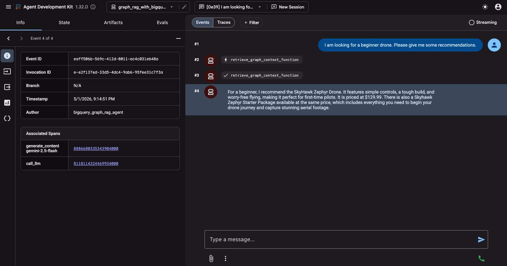
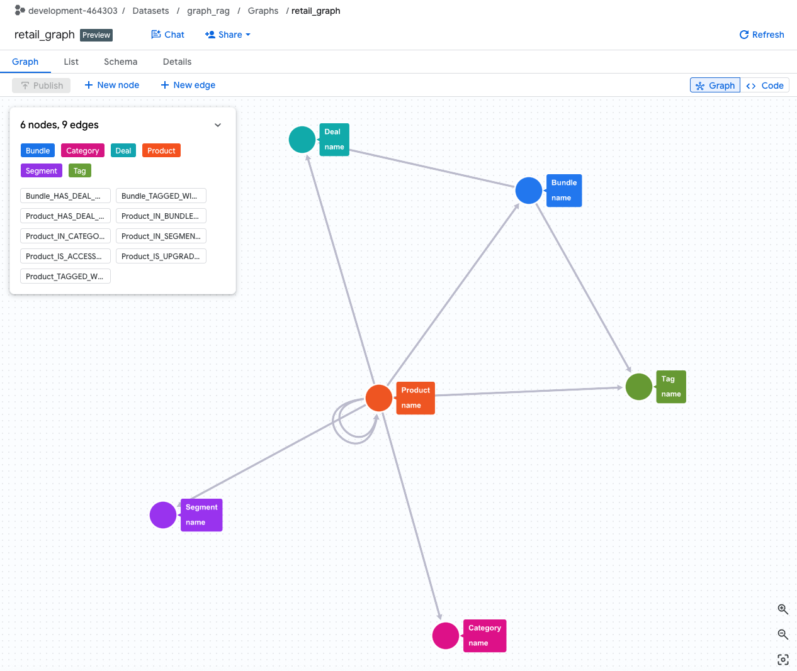
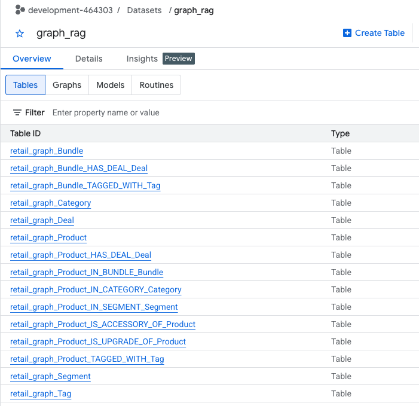

# Agentic Graph RAG Project with BigQuery Graph

This project is a sample implementation of an Agentic Graph RAG using the Agent Development Kit (ADK) and the Graph feature of Google Cloud BigQuery, powered by the [**langchain-bigquery-graph**](https://github.com/ksmin23/langchain-bigquery-graph) library.

## Project Structure

```
/graph-rag-with-bigquery
├── assets/                  # Images for README
├── data_ingestion/          # Data ingestion directory
│   ├── ingest.py            # Data ingestion script
│   └── requirements.txt     # Data ingestion script dependencies
├── graph_rag_with_bigquery/  # ADK Agent directory
│   ├── agent.py
│   ├── prompt.py
│   ├── requirements.txt     # Agent dependencies
│   └── tools.py
├── notebooks/               # Jupyter notebooks for exploration
│   ├── graph_rag_with_bigquery.ipynb
│   └── requirements.txt
└── README.md
```

## Prerequisites

Before you begin, you need to have an active Google Cloud project with BigQuery enabled.

### 1. Configure your Google Cloud project

First, you need to authenticate with Google Cloud. Run the following command and follow the instructions to log in.

```bash
gcloud auth application-default login
```

Next, set up your project and enable the necessary APIs.

```bash
# Set your project ID
export PROJECT_ID=$(gcloud config get-value project)

# Enable the required APIs
gcloud services enable \
  bigquery.googleapis.com \
  aiplatform.googleapis.com \
  cloudresourcemanager.googleapis.com
```

### 2. Create a BigQuery Dataset

Create a BigQuery dataset. The property graph and tables will be created automatically during data ingestion.

```bash
# Set environment variables
export BIGQUERY_DATASET="graph_rag_demo"
export BIGQUERY_GRAPH_NAME="retail_graph"
export BIGQUERY_LOCATION="us-central1"

# Create the dataset using bq CLI
bq --location=$BIGQUERY_LOCATION mk --dataset $PROJECT_ID:$BIGQUERY_DATASET
```

### 3. Grant Agent Engine permissions to BigQuery

To allow the deployed Agent Engine to connect to your BigQuery dataset, you must grant the necessary IAM roles to the Agent Engine's service account.

```bash
export PROJECT_NUMBER=$(gcloud projects describe $PROJECT_ID --format="value(projectNumber)")

# Grant BigQuery Data Viewer role
gcloud projects add-iam-policy-binding $PROJECT_ID \
    --member="serviceAccount:service-${PROJECT_NUMBER}@gcp-sa-aiplatform-re.iam.gserviceaccount.com" \
    --role="roles/bigquery.dataViewer"

# Grant BigQuery Job User role
gcloud projects add-iam-policy-binding $PROJECT_ID \
    --member="serviceAccount:service-${PROJECT_NUMBER}@gcp-sa-aiplatform-re.iam.gserviceaccount.com" \
    --role="roles/bigquery.jobUser"
```

## Setup

### 1. Install Dependencies

This project uses `uv` to manage the Python virtual environment and package dependencies.

**Create and activate the virtual environment:**
```bash
# Create the virtual environment
uv venv

# Activate the virtual environment (macOS/Linux)
source .venv/bin/activate
# Activate the virtual environment (Windows)
.venv\Scripts\activate
```

**Install dependencies:**
```bash
# Install agent dependencies
uv pip install -r graph_rag_with_bigquery/requirements.txt

# Install data ingestion script dependencies
uv pip install -r data_ingestion/requirements.txt
```

### 2. Data Ingestion

Run the `data_ingestion/ingest.py` script to load the documents into BigQuery Graph.

First, you need to create a `.env` file for the data ingestion script by copying the example file and filling in the required values.

```bash
cp .env.example .env
# Now, open .env in an editor and modify the values.
```

**Basic Usage:**
```bash
python data_ingestion/ingest.py
```

**Custom Configuration:**
```bash
python data_ingestion/ingest.py \
  --project_id="your-gcp-project-id" \
  --dataset_id="graph_rag_demo" \
  --graph_name="retail_graph" \
  --location="us-central1"
```

**Additional Options:**

*   `--cleanup`: Delete existing graph data before ingestion.
*   `--print-graph`: Print the transformed graph documents before ingestion (useful for debugging).
*   `--llm_model`: Specify the LLM model for graph transformation (default: `gemini-2.5-flash`).
*   `--embedding_model`: Specify the embedding model for node properties (default: `gemini-embedding-001`).

**Example with all options:**
```bash
python data_ingestion/ingest.py \
  --cleanup \
  --print-graph \
  --llm_model="gemini-2.5-pro" \
  --embedding_model="gemini-embedding-001"
```

### 3. Run the Agent Locally

Before running the agent, you need to create a `.env` file in the `graph_rag_with_bigquery` directory.

You can run the agent using either the command-line interface or a web-based interface.

#### Using the Command-Line Interface (CLI)

Run the agent in your terminal using the `adk run` command.

```bash
adk run graph_rag_with_bigquery
```

#### Using the Web Interface

You can also interact with the agent through a web interface using the `adk web` command.

```bash
adk web
```

**Screenshot:**
<div align="center">
  
  <br>
  <b>Figure 1:</b> ADK Web Interface for Graph RAG with BigQuery
</div>

<br>

<table align="center" border="0" cellspacing="0" cellpadding="0">
  <tr>
    <td align="center" valign="middle" width="50%">
      
      <br>
      <b>Figure 2:</b> Retail Graph in BigQuery
    </td>
    <td align="center" valign="middle" width="50%">
      
      <br>
      <b>Figure 3:</b> Retail Tables in BigQuery
    </td>
  </tr>
</table>

## Deployment

The Graph RAG with BigQuery agent can be deployed to Vertex AI Agent Engine using the following commands.

### 1. Set Environment Variables

Before running the deployment script, you need to set the following environment variables.

```bash
export GOOGLE_CLOUD_PROJECT=$(gcloud config get-value project)
export GOOGLE_CLOUD_LOCATION="us-central1"
export GOOGLE_CLOUD_STORAGE_BUCKET="your-gcs-bucket-for-staging"
```

### 2. Run the Deployment Command

Deploy the agent using the ADK CLI. You will need to provide a GCS bucket for staging the deployment artifacts.

```bash
adk deploy agent_engine \
  --staging_bucket gs://$GOOGLE_CLOUD_STORAGE_BUCKET \
  --display_name "Graph RAG Agent with BigQuery" \
  graph_rag_with_bigquery
```

This command packages the agent located in the `graph_rag_with_bigquery` directory and deploys it to Vertex AI Agent Engine.

When the deployment finishes, it will print a line like this:
`Successfully created remote agent: projects/<PROJECT_NUMBER>/locations/<LOCATION>/agentEngines/<AGENT_ENGINE_ID>`

Make a note of the `AGENT_ENGINE_ID`.

### 3. Interact with the Deployed Agent

You can interact with your deployed agent using a simple Python script.

**a. Set Environment Variables:**
Ensure the following environment variables are set in your terminal. You will need the `AGENT_ENGINE_ID` from the deployment step.

```bash
export GOOGLE_CLOUD_PROJECT="your-gcp-project-id"
export GOOGLE_CLOUD_LOCATION="us-central1"
export AGENT_ENGINE_ID="your-agent-engine-id"
```

**b. Create and Run the Python Script:**
Create a file named `query_agent.py` and add the following code.

```python
import asyncio
import os
import vertexai

async def query_remote_agent(project_id, location, agent_id, user_query):
    """Initializes Vertex AI and sends a query to the deployed agent."""
    vertexai.init(project=project_id, location=location)

    # Initialize the client
    client = vertexai.Client(project=project_id, location=location)

    # Construct the full resource name
    agent_name = f"projects/{project_id}/locations/{location}/reasoningEngines/{agent_id}"

    # Get the deployed agent
    remote_agent = client.agent_engines.get(name=agent_name)

    # Create a session for this user
    remote_session = await remote_agent.async_create_session(user_id="u_123")

    print(f"Querying agent: '{user_query}'...")

    # Stream the query and print the response
    try:
        async for event in remote_agent.async_stream_query(
            user_id="u_123",
            session_id=remote_session["id"],
            message=user_query
        ):
            if "content" in event and event["content"] and "parts" in event["content"]:
                for part in event["content"]["parts"]:
                    if "text" in part:
                        print(part["text"], end="", flush=True)
        print("\n")
    except Exception as e:
        print(f"Error querying agent: {e}")

if __name__ == "__main__":
    project = os.getenv("GOOGLE_CLOUD_PROJECT")
    loc = os.getenv("GOOGLE_CLOUD_LOCATION")
    agent = os.getenv("AGENT_ENGINE_ID")
    
    if not all([project, loc, agent]):
        print("Error: GOOGLE_CLOUD_PROJECT, GOOGLE_CLOUD_LOCATION, and AGENT_ENGINE_ID environment variables must be set.")
    else:
        query = "Give me recommendations for a beginner drone"
        asyncio.run(query_remote_agent(project, loc, agent, query))
```

**c. Run the script:**
```bash
python query_agent.py
```

## References

#### Google Cloud & BigQuery Graph
- [BigQuery Property Graph Overview](https://cloud.google.com/bigquery/docs/graph-overview)
- [langchain-bigquery-graph - GitHub](https://github.com/ksmin23/langchain-bigquery-graph)
- [BigQuery Graph RAG Example (Jupyter Notebook)](https://github.com/ksmin23/langchain-bigquery-graph/blob/main/examples/graph_rag.ipynb)
- [Build GraphRAG applications using Spanner Graph and LangChain (2025-03-22)](https://cloud.google.com/blog/products/databases/using-spanner-graph-with-langchain-for-graphrag)
   - [LangChain LLMGraphTransformer - System Prompt to extract nodes and edges from text](https://github.com/langchain-ai/langchain-experimental/blob/libs/experimental/v0.4.1/libs/experimental/langchain_experimental/graph_transformers/llm.py#L72)
- [Gemini Enterprise Agent Platform](https://docs.cloud.google.com/agent-builder/agent-engine/overview) - A fully managed environment for scaling AI agents in production, handling testing, release management, and reliability

#### GraphRAG Frameworks & Implementations
- [Intro to GraphRAG](https://graphrag.com/concepts/intro-to-graphrag/) - A dive into GraphRAG pattern details
- [GraphRAG (Microsoft)](https://microsoft.github.io/graphrag/) - A structured RAG approach by Microsoft that builds knowledge graphs from private datasets to enhance LLM reasoning and holistic understanding of complex data collections
- [GraphRAG (Microsoft) GitHub](https://github.com/microsoft/graphrag) - A modular graph-based Retrieval-Augmented Generation (RAG) system
- [LightRAG](https://lightrag.github.io/) - Simple and Fast Retrieval-Augmented Generation that incorporates graph structures into text indexing and retrieval processes.
  - [LightRAG GitHub](https://github.com/HKUDS/LightRAG/blob/v1.4.9.10/lightrag/prompt.py)
- [PathRAG](https://github.com/BUPT-GAMMA/PathRAG/blob/main/PathRAG/prompt.py) - PathRAG (Path-based Retrieval Augmented Generation) is an advanced approach to knowledge retrieval and generation that combines the power of knowledge graphs with large language models (LLMs)

#### Practical Guides & Case Studies
- [Building GraphRAG System Step by Step Approach (2025-12-09)](https://machinelearningmastery.com/building-graph-rag-system-step-by-step-approach/) - Step-by-Step Implementation of GraphRAG with LlamaIndex
  - [Hands-on Tutorial for Building a GraphRAG System (GitHub)](https://github.com/ksmin23/building-graph-rag-system-step-by-step-approach)
- [Enhancing RAG-based applications accuracy by constructing and leveraging knowledge graphs (2025-03-15)](https://blog.langchain.com/enhancing-rag-based-applications-accuracy-by-constructing-and-leveraging-knowledge-graphs/) - A practical guide to constructing and retrieving information from knowledge graphs in RAG applications with Neo4j and LangChain
- [Building knowledge graphs with LLM Graph Transformer (2024-06-26)](https://medium.com/data-science/building-knowledge-graphs-with-llm-graph-transformer-a91045c49b59) - A deep dive into LangChain's implementation of graph construction with LLMs
