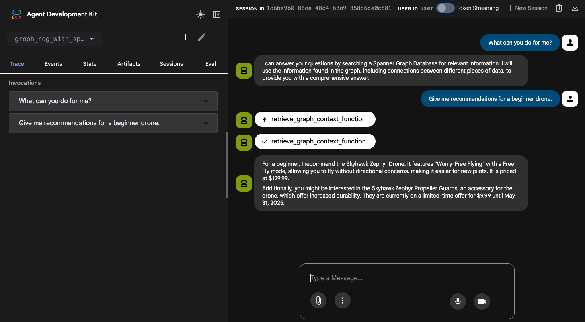

# Agentic Graph RAG Project with Spanner Graph

This project is a sample implementation of an Agentic Graph RAG using the Agent Development Kit (ADK) and the Graph feature of Google Cloud Spanner.

## Project Structure

```
/graph-rag-with-spanner
├── graph_rag_with_spanner/  # ADK Agent directory
│   ├── agent.py
│   ├── prompt.py
│   ├── requirements.txt     # Agent dependencies
│   └── tools.py
├── data_ingestion/          # Data ingestion directory
│   └── ingest.py            # Data ingestion script
│   └── requirements.txt     # Data ingestion script dependencies
├── notebooks/               # Jupyter notebooks for exploration
│   ├── requirements.txt
│   └── spanner_graph_rag.ipynb
└── README.md
```

## Prerequisites

Before you begin, you need to have an active Google Cloud project and a Spanner instance.

### 1. Configure your Google Cloud project

First, you need to authenticate with Google Cloud. Run the following command and follow the instructions to log in.

```bash
gcloud auth application-default login
```

Next, set up your project, enable the necessary APIs, and create a service account with the required permissions.

```bash
# Set your project ID
export PROJECT_ID=$(gcloud config get-value project)

# Enable the required APIs
gcloud services enable \
  spanner.googleapis.com \
  aiplatform.googleapis.com \
  cloudresourcemanager.googleapis.com

# Create a service account for local execution and data ingestion
export SERVICE_ACCOUNT="spanner-graph-rag-sa"
gcloud iam service-accounts create $SERVICE_ACCOUNT \
    --description="Service account for the Spanner Graph RAG sample" \
    --display-name="Spanner Graph RAG SA"

# Grant the required roles to the service account
gcloud projects add-iam-policy-binding $PROJECT_ID \
    --member="serviceAccount:${SERVICE_ACCOUNT}@${PROJECT_ID}.iam.gserviceaccount.com" \
    --role="roles/spanner.databaseUser"

gcloud projects add-iam-policy-binding $PROJECT_ID \
    --member="serviceAccount:${SERVICE_ACCOUNT}@${PROJECT_ID}.iam.gserviceaccount.com" \
    --role="roles/aiplatform.user"
```

### 2. Create a Spanner Instance and Database

Create a Spanner instance and a database using the `gcloud` CLI.

```bash
# Set environment variables
export SPANNER_INSTANCE="your-spanner-instance"
export SPANNER_DATABASE="your-spanner-database"
export SPANNER_REGION="your-spanner-region"

# Create the Spanner instance
gcloud spanner instances create $SPANNER_INSTANCE \
  --config=regional-$SPANNER_REGION \
  --description="Spanner instance for Graph RAG" \
  --nodes=1 \
  --edition=ENTERPRISE

# Create the database
gcloud spanner databases create $SPANNER_DATABASE \
  --instance=$SPANNER_INSTANCE
```

### 3. Grant Agent Engine permissions to Spanner

To allow the deployed Agent Engine to connect to your Spanner instance, you must grant the necessary IAM roles to the Agent Engine's service account.

Run the following commands to grant both roles to the Agent Engine service account:

```bash
export PROJECT_NUMBER=$(gcloud projects describe $PROJECT_ID --format="value(projectNumber)")

# Grant permission to read database metadata
gcloud projects add-iam-policy-binding $PROJECT_ID \
    --member="serviceAccount:service-${PROJECT_NUMBER}@gcp-sa-aiplatform-re.iam.gserviceaccount.com" \
    --role="roles/spanner.databaseReaderWithDataBoost"

# Grant permission to get databases
gcloud projects add-iam-policy-binding $PROJECT_ID \
    --member="serviceAccount:service-${PROJECT_NUMBER}@gcp-sa-aiplatform-re.iam.gserviceaccount.com" \
    --role="roles/spanner.restoreAdmin"
```

The `roles/spanner.restoreAdmin` role is granted to the Agent Engine service account to provide the necessary `spanner.databases.get` permission.

Without this permission, the following error will occur:

```
google.api_core.exceptions.PermissionDenied: 403 Caller is missing IAM permission spanner.databases.get on resource projects/[PROJECT_ID]/instances/[SPANNER_INSTANCE]/databases/[SPANNER_DATABASE].
```

To check the roles assigned to the Agent Engine, run the following command:

```bash
gcloud projects get-iam-policy $(gcloud config get-value project) \
    --flatten="bindings[].members" \
    --format='table(bindings.role)' \
    --filter="bindings.members:service-${PROJECT_NUMBER}@gcp-sa-aiplatform-re.iam.gserviceaccount.com"
```

## Setup

### 1. Install Dependencies

This project uses `uv` to manage the Python virtual environment and package dependencies.

**Create and activate the virtual environment:**
```bash
# Create the virtual environment
uv venv

# Activate the virtual environment (macOS/Linux)
source .venv/bin/activate
# Activate the virtual environment (Windows)
.venv\Scripts\activate
```

**Install dependencies:**
```bash
# Install agent dependencies
uv pip install -r graph_rag_with_spanner/requirements.txt

# Install data ingestion script dependencies
uv pip install -r data_ingestion/requirements.txt
```

### 2. Data Ingestion

Run the `data_ingestion/ingest.py` script to load the documents into Spanner Graph.

First, you need to create a `.env` file for the data ingestion script by copying the example file and filling in the required values.

```bash
cp .env.example .env
# Now, open .env in an editor and modify the values.
```

### 2. Data Ingestion

Run the `data_ingestion/ingest.py` script to load the documents into Spanner Graph.

You can configure the ingestion using command-line arguments. Environment variables defined in `.env` will be used as default values.

**Basic Usage:**
```bash
python data_ingestion/ingest.py
```

**Custom Configuration:**
```bash
python data_ingestion/ingest.py \
  --instance_id="your-spanner-instance" \
  --database_id="your-spanner-database" \
  --graph_name="your-graph-name"
```

**Additional Options:**

*   `--cleanup`: Delete existing graph data before ingestion.
*   `--print-graph`: Print the transformed graph documents before ingestion (useful for debugging).
*   `--llm_model`: Specify the LLM model for graph transformation (default: `gemini-2.5-flash`).
*   `--embedding_model`: Specify the embedding model for node properties (default: `text-embedding-005`).

**Example with all options:**
```bash
python data_ingestion/ingest.py \
  --cleanup \
  --print-graph \
  --llm_model="gemini-2.5-pro" \
  --embedding_model="text-embedding-005"
```

### 3. Run the Agent Locally

Before running the agent, you need to create a `.env` file in the `graph_rag_with_spanner` directory (or use the root `.env` if configured to load from there).

You can run the agent using either the command-line interface or a web-based interface.

#### Using the Command-Line Interface (CLI)

Run the agent in your terminal using the `adk run` command.

```bash
adk run graph_rag_with_spanner
```

#### Using the Web Interface

You can also interact with the agent through a web interface using the `adk web` command.

```bash
adk web
```
**Screenshot:**



## Deployment

The Graph RAG with Spanner agent can be deployed to Vertex AI Agent Engine using the following commands.

### 1. Set Environment Variables

Before running the deployment script, you need to set the following environment variables.

```bash
export GOOGLE_CLOUD_PROJECT=$(gcloud config get-value project)
export GOOGLE_CLOUD_LOCATION="your-gcp-location"
export GOOGLE_CLOUD_STORAGE_BUCKET="your-gcs-bucket-for-staging"
```

### 2. Run the Deployment Command

Deploy the agent using the ADK CLI. You will need to provide a GCS bucket for staging the deployment artifacts.

```bash
adk deploy agent_engine \
  --staging_bucket gs://$GOOGLE_CLOUD_STORAGE_BUCKET \
  --display_name "Graph RAG Agent with Spanner" \
  graph_rag_with_spanner
```

This command packages the agent located in the `graph_rag_with_spanner` directory and deploys it to Vertex AI Agent Engine.

When the deployment finishes, it will print a line like this:
`Successfully created remote agent: projects/<PROJECT_NUMBER>/locations/<LOCATION>/agentEngines/<AGENT_ENGINE_ID>`

Make a note of the `AGENT_ENGINE_ID`.

### 3. Interact with the Deployed Agent

You can interact with your deployed agent using a simple Python script.

**a. Set Environment Variables:**
Ensure the following environment variables are set in your terminal. You will need the `AGENT_ENGINE_ID` from the deployment step.

```bash
export GOOGLE_CLOUD_PROJECT="your-gcp-project-id"
export GOOGLE_CLOUD_LOCATION="your-gcp-location"
export AGENT_ENGINE_ID="your-agent-engine-id"
```

**b. Create and Run the Python Script:**
Create a file named `query_agent.py` and add the following code.

```python
import os
import vertexai
from vertexai import agent_engines

def query_remote_agent(project_id, location, agent_id, user_query):
    """Initializes Vertex AI and sends a query to the deployed agent."""
    vertexai.init(project=project_id, location=location)

    # Load the deployed agent
    remote_agent = agent_engines.get(agent_id)
    remote_session = remote_agent.create_session(user_id="u_123")

    print(f"Querying agent: '{user_query}'...")

    # Stream the query and print the final text response
    try:
        # Stream the query and print the final text response
        for event in remote_agent.stream_query(
            user_id="u_123",
            session_id=remote_session["id"],
            message=user_query
        ):
            if event.get('content', {}).get('parts', [{}])[0].get('text'):
                print("Response:", event['content']['parts'][0]['text'])
    except Exception:
        # Fallback to stream_query if query method is not supported or for streaming
        # This part might need adjustment based on the specific ADK agent implementation details
        # For simplicity, we'll assume the standard query pattern for Agent Engine
        pass

if __name__ == "__main__":
    project = os.getenv("GOOGLE_CLOUD_PROJECT")
    loc = os.getenv("GOOGLE_CLOUD_LOCATION")
    agent = os.getenv("AGENT_ENGINE_ID")
    
    if not all([project, loc, agent]):
        print("Error: GOOGLE_CLOUD_PROJECT, GOOGLE_CLOUD_LOCATION, and AGENT_ENGINE_ID environment variables must be set.")
    else:
        query = "Give me recommendations for a beginner drone"
        query_remote_agent(project, loc, agent, query)
```

**c. Run the script:**
```bash
python query_agent.py
```

## References

- [Build GraphRAG applications using Spanner Graph and LangChain (2025-03-22)](https://cloud.google.com/blog/products/databases/using-spanner-graph-with-langchain-for-graphrag)
- [langchain-google-spanner-python - GitHub](https://github.com/googleapis/langchain-google-spanner-python)
- [Spanner Graph Retrievers Usage (Jupyter Notebook)](https://github.com/googleapis/langchain-google-spanner-python/blob/main/docs/graph_rag.ipynb)
- [Spanner Graph Store Usage (Jupyter Notebook)](https://github.com/googleapis/langchain-google-spanner-python/blob/main/docs/graph_store.ipynb)
- [IAM for Spanner](https://cloud.google.com/spanner/docs/iam)
- [Spanner Graph Notebook](https://github.com/cloudspannerecosystem/spanner-graph-notebook) - Visually query Spanner Graph data in notebooks
- [pydata-google-auth](https://pydata-google-auth.readthedocs.io/en/latest/) - a wrapper to authenticate to Google APIs, such as Google BigQuery
- [Vertex AI Agent Engine](https://docs.cloud.google.com/agent-builder/agent-engine/overview)
- [GraphRAG in Practice: How to Build Cost-Efficient High-Recall Retrieval Systems (2025-12-09)](https://towardsdatascience.com/graphrag-in-practice-how-to-build-cost-efficient-high-recall-retrieval-systems/)
- [Building GraphRAG System Step by Step Approach (2025-12-09)](https://machinelearningmastery.com/building-graph-rag-system-step-by-step-approach/) - Step-by-Step Implementation of GraphRAG with LlamaIndex
- [Enhancing RAG-based applications accuracy by constructing and leveraging knowledge graphs (2025-03-15)](https://blog.langchain.com/enhancing-rag-based-applications-accuracy-by-constructing-and-leveraging-knowledge-graphs/) - A practical guide to constructing and retrieving information from knowledge graphs in RAG applications with Neo4j and LangChain
- [Building knowledge graphs with LLM Graph Transformer (2024-06-26)](https://medium.com/data-science/building-knowledge-graphs-with-llm-graph-transformer-a91045c49b59) - A deep dive into LangChain’s implementation of graph construction with LLMs
