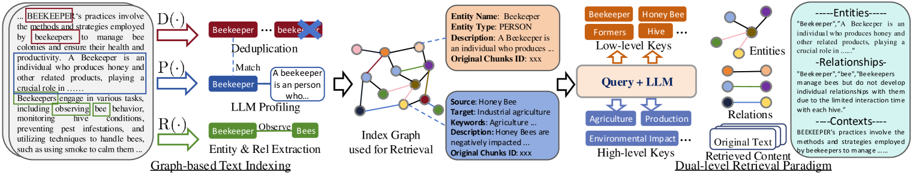
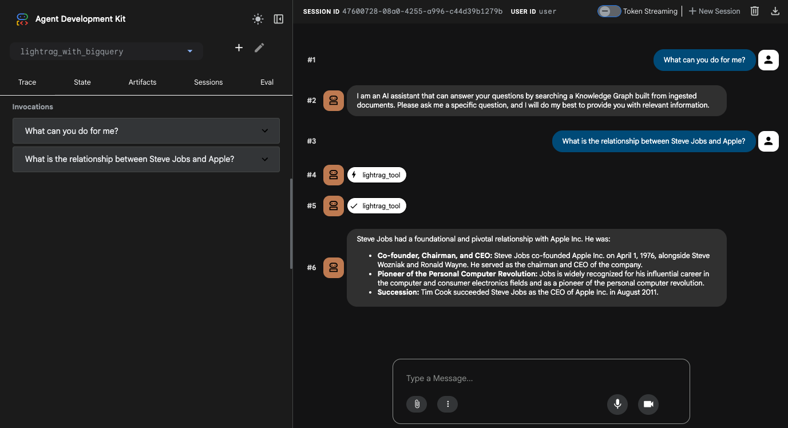
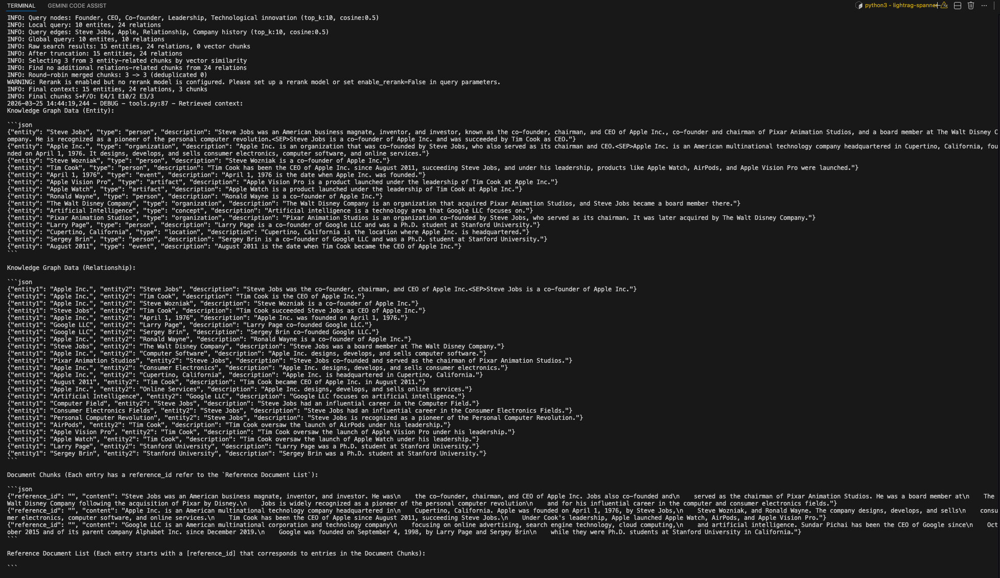
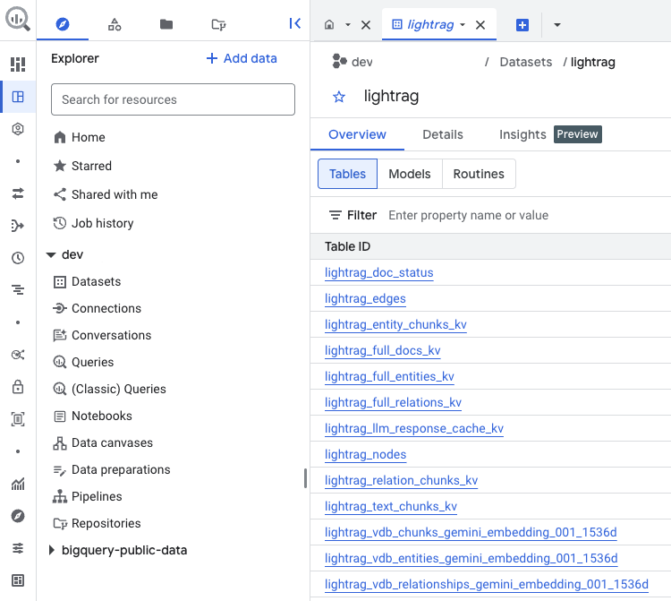

# LightRAG Agent with BigQuery Graph

This project demonstrates how to implement a LightRAG (Light Retrieval Augmented Generation) agent using the Agent Development Kit (ADK) with **Google Cloud BigQuery** as the storage backend.

It leverages the [LightRAG](https://github.com/HKUDS/LightRAG) library with the [lightrag-bigquery](https://github.com/ksmin23/lightrag-bigquery) storage plugin and Gemini models for LLM and embedding.

## Architecture

<table border="0" cellpadding="0" cellspacing="0" style="border: none; border-collapse: collapse;">
  <tr style="border: none;">
    <td valign="middle" align="center" width="70%" style="border: none;">
      <br><br>
      <em>Image Source: <a href="https://arxiv.org/abs/2410.05779">"LightRAG: Simple and Fast Retrieval-Augmented Generation"</a></em>
    </td>
    <td valign="middle" width="30%" style="border: none;">
      <pre>User Query
    |
    v
ADK Agent (Gemini 2.5 Flash)
    |  tool call
    v
lightrag_tool(query)
    |
    v
LightRAG.aquery(only_need_context=True)
    |-- Keyword Extraction (LLM)
    |-- Graph Search (BigQuery Property Graph)
    |-- Vector Search (BigQuery Vector Search)
    +-- Context assembly and return
    |
    v
ADK Agent generates final answer based on context</pre>
      <p><code>QueryParam(only_need_context=True)</code> skips answer generation inside LightRAG, letting the ADK Agent's LLM generate the final answer from the retrieved context.</p>
    </td>
  </tr>
</table>

## How It Works

1. **User sends a query** to the ADK Agent.
2. **Agent calls `lightrag_tool`** with the query.
3. **LightRAG processes the query**:
   - Extracts keywords (high-level & low-level) using LLM.
   - Searches the BigQuery Property Graph (entities, relationships).
   - Searches the BigQuery Vector Store (semantic similarity).
   - Combines results into structured context.
4. **Context is returned** to the Agent (no LLM answer generation inside LightRAG).
5. **Agent generates the final answer** using the retrieved context.

## Project Structure

```
lightrag-with-bigquery/
├── lightrag_with_bigquery/           # ADK Agent directory
│   ├── __init__.py
│   ├── agent.py                     # ADK Agent definition (root_agent)
│   ├── prompt.py                    # Agent system instructions
│   ├── tools.py                     # lightrag_tool - context retrieval via LightRAG
│   └── .env.example                 # Environment variables template
├── data_ingestion/                  # Data ingestion directory
│   └── insert.py                    # Script to ingest documents
├── requirements.txt                 # Project dependencies
└── README.md
```

### Key Files

| File | Description |
|------|-------------|
| `lightrag_with_bigquery/agent.py` | `root_agent` definition using Gemini 2.5 Flash and `lightrag_tool` |
| `lightrag_with_bigquery/tools.py` | `lightrag_tool` function, extracts context from LightRAG |
| `lightrag_with_bigquery/prompt.py` | System instruction guiding the Agent to answer based on tool-retrieved context |
| `data_ingestion/insert.py` | Script to ingest documents into the LightRAG Knowledge Graph |

## Storage Backend

This project uses **Google Cloud BigQuery** for scalable, serverless storage. Tables are automatically created by `lightrag-bigquery` on first use via `initialize_storages()`.

| Component | Backend |
|-----------|---------|
| KV Storage | `BigQueryKVStorage` |
| Vector Storage | `BigQueryVectorStorage` |
| Graph Storage | `BigQueryGraphStorage` |
| Doc Status Storage | `BigQueryDocStatusStorage` |

## Prerequisites

Before you begin, ensure you have the following tools installed:

- [uv](https://github.com/astral-sh/uv) (for Python package management)
- [Google Cloud SDK (gcloud)](https://cloud.google.com/sdk/docs/install)

### 1. Configure your Google Cloud project

First, authenticate with Google Cloud:

```bash
gcloud auth application-default login
```

Next, set up your project and enable the necessary APIs:

```bash
export PROJECT_ID=$(gcloud config get-value project)

gcloud services enable \
  bigquery.googleapis.com \
  aiplatform.googleapis.com
```

### 2. Create a BigQuery Dataset

Create a BigQuery dataset using the `gcloud` CLI.

```bash
# Set environment variables
export BIGQUERY_PROJECT=$PROJECT_ID
export BIGQUERY_DATASET="lightrag"
export BIGQUERY_LOCATION="us-central1"

# Create the BigQuery dataset
bq --location=$BIGQUERY_LOCATION mk \
  --dataset \
  --description="LightRAG Dataset" \
  ${BIGQUERY_PROJECT}:${BIGQUERY_DATASET}
```

### 3. Set Environment Variables

Copy the example file and edit it:

```bash
cp lightrag_with_bigquery/.env.example lightrag_with_bigquery/.env
```

```bash
export GOOGLE_CLOUD_PROJECT="your-project-id"
export GOOGLE_CLOUD_LOCATION="us-central1"
export GOOGLE_GENAI_USE_VERTEXAI="true"
export BIGQUERY_PROJECT="your-project-id"
export BIGQUERY_DATASET="lightrag"
```

## Setup

### 1. Install Dependencies

This project uses `uv` to manage the Python virtual environment and package dependencies.

**Create and activate the virtual environment:**

```bash
# Create the virtual environment
uv venv

# Activate the virtual environment
source .venv/bin/activate
```

**Install dependencies:**

```bash
uv pip install -r requirements.txt
```

### 2. Data Ingestion

First, load the environment variables from the `.env` file:

```bash
source lightrag_with_bigquery/.env
```

Ingest documents into the LightRAG Knowledge Graph.

```bash
# Ingest sample documents (Apple, Steve Jobs, Google)
python data_ingestion/insert.py --sample

# Or ingest your own document
python data_ingestion/insert.py --file your_document.txt
```

### 3. Run the Agent

You can run the agent using either the command-line interface or a web-based interface.

#### Using the Command-Line Interface (CLI)

```bash
adk run lightrag_with_bigquery
```

#### Using the Web Interface

```bash
adk web
```

**Screenshot:**

<table border="0" cellpadding="0" cellspacing="0" style="border: none; border-collapse: collapse;">
  <tr style="border: none;">
    <td style="border: none;" colspan="2" align="center">
      <br>
      Figure 1. LightRAG with Bigquery - ADK Web UI
    </td>
  </tr>
  <tr style="border: none;">
    <td valign="middle" align="center"style="border: none;">
      <br>
      Figure 2. LightRAG with Bigquery - ADK Log
    </td>
    <td valign="middle" align="center" style="border: none;">
      <br>
      Figure 3. LightRAG with Bigquery - Storages
    </td>
  </tr>
</table>

## References

- :octocat: [LightRAG GitHub](https://github.com/HKUDS/LightRAG): Simple and Fast Retrieval-Augmented Generation that incorporates graph structures into text indexing and retrieval processes.
- :octocat: [lightrag-bigquery GitHub](https://github.com/ksmin23/lightrag-bigquery): Google Cloud BigQuery storage backend for LightRAG.
- [Intro to GraphRAG](https://graphrag.com/concepts/intro-to-graphrag/) - A dive into GraphRAG pattern details
- [Google ADK Documentation](https://google.github.io/adk-docs/)
- **BigQuery Graph**
  - [Introduction to BigQuery Graph](https://docs.cloud.google.com/bigquery/docs/graph-overview)
  - [The Practical Guide to BigQuery Graph: Resources, Codelabs, and GQL Examples](https://medium.com/google-cloud/the-practical-guide-to-bigquery-graph-resources-codelabs-and-gql-examples-c88e8ed67a54)
  - [The unified graph solution with Spanner Graph and BigQuery Graph](https://cloud.google.com/blog/products/data-analytics/the-unified-graph-solution-with-spanner-graph-and-bigquery-graph/)
- [Vertex AI Gemini](https://cloud.google.com/vertex-ai/generative-ai/docs/model-reference/gemini)
