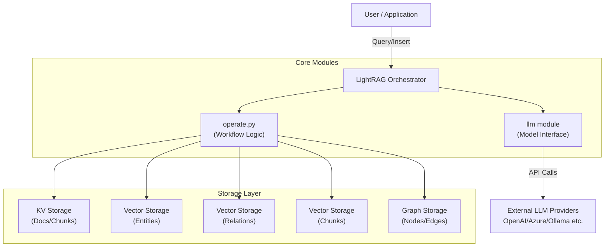
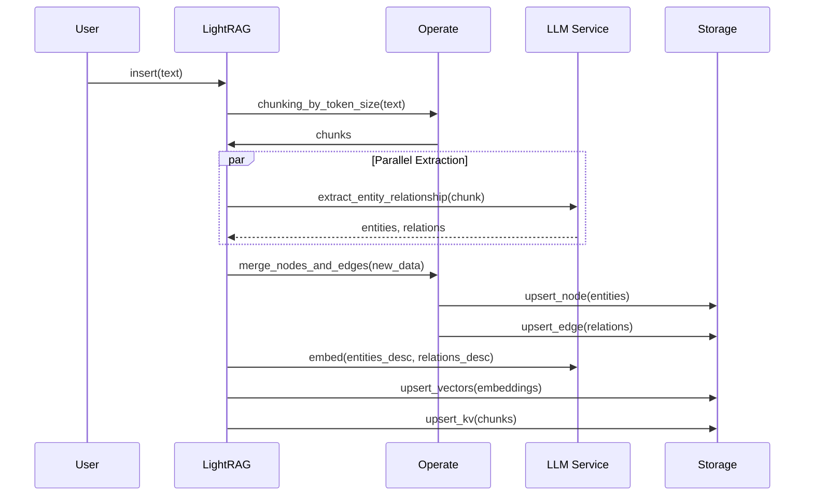
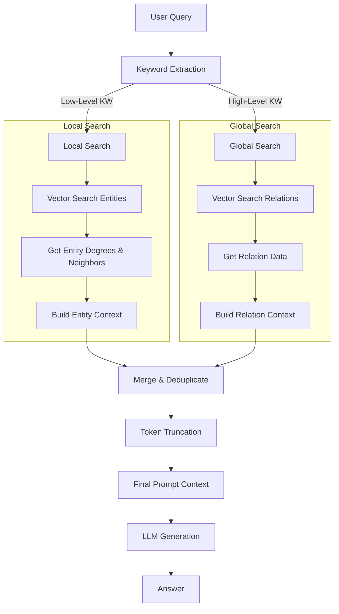
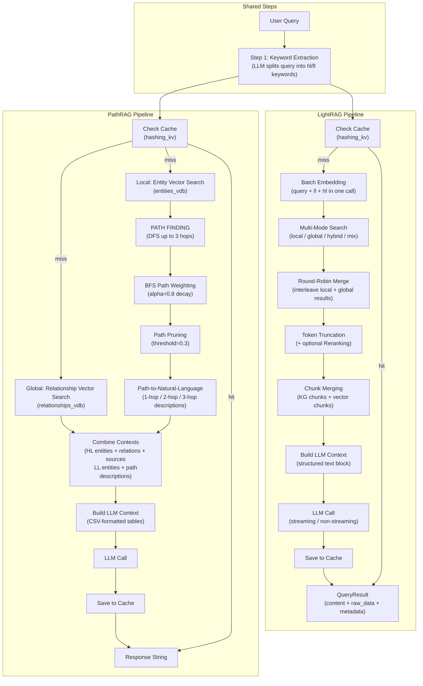
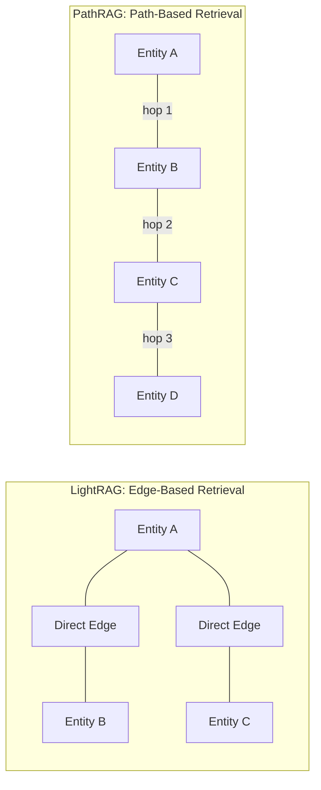
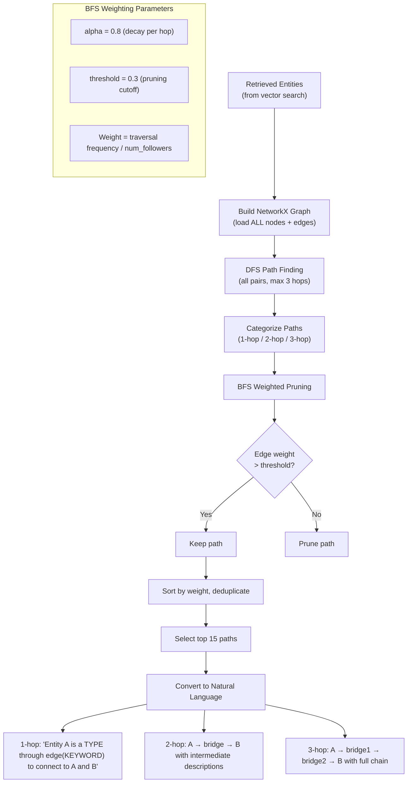

# LightRAG Technical Specification

- **Source Repository:** [HKUDS/LightRAG](https://github.com/HKUDS/LightRAG)
- **Analyzed Commit:** [`c884d7dd`](https://github.com/HKUDS/LightRAG/tree/c884d7dda261d82a92312fdae0028ad9fdde6fc3) (2026-02-09)
- **Initial Document Date:** 2026-02-11
- **Last Updated:** 2026-03-20

## 1. Executive Summary

LightRAG is a specialized Retrieval-Augmented Generation (RAG) framework designed to be simple, fast, and cost-effective. Unlike traditional RAG systems that rely solely on vector similarity, LightRAG integrates **Graph-based** and **Vector-based** retrieval strategies. It builds a Knowledge Graph (KG) from documents to capture complex relationships and entities, enabling "Global" (high-level summary) and "Local" (specific detail) query capabilities. The system is built with an "Async-First" architecture to handle high-throughput ingestion and retrieval.

## 2. System Architecture

### 2.1 High-Level Architecture

The system follows a modular architecture where the **LightRAG** orchestrator coordinates interactions between the user, the LLM service, and four distinct storage backends.



### 2.2 Functionality Breakdown

*   **`LightRAG` (Orchestraator)**: The main entry point. It initializes storage, manages configuration (using `lightrag.py`), and exposes `insert` and `query` methods.
*   **`operate.py` (The Engine)**: Contains the business logic for:
    *   **Chunking**: Splitting text by token size.
    *   **Extraction**: Prompting LLMs to identify Entities and Relationships.
    *   **Retrieval**: Implementing the Logic for Local, Global, and Hybrid search.
    *   **Consolidation**: Merging duplicate entities and updating the graph.
*   **`base.py` (Interfaces)**: Defines abstract base classes (`BaseGraphStorage`, `BaseKVStorage`, `BaseVectorStorage`) to ensure backend agnosticism.
*   **Storage Implementations**:
    *   **Graph**: NetworkX (local), Neo4j, ArangoDB, PostgreSQL (Apache AGE).
    *   **Vector**: NanoVectorDB (local), Milvus, Chroma, Qdrant, PostgreSQL (pgvector).
    *   **KV**: JSON (local), Redis, MongoDB, PostgreSQL.

## 3. Data Model

LightRAG uses a hybrid data model combining structured graph data with unstructured vector embeddings.

### 3.1 Entities & Nodes
*   **Structure**: `{"entity_name": "...", "entity_type": "...", "description": "...", "source_id": "..."}`
*   **Storage**:
    *   **Graph**: Stored as Nodes with properties.
    *   **Vector**: Description + Name embedded for similarity search.

### 3.2 Relationships & Edges
*   **Structure**: `{"src_id": "A", "tgt_id": "B", "keywords": [...], "description": "...", "weight": float}`
*   **Storage**:
    *   **Graph**: Stored as Edges with properties.
    *   **Vector**: Description + Keywords embedded for global (relationship-centric) search.

### 3.3 Documents & Chunks
*   **Document**: Raw input text.
*   **Chunk**: Token-limited segment of a document.
*   **Storage**: KV Store maps `id -> content`. Chunks can also be embedded (Naive RAG).

## 4. Key Workflows

### 4.1 Ingestion Pipeline (Indexing)

The ingestion process transforms raw text into a queryable Knowledge Graph through a multi-step pipeline.



#### Detailed Steps

1.  **Document Deduplication**:
    *   Calculates MD5 hash of input documents.
    *   Skips documents that have already been processed to avoid redundant computation.

2.  **Chunking (`chunking_by_token_size`)**:
    *   Splits documents into manageable segments based on token count (default: 1200 tokens).
    *   Maintains an overlap (default: 100 tokens) to preserve context across boundaries.
    *   Uses `tiktoken` for accurate tokenization.

3.  **Entity & Relationship Extraction**:
    *   **Prompting**: Uses `entity_extraction_system_prompt` to instruct the LLM to identify entities (e.g., Person, Org, Geo) and their relationships.
    *   **Multi-Gleaning**: Optionally performs multiple extraction passes to catch missed entities.
    *   **Structured Parsing**: Converts LLM output (often in specific delimiter-separated formats like `("entity"<|>NAME<|>TYPE<|>DESC)`) into structured objects.

4.  **Graph Construction & Update**:
    *   **Entity Merging**: Combines descriptions for the same entity from different chunks.
    *   **Relationship Merging**: Aggregates weights and combines descriptions for identical edges.
    *   **Storage**: Persists Nodes and Edges to the Graph Storage (e.g., NetworkX, Neo4j, AGE).

5.  **Vector Indexing**:
    *   **Entity Embedding**: Embeds `Name + Description` for entity-centric search.
    *   **Relationship Embedding**: Embeds `Keywords + Description` for relationship-centric (global) search.
    *   **Chunk Embedding**: Embeds raw chunk text for fallback or hybrid retrieval.

### 4.2 Retrieval Pipeline (Query)

LightRAG implements a sophisticated query pipeline that adapts to the nature of the user's question.



#### Query Modes

1.  **Local Query (Entity-Centric)**:
    *   **Goal**: Answer specific questions about details (e.g., "What is the battery life of X?").
    *   **Mechanism**:
        *   Extracts specific entity names (keywords).
        *   Performs Vector Search on the **Entity Index**.
        *   Retrieves 1-hop neighbors from the Knowledge Graph.
        *   Constructs context from Entity Descriptions + Neighbor Relations.

2.  **Global Query (Theme-Centric)**:
    *   **Goal**: Answer broad, summary questions (e.g., "What are the main themes in this dataset?").
    *   **Mechanism**:
        *   Extracts high-level concepts/keywords.
        *   Performs Vector Search on the **Relationship Index**.
        *   Retrieves top-ranked edges (relationships) based on semantic similarity.
        *   Constructs context primarily from Relationship Descriptions.

3.  **Hybrid Query (Best of Both)**:
    *   **Goal**: Provide a comprehensive answer covering both specific details and broad context.
    *   **Mechanism**: Executes both Local and Global strategies, merges the distinct contexts (deduplicating overlapped chunks), and prompts the LLM to synthesize the information.

#### Retrieval Algorithm

1.  **Keyword Extraction**: Uses LLM to separate query into `high_level_keywords` (for global) and `low_level_keywords` (for local).
2.  **Dual Context Retrieval**:
    *   Queries `entities_vdb` with low-level keywords.
    *   Queries `relationships_vdb` with high-level keywords.
3.  **Context Combination & Pruning**:
    *   Merges results from both streams.
    *   **Token Truncation**: Strictly enforces token limits (e.g., 5000 tokens) by prioritizing the most relevant chunks/entities.
4.  **Generation**: Sends the finalized, token-bounded context to the LLM with a specific generation prompt.

### 4.3 Query Processing Deep Dive: `kg_query`

The `kg_query` function (in `operate.py`) is the central entry point for processing a user's natural language query against the knowledge graph. It orchestrates an end-to-end pipeline that transforms raw text into a grounded, context-rich LLM response. Below is a detailed, step-by-step breakdown of this pipeline, including which storage backend is involved at each stage.

#### Step 1: Input Validation and Model Selection

The function begins by checking for an empty query (returning a fail response immediately if so). It then resolves which LLM function to use: if `query_param.model_func` is provided it takes precedence, otherwise the global `llm_model_func` is used with an elevated priority (`_priority=5`) to ensure query-time calls are scheduled ahead of lower-priority background tasks.

**Storage used:** None.

#### Step 2: Keyword Extraction (`get_keywords_from_query`)

Before any retrieval can happen, the query must be decomposed into two classes of keywords:

| Keyword Type | Purpose | Used By |
|---|---|---|
| **High-level (hl_keywords)** | Broad themes, abstract concepts | Global / Hybrid / Mix search |
| **Low-level (ll_keywords)** | Specific entities, concrete details | Local / Hybrid / Mix search |

If keywords are pre-supplied via `query_param`, they are used directly. Otherwise, the function calls `extract_keywords_only`, which prompts the LLM with a keyword-extraction template and parses the structured JSON response. A fallback mechanism exists: when both keyword lists are empty and the query is short (under 50 characters), the raw query text itself is used as a low-level keyword.

**Storage used:** `hashing_kv` (**BaseKVStorage**) — caches keyword extraction results to avoid redundant LLM calls on repeated or similar queries.

#### Step 3: Knowledge Graph Search (`_perform_kg_search`)

This is the core retrieval stage. It operates differently depending on the selected query mode.

##### 3a. Embedding Pre-computation

Before dispatching mode-specific searches, the function batches all required embedding calls into a single request. Depending on the mode, it may embed the raw query, the low-level keywords, and/or the high-level keywords. Batching avoids 2–3 sequential API round-trips and significantly reduces latency.

**Storage used:** Embedding function (external API call).

##### 3b. Mode-Specific Search

| Mode | Search Path | Description |
|---|---|---|
| **local** | `_get_node_data(ll_keywords)` | Finds entities via vector similarity, then traverses their graph neighborhood |
| **global** | `_get_edge_data(hl_keywords)` | Finds relationships via vector similarity, then retrieves associated entities |
| **hybrid** | Both local + global in sequence | Executes both paths and merges results |
| **mix** | hybrid + `_get_vector_context(query)` | Adds a direct vector search over document chunks on top of hybrid |

**Local path (`_get_node_data`):**

1. Queries `entities_vdb` with the low-level keywords to find semantically similar entities.
2. Retrieves full node data and degree counts from `knowledge_graph_inst` via `get_nodes_batch()` and `node_degrees_batch()`.
3. Calls `_find_most_related_edges_from_entities` to discover edges connected to the matched entities via `get_nodes_edges_batch()`, then fetches edge details in batch.

**Global path (`_get_edge_data`):**

1. Queries `relationships_vdb` with the high-level keywords to find semantically similar relationships.
2. Retrieves full edge data and associated source/target entities from `knowledge_graph_inst`.

**Mix path (additional):**

1. Queries `chunks_vdb` with the original query text to retrieve raw document chunks ranked by vector similarity.

**Storage used:**
- `entities_vdb` (**BaseVectorStorage**) — cosine similarity search for entities.
- `relationships_vdb` (**BaseVectorStorage**) — cosine similarity search for relationships.
- `knowledge_graph_inst` (**BaseGraphStorage**) — node/edge data retrieval, degree computation, neighborhood traversal.
- `chunks_vdb` (**BaseVectorStorage**) — direct document chunk retrieval (mix mode only).

##### 3c. Round-Robin Merge

Results from the local and global paths are interleaved in round-robin fashion (one local, one global, alternating) and deduplicated by entity name or relationship key. This ensures balanced representation from both retrieval strategies.

#### Step 4: Token Truncation (`_apply_token_truncation`)

The raw search results typically exceed the LLM's context budget. This stage enforces strict token limits (`max_entity_tokens`, `max_relation_tokens`, `max_total_tokens`) by scoring and ranking the results and discarding lower-priority items. When reranking is enabled (`enable_rerank=True`), a reranker model re-scores the candidates before truncation for improved relevance.

**Storage used:** None (in-memory processing).

#### Step 5: Chunk Merging (`_merge_all_chunks`)

After truncation, the system collects the original text chunks that are linked to the surviving entities and relationships. These are merged with any vector chunks retrieved in mix mode. The merging process deduplicates chunks by ID, tracks provenance (whether a chunk was found via KG traversal or direct vector search), and applies frequency-based scoring.

**Storage used:**
- `text_chunks_db` (**BaseKVStorage**) — resolves chunk IDs to their original text content.
- `knowledge_graph_inst` (**BaseGraphStorage**) — traces entity/relationship source IDs back to chunks.
- `chunks_vdb` (**BaseVectorStorage**) — used during chunk reranking when applicable.

#### Step 6: Context Assembly (`_build_context_str`)

The filtered entities, relationships, and text chunks are formatted into a structured text block that will serve as the LLM's context window. This context is then injected into the `rag_response` prompt template alongside the user's query, response type preferences, and any custom `user_prompt` instructions.

**Storage used:** None (string formatting only).

#### Step 7: Cache Check and LLM Invocation

Before calling the LLM, the function computes a deterministic hash from the query parameters (mode, query text, top_k, token limits, keywords, rerank flag, etc.) and checks the cache. On a cache hit, the stored response is returned immediately without an LLM call. On a cache miss, the LLM is invoked (supporting both streaming and non-streaming modes), and the response is written back to the cache for future reuse.

**Storage used:** `hashing_kv` (**BaseKVStorage**) — query response caching (read and write).

#### Step 8: Response Construction

The final response is wrapped in a `QueryResult` object:

- **Non-streaming**: `QueryResult(content=response_text, raw_data=context_metadata)`
- **Streaming**: `QueryResult(response_iterator=async_iterator, raw_data=context_metadata, is_streaming=True)`

The `raw_data` field carries structured metadata including the retrieved entities, relationships, chunks, keyword breakdowns, and processing statistics (counts before/after truncation, etc.).

Special return modes are also supported:
- `only_need_context=True`: Returns just the assembled context string (no LLM call).
- `only_need_prompt=True`: Returns the full prompt that would be sent to the LLM (no LLM call).

#### Storage Usage Summary

| Storage Instance | Type | Steps Used | Role |
|---|---|---|---|
| `hashing_kv` | BaseKVStorage | 2, 7 | Caches keyword extraction and LLM query responses |
| `entities_vdb` | BaseVectorStorage | 3 | Cosine similarity search for entity discovery |
| `relationships_vdb` | BaseVectorStorage | 3 | Cosine similarity search for relationship discovery |
| `chunks_vdb` | BaseVectorStorage | 3, 5 | Direct document chunk retrieval (mix mode) and chunk reranking |
| `knowledge_graph_inst` | BaseGraphStorage | 3, 5 | Node/edge data, degree computation, neighborhood traversal, source chunk tracing |
| `text_chunks_db` | BaseKVStorage | 5 | Resolves chunk IDs to original text content |

### 4.4 LightRAG vs PathRAG: `kg_query` Pipeline Comparison

LightRAG and PathRAG share a common ancestry but diverge significantly in how they process queries. This section provides a side-by-side comparison of their `kg_query` pipelines, highlighting the architectural differences and the unique path-based retrieval strategy that defines PathRAG.

#### Overall Pipeline Diagram



#### Key Architectural Differences



| Aspect | LightRAG | PathRAG |
|--------|----------|---------|
| **Query Modes** | `local`, `global`, `hybrid`, `mix`, `naive` | `hybrid` only |
| **Cache Timing** | After keyword extraction, before search | Before keyword extraction (early exit) |
| **Embedding Strategy** | Batch pre-computation (query + ll + hl in one API call) | Individual calls per search |
| **Local Retrieval** | Entity vector search → 1-hop neighbor edges | Entity vector search → **multi-hop path finding (1-3 hops)** |
| **Path Finding** | Not used (direct edge retrieval) | DFS to find all paths, BFS-weighted pruning (`alpha=0.8`, `threshold=0.3`) |
| **Relation Context** | Raw edge descriptions (CSV) | **Natural language path descriptions** connecting entities through intermediate nodes |
| **Result Merging** | Round-robin interleave with deduplication | CSV-based `process_combine_contexts` merging |
| **Token Management** | 4-stage pipeline with dedicated truncation step + reranker support | Per-context-type token budgets (`max_token_for_text_unit`, `max_token_for_local_context`, `max_token_for_global_context`) |
| **Chunk Retrieval** | `mix` mode adds direct vector chunk search (`chunks_vdb`) | Source chunks traced from entity/edge `source_id` fields |
| **Return Type** | `QueryResult` object (content + raw_data + streaming support) | Plain string |
| **Streaming** | Supported (returns `AsyncIterator`) | Supported (pass-through from LLM) |

#### Step-by-Step Comparison

##### Step 1: Cache Check

- **LightRAG**: Checks cache *after* keyword extraction (Step 2 completes first). The cache key includes mode, query, response_type, top_k, chunk_top_k, token limits, keywords, and rerank flag — a highly specific hash.
- **PathRAG**: Checks cache *before* keyword extraction (immediate early exit). The cache key is a simpler hash of `(mode, query)` only.

##### Step 2: Keyword Extraction

Both systems use the same LLM-based approach to split the query into `high_level_keywords` and `low_level_keywords`. However:

- **LightRAG**: Supports pre-supplied keywords via `query_param.hl_keywords` / `query_param.ll_keywords`, and caches keyword extraction results separately. Falls back to using the raw query as a keyword when both lists are empty and the query is short.
- **PathRAG**: Always calls the LLM for extraction. Returns a fail response immediately if either keyword list is empty.

##### Step 3: Retrieval (The Core Divergence)

**LightRAG** performs mode-dependent retrieval through `_perform_kg_search`:

```
local  → entities_vdb.query(ll) → get_nodes_batch → get_nodes_edges_batch → get_edges_batch
global → relationships_vdb.query(hl) → get_edges_batch → find related entities
hybrid → local + global in parallel
mix    → hybrid + chunks_vdb.query(raw query)
```

**PathRAG** performs hybrid-only retrieval with an additional path-finding stage:

```
Local path:
  entities_vdb.query(ll) → get_node → node_degree
  → find_paths_and_edges_with_stats (DFS, up to 3 hops)
  → bfs_weighted_paths (frequency-based weighting)
  → prune paths below threshold
  → convert surviving paths to natural language

Global path:
  relationships_vdb.query(hl) → get_edge → edge_degree
  → find related entities → find related text chunks
```

##### Step 4: Context Assembly

- **LightRAG**: Uses a 4-stage architecture (search → truncate → merge chunks → build context). The final context is a structured text block with entities, relations, and chunks sections. Supports reranking at the truncation stage.
- **PathRAG**: Formats context as CSV tables organized into `global-information` (HL entities, HL relations, sources) and `local-information` (LL entities, LL path-based relations) blocks. Token budgets are applied per context type during retrieval, not in a separate truncation stage.

##### Step 5: LLM Invocation

Both systems inject the assembled context into a `rag_response` prompt template and call the LLM. Both apply a post-processing step to strip leaked system prompt fragments from the response. Both support caching the result.

- **LightRAG** additionally supports `conversation_history` for multi-turn conversations, `enable_cot` for chain-of-thought, and returns a structured `QueryResult` with metadata.
- **PathRAG** returns a plain response string.

#### Storage Usage Comparison

| Storage | LightRAG | PathRAG |
|---------|----------|---------|
| `hashing_kv` (BaseKVStorage) | Keyword cache + query response cache | Query response cache only |
| `entities_vdb` (BaseVectorStorage) | Cosine search for entities | Cosine search for entities |
| `relationships_vdb` (BaseVectorStorage) | Cosine search for relationships | Cosine search for relationships |
| `chunks_vdb` (BaseVectorStorage) | Direct chunk retrieval (mix mode) | Not used in query pipeline |
| `knowledge_graph_inst` (BaseGraphStorage) | Batch node/edge retrieval, degree computation | Node/edge retrieval, degree computation, **full graph export for path finding** |
| `text_chunks_db` (BaseKVStorage) | Chunk ID → text resolution | Chunk ID → text resolution (traced from `source_id`) |

#### PathRAG's Path-Finding Algorithm in Detail

The core innovation of PathRAG is the `_find_most_related_edges_from_entities3` function, which replaces LightRAG's direct edge lookup with a multi-hop path discovery process:



This approach enables PathRAG to surface **indirect semantic connections** — information that is multiple relationship hops away from the query entities — which LightRAG's direct edge retrieval would miss. The trade-off is computational cost: path finding is O(n^k) where n is the number of retrieved entities and k is the maximum hop count.

## 5. Core Algorithms & Logic

### 5.1 Retrieval Strategy (`operate.py`)
The `_build_query_context` function orchestrates the 4-stage retrieval:
1.  **Search**: Calls `_perform_kg_search` to get raw entities/relations/chunks.
2.  **Truncate**: Calls `_apply_token_truncation` to fit LLM context windows, prioritizing highly relevant/dense information.
3.  **Merge**: `_merge_all_chunks` combines text chunks associated with the selected entities/relations.
4.  **Build**: `_build_context_str` assembles the final prompt.

### 5.2 Concurrency Control
LightRAG uses `priority_limit_async_func_call` (in `utils.py`) to manage LLM rate limits.
*   It implements a **Priority Queue** to manage request ordering.
*   It includes **Health Checks** to detect and recover from stuck tasks.
*   It wraps execution in robust **Timeout** handling logic.

### 5.3 Caching
*   **LLM Cache**: Responses are cached (hashed by prompt + args) to save costs and reduce latency on repeated queries.
*   **KV Storage**: Used to store the cache, enabling persistence across runs if a persistent KV backend (like Redis/Disk) is used.

## 6. Configuration & Extensibility

*   **Environment Variables**: Heavily used for setup (`OPENAI_API_KEY`, `LIGHTRAG_LOG_DIR`).
*   **Storage Swapping**: Users can mix and match storage backends (e.g., Neo4j for Graph + Milvus for Vector + Redis for KV) by passing different storage class instances to `LightRAG`.
*   **Custom Prompts**: System prompts (in `prompt.py`) can be overridden via `global_config` to tailor extraction/generation styles (e.g., changing the language or detail level).

### 6.1 Tokenizer Customization

While LightRAG defaults to `tiktoken` (OpenAI's tokenizer), it supports custom tokenizers via the `Tokenizer` interface. This is useful when using models with different tokenization schemes, such as Google's Gemini.

To use a custom tokenizer (e.g., for Gemini):
1.  Implement a wrapper class adhering to the `Tokenizer` protocol (must implement `encode` and `decode`).
2.  Pass an instance of this class to the `LightRAG` constructor via the `tokenizer` argument.

```python
import os
from typing import List
from lightrag.utils import Tokenizer
from google import genai

class GeminiTokenizer(Tokenizer):
    def __init__(self, model_name: str = "gemini-2.5-flash"):
        self.model_name = model_name
        self.token_map = {}
        try:
            project_id = os.environ.get("GOOGLE_CLOUD_PROJECT")
            assert project_id is not None
            location = os.environ.get("GOOGLE_CLOUD_LOCATION", "global")
            self.client = genai.Client(vertexai=True, project=project_id, location=location)
        except Exception as e:
            # Fallback or error handling
            print(f"Error initializing Gemini tokenizer: {e}")
            raise

    def encode(self, content: str) -> List[int]:
        # returns the list of token IDs
        response = self.client.models.compute_tokens(
            model=self.model_name,
            contents=content,
        )
        # Store token_ids -> tokens(bytes) mapping for decoding
        if response.tokens_info:
            info = response.tokens_info[0]
            for t_id, t_bytes in zip(info.token_ids, info.tokens):
                self.token_map[t_id] = t_bytes
            return info.token_ids
        return []
    
    def decode(self, tokens: List[int]) -> str:
        # returns the original string using stored token map
        decoded_bytes = b""
        for t_id in tokens:
            if t_id in self.token_map:
                decoded_bytes += self.token_map[t_id]
        return decoded_bytes.decode("utf-8", errors="replace")

# Usage
# rag = LightRAG(..., tokenizer=GeminiTokenizer())
```

#### Analysis: Role of the Tokenizer in LightRAG

The `Tokenizer` in LightRAG is far more than a simple text splitter. It serves as **the core token budget manager** that enforces LLM context window limits while maximizing the density of retrieved knowledge flowing through the pipeline. Its responsibilities fall into four categories:

**1. Token-precise document chunking**

The primary role is splitting source documents into chunks sized by actual token count rather than character count. The `chunking_by_token_size` function in `operate.py` encodes text into a token array via `tokenizer.encode()`, slices the array according to `chunk_token_size` (default: 1200) and `chunk_overlap_token_size`, then decodes each slice back to a string with `tokenizer.decode()`. This guarantees that no chunk exceeds the configured token limit and prevents `ChunkTokenLimitExceededError` from propagating through the pipeline.

**2. Map-reduce control for entity/relation description merging**

During knowledge graph construction, the same entity or relation may be described across multiple document chunks. The `_handle_entity_relation_summary` function in `operate.py` uses `len(tokenizer.encode(desc))` to sum the total tokens across all descriptions and decide the merging strategy: if the total fits within `summary_context_size`, the descriptions are sent to the LLM in a single summarization call; if not, they are partitioned into token-budget-compliant groups (Map), each group is summarized individually, and the intermediate summaries are then re-summarized (Reduce).

**3. Prompt context window and cost optimization**

During RAG retrieval, the tokenizer enforces strict limits on the context data (node descriptions, edge descriptions, text units) injected alongside the user query. Functions such as `truncate_list_by_token_size` in `utils.py` iterate over retrieved items, accumulate their token counts via `tokenizer.encode()`, and truncate the list as soon as the cumulative count exceeds `max_token_size`. This prevents unnecessarily long inputs that would increase both latency and API billing.

**4. Abstraction across LLM providers**

The `TokenizerInterface` protocol (`utils.py`) and its implementations — `TiktokenTokenizer` for OpenAI models and `GeminiTokenizer` (`utils_gemini.py`) for Gemini — allow LightRAG to adapt to different tokenization schemes without changing any pipeline logic.

#### Can TiktokenTokenizer Be Used with Gemini Models?

**Yes — it works, and in practice it is often the preferred choice for performance reasons.** However, vocabulary differences between tiktoken (OpenAI's BPE, `cl100k_base`/`o200k_base`) and Gemini's tokenizer (SentencePiece-based) introduce token count discrepancies that require attention.

**Why TiktokenTokenizer is commonly used even with Gemini**

The main reason is **speed**. The `GeminiTokenizer` implementation in `utils_gemini.py` calls `client.models.compute_tokens` — a network API request — for every `encode()` invocation. When processing large document corpora (hundreds of thousands to millions of characters), these network round-trips dramatically slow down the ingestion pipeline and risk hitting API rate limits. In contrast, `TiktokenTokenizer` runs entirely in local memory as a C/Rust-backed library, making it orders of magnitude faster.

**Risks to be aware of**

The two tokenizers can diverge significantly in token counts for the same input — especially for **non-Latin scripts (e.g., Korean, Japanese, Chinese) and code snippets**, where discrepancies of 20–30% or more are common. This creates two concrete risks:

1. **Embedding model input limit overflow (most critical)**: Gemini LLMs have large context windows (up to 2M tokens), so slightly oversized chunks are harmless for LLM calls. However, embedding models such as `gemini-embedding-001` enforce strict input token limits (e.g., 2048 tokens). If tiktoken estimates a chunk at 2000 tokens but Gemini's tokenizer counts it as 2200, the embedding API call will either fail with a 400 error or silently truncate the text, causing information loss in the vector index.

2. **Billing estimation inaccuracy**: Internal token counts computed by tiktoken will not match the actual token counts reported by Google Cloud billing, making cost monitoring unreliable.

**Recommendation: use TiktokenTokenizer with conservative limits**

To retain the speed advantage of tiktoken while avoiding overflow errors, apply a safety margin by reducing the relevant configuration parameters:

*   **`chunk_token_size`**: Lower from the default 1200 to **800–1000**. This buffer ensures that even if Gemini counts more tokens than tiktoken, chunks remain safely within the embedding model's input limit (2048).
*   **`summary_max_tokens` and `summary_context_size`**: Reduce by approximately **10–20%** from their defaults to prevent oversized summarization prompts.

In summary, **using TiktokenTokenizer with Gemini is a sound strategy for fast indexing — provided that `chunk_token_size` is tuned conservatively** (e.g., 800) to absorb the token count variance, particularly for non-English content. Switch to `GeminiTokenizer` only when exact token-level precision is required and the added network latency is acceptable.

### 6.2 Chunking Customization (`chunking_func`)

LightRAG allows users to override the default text chunking logic (`chunking_by_token_size`) by providing a custom `chunking_func`. This is useful for implementing domain-specific splitting (e.g., paragraph-based, sentence-based, or Markdown-aware chunking).

To use a custom chunking function:
1.  Define a synchronous or asynchronous function that matches the required signature.
2.  Pass this function to the `LightRAG` constructor via the `chunking_func` argument.

#### Synchronous vs Asynchronous Support

The `chunking_func` can be implemented as either a synchronous or an asynchronous function. The LightRAG framework automatically detects the type of the function and handles it appropriately.

- **Synchronous**: If the function is a standard `def`, it is called directly.
- **Asynchronous**: If the function is an `async def`, it is awaited automatically.

This flexibility allows you to perform basic text manipulation synchronously or more complex, IO-bound operations (like calling an external API for splitting) asynchronously.

#### Function Signature

The custom function must accept the following arguments and return a list of dictionaries:

```python
from typing import Any, List, Dict
from lightrag.utils import Tokenizer

def my_custom_chunking(
    tokenizer: Tokenizer,
    content: str,
    split_by_character: str | None = None,
    split_by_character_only: bool = False,
    chunk_overlap_token_size: int = 100,
    chunk_token_size: int = 1200,
) -> List[Dict[str, Any]]:
    # Implementation here...
    return [
        {
            "tokens": token_count, # int
            "content": chunk_text, # str
            "chunk_order_index": index # int
        },
        # ...
    ]
```

#### Example Implementation (Paragraph-based)

```python
def paragraph_chunking(
    tokenizer: Tokenizer,
    content: str,
    split_by_character: str | None = None,
    split_by_character_only: bool = False,
    chunk_overlap_token_size: int = 100,
    chunk_token_size: int = 1200,
) -> List[Dict[str, Any]]:
    """Simple paragraph-based chunker example."""
    chunks = []
    # Simple split by double newline
    paragraphs = content.split("\n\n")
    
    for i, p in enumerate(paragraphs):
        p = p.strip()
        if not p:
            continue
            
        # Calculate tokens using the provided tokenizer
        token_ids = tokenizer.encode(p)
        token_count = len(token_ids)
        
        chunks.append({
            "tokens": token_count,
            "content": p,
            "chunk_order_index": i
        })
    return chunks

# Usage
# rag = LightRAG(..., chunking_func=paragraph_chunking)
```
