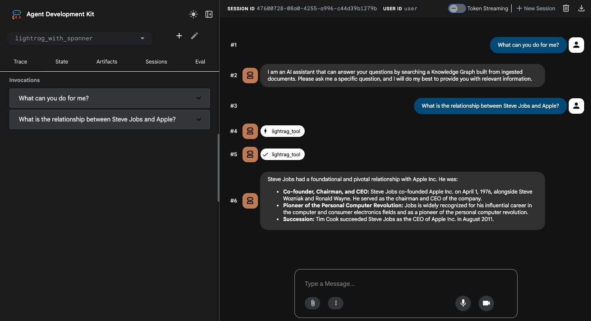

# LightRAG Agent with Spanner Graph

This project demonstrates how to implement a LightRAG (Light Retrieval Augmented Generation) agent using the Agent Development Kit (ADK) with **Google Cloud Spanner** as the storage backend.

It leverages the [LightRAG](https://github.com/HKUDS/LightRAG) library with the [lightrag-spanner](https://github.com/ksmin23/lightrag-spanner) storage plugin and Gemini models for LLM and embedding.

## Architecture

```
User Query
    |
    v
ADK Agent (Gemini 2.5 Flash)
    |  tool call
    v
lightrag_tool(query)
    |
    v
LightRAG.aquery(only_need_context=True)
    |-- Keyword Extraction (LLM)
    |-- Graph Search (Spanner Property Graph)
    |-- Vector Search (Spanner Vector Search)
    +-- Context assembly and return
    |
    v
ADK Agent generates final answer based on context
```

`QueryParam(only_need_context=True)` skips answer generation inside LightRAG, letting the ADK Agent's LLM generate the final answer from the retrieved context.

## How It Works

1. **User sends a query** to the ADK Agent.
2. **Agent calls `lightrag_tool`** with the query.
3. **LightRAG processes the query**:
   - Extracts keywords (high-level & low-level) using LLM.
   - Searches the Spanner Graph (entities, relationships).
   - Searches the Spanner Vector Store (semantic similarity).
   - Combines results into structured context.
4. **Context is returned** to the Agent (no LLM answer generation inside LightRAG).
5. **Agent generates the final answer** using the retrieved context.

## Project Structure

```
lightrag-with-spanner/
├── lightrag_with_spanner/           # ADK Agent directory
│   ├── __init__.py
│   ├── agent.py                     # ADK Agent definition (root_agent)
│   ├── prompt.py                    # Agent system instructions
│   ├── tools.py                     # lightrag_tool - context retrieval via LightRAG
│   └── .env.example                 # Environment variables template
├── data_ingestion/                  # Data ingestion directory
│   └── insert.py                    # Script to ingest documents
├── requirements.txt                 # Project dependencies
└── README.md
```

### Key Files

| File | Description |
|------|-------------|
| `lightrag_with_spanner/agent.py` | `root_agent` definition using Gemini 2.5 Flash and `lightrag_tool` |
| `lightrag_with_spanner/tools.py` | `lightrag_tool` function, extracts context from LightRAG |
| `lightrag_with_spanner/prompt.py` | System instruction guiding the Agent to answer based on tool-retrieved context |
| `data_ingestion/insert.py` | Script to ingest documents into the LightRAG Knowledge Graph |

## Storage Backend

This project uses **Google Cloud Spanner** for production-grade, scalable storage. Tables are automatically created by `lightrag-spanner` on first use via `initialize_storages()`.

| Component | Backend |
|-----------|---------|
| KV Storage | `SpannerKVStorage` |
| Vector Storage | `SpannerVectorStorage` |
| Graph Storage | `SpannerGraphStorage` |
| Doc Status Storage | `SpannerDocStatusStorage` |

## Prerequisites

Before you begin, ensure you have the following tools installed:

- [uv](https://github.com/astral-sh/uv) (for Python package management)
- [Google Cloud SDK (gcloud)](https://cloud.google.com/sdk/docs/install)

### 1. Configure your Google Cloud project

First, authenticate with Google Cloud:

```bash
gcloud auth application-default login
```

Next, set up your project and enable the necessary APIs:

```bash
export PROJECT_ID=$(gcloud config get-value project)

gcloud services enable \
  spanner.googleapis.com \
  aiplatform.googleapis.com
```

### 2. Create a Spanner Instance and Database

Create a Spanner instance and a database using the `gcloud` CLI.

```bash
# Set environment variables
export SPANNER_INSTANCE="lightrag-instance"
export SPANNER_DATABASE="lightrag-db"
export SPANNER_REGION="us-central1"

# Create the Spanner instance
gcloud spanner instances create $SPANNER_INSTANCE \
  --config=regional-$SPANNER_REGION \
  --description="LightRAG Instance" \
  --nodes=1 \
  --edition=ENTERPRISE

# Create the database
gcloud spanner databases create $SPANNER_DATABASE \
  --instance=$SPANNER_INSTANCE
```

### 3. Grant Agent Engine permissions to Spanner

To allow the deployed Agent Engine to connect to your Spanner instance, you must grant the necessary IAM roles to the Agent Engine's service account.

Run the following commands to grant both roles to the Agent Engine service account:

```bash
export PROJECT_NUMBER=$(gcloud projects describe $PROJECT_ID --format="value(projectNumber)")

# Grant permission to read database metadata
gcloud projects add-iam-policy-binding $PROJECT_ID \
    --member="serviceAccount:service-${PROJECT_NUMBER}@gcp-sa-aiplatform-re.iam.gserviceaccount.com" \
    --role="roles/spanner.databaseReaderWithDataBoost"

# Grant permission to get databases
gcloud projects add-iam-policy-binding $PROJECT_ID \
    --member="serviceAccount:service-${PROJECT_NUMBER}@gcp-sa-aiplatform-re.iam.gserviceaccount.com" \
    --role="roles/spanner.restoreAdmin"
```

The `roles/spanner.restoreAdmin` role is granted to the Agent Engine service account to provide the necessary `spanner.databases.get` permission.

### 4. Set Environment Variables

Copy the example file and edit it:

```bash
cp lightrag_with_spanner/.env.example lightrag_with_spanner/.env
```

```bash
export GOOGLE_CLOUD_PROJECT="your-project-id"
export GOOGLE_CLOUD_LOCATION="us-central1"
export GOOGLE_GENAI_USE_VERTEXAI="true"
export SPANNER_INSTANCE="lightrag-instance"
export SPANNER_DATABASE="lightrag-db"
```

## Setup

### 1. Install Dependencies

This project uses `uv` to manage the Python virtual environment and package dependencies.

**Create and activate the virtual environment:**

```bash
# Create the virtual environment
uv venv

# Activate the virtual environment
source .venv/bin/activate
```

**Install dependencies:**

```bash
uv pip install -r requirements.txt
```

### 2. Data Ingestion

First, load the environment variables from the `.env` file:

```bash
source lightrag_with_spanner/.env
```

Ingest documents into the LightRAG Knowledge Graph.

```bash
# Ingest sample documents (Apple, Steve Jobs, Google)
python data_ingestion/insert.py --sample

# Or ingest your own document
python data_ingestion/insert.py --file your_document.txt
```

### 3. Run the Agent

You can run the agent using either the command-line interface or a web-based interface.

#### Using the Command-Line Interface (CLI)

```bash
adk run lightrag_with_spanner
```

#### Using the Web Interface

```bash
adk web
```
**Screenshot:**


## References

- :octocat: [LightRAG GitHub](https://github.com/HKUDS/LightRAG): Simple and Fast Retrieval-Augmented Generation that incorporates graph structures into text indexing and retrieval processes.
- :octocat: [lightrag-spanner GitHub](https://github.com/ksmin23/lightrag-spanner): Google Cloud Spanner storage backend for LightRAG.
- [Intro to GraphRAG](https://graphrag.com/concepts/intro-to-graphrag/) - A dive into GraphRAG pattern details
- [Google ADK Documentation](https://google.github.io/adk-docs/)
- [Google Cloud Spanner Graph](https://cloud.google.com/spanner/docs/graph/overview)
- [Vertex AI Gemini](https://cloud.google.com/vertex-ai/generative-ai/docs/model-reference/gemini)
