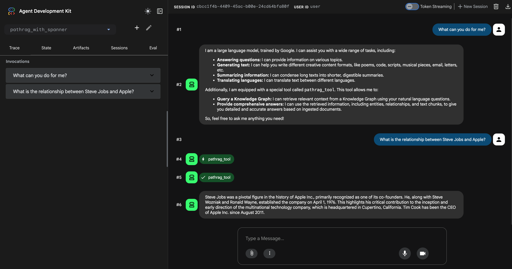

# PathRAG Agent with Spanner Graph

This project demonstrates how to implement a PathRAG (Path-based Retrieval Augmented Generation) agent using the Agent Development Kit (ADK). It supports two storage backends: **Google Cloud Spanner** for production use and **local file-based storage** for quick development and testing.

It leverages the [PathRAG](https://github.com/ksmin23/PathRAG) library with built-in Spanner storage backends and LiteLLM for Gemini model integration.

## Architecture

```
User Query
    |
    v
ADK Agent (Gemini 2.5 Flash)
    |  tool call
    v
pathrag_tool(query)
    |
    v
PathRAG.aquery(only_need_context=True)
    |-- Keyword Extraction (LLM)
    |-- Graph Search (Spanner Property Graph)
    |-- Vector Search (Spanner Vector Search)
    +-- Context assembly and return
    |
    v
ADK Agent generates final answer based on context
```

`QueryParam(only_need_context=True)` skips answer generation inside PathRAG, letting the ADK Agent's LLM generate the final answer from the retrieved context.

## How It Works

1. **User sends a query** to the ADK Agent.
2. **Agent calls `pathrag_tool`** with the query.
3. **PathRAG processes the query**:
   - Extracts keywords (high-level & low-level) using LLM.
   - Searches the Spanner Graph (entities, relationships, paths).
   - Searches the Spanner Vector Store (semantic similarity).
   - Combines results into structured context.
4. **Context is returned** to the Agent (no LLM answer generation inside PathRAG).
5. **Agent generates the final answer** using the retrieved context.

## Project Structure

```
pathrag-with-spanner/
├── pathrag_with_spanner/         # ADK Agent directory
│   ├── __init__.py
│   ├── agent.py                  # ADK Agent definition (root_agent)
│   ├── prompt.py                 # Agent system instructions
│   ├── tools.py                  # pathrag_tool - context retrieval via PathRAG
├── data_ingestion/               # Data ingestion directory
│   └── insert.py                 # Script to ingest documents
├── requirements.txt              # Project dependencies
└── README.md
```

### Key Files

| File | Description |
|------|-------------|
| `pathrag_with_spanner/agent.py` | `root_agent` definition using Gemini 2.5 Flash and `pathrag_tool` |
| `pathrag_with_spanner/tools.py` | `pathrag_tool` function, extracts context from PathRAG |
| `pathrag_with_spanner/prompt.py` | System instruction guiding the Agent to answer based on tool-retrieved context |
| `data_ingestion/insert.py` | Script to ingest documents into the PathRAG Knowledge Graph |

## Storage Backends

The storage backend is selected via the `PATHRAG_STORAGE_TYPE` environment variable.

### Option A: Local file-based storage (`default`)

Uses local files for all storage — no cloud setup required. Ideal for quick development and testing.

| Component | Backend | Storage |
|-----------|---------|---------|
| KV Storage | `JsonKVStorage` | JSON files in `PATHRAG_WORKING_DIR` |
| Vector Storage | `NanoVectorDBStorage` | Local vector DB files |
| Graph Storage | `NetworkXStorage` | NetworkX graph file |

> **Note:** `PATHRAG_WORKING_DIR` is **required** when using local storage, since data is persisted to disk.

### Option B: Google Cloud Spanner (`spanner`)

Uses Cloud Spanner for production-grade, scalable storage. Tables and Property Graph are automatically created by PathRAG's `_ensure_schema()` on first use.

**KV Storage** (`SpannerKVStorage`) — `{namespace}_kv`

| Table | Purpose |
|-------|---------|
| `full_docs_kv` | Full document storage |
| `text_chunks_kv` | Text chunk storage |
| `llm_response_cache_kv` | LLM response caching |

**Vector Storage** (`SpannerVectorDBStorage`) — `vdb_{namespace}`

| Table | Purpose |
|-------|---------|
| `vdb_entities` | Entity embeddings |
| `vdb_relationships` | Relationship embeddings |
| `vdb_chunks` | Chunk embeddings |

**Graph Storage** (`SpannerGraphStorage`) — `{namespace}_nodes`, `{namespace}_edges`

| Table | Purpose |
|-------|---------|
| `chunk_entity_relation_nodes` | Knowledge Graph nodes (entities) |
| `chunk_entity_relation_edges` | Knowledge Graph edges (relationships) |
| `pathrag_chunk_entity_relation` | Spanner Property Graph |

## Prerequisites

Before you begin, ensure you have the following tools installed:

- [uv](https://github.com/astral-sh/uv) (for Python package management)
- [Google Cloud SDK (gcloud)](https://cloud.google.com/sdk/docs/install) — required only for Spanner backend

### 1. Configure your Google Cloud project (Spanner backend only)

First, authenticate with Google Cloud:

```bash
gcloud auth application-default login
```

Next, set up your project and enable the necessary APIs:

```bash
export PROJECT_ID=$(gcloud config get-value project)

gcloud services enable \
  spanner.googleapis.com \
  aiplatform.googleapis.com
```

### 2. Create a Spanner Instance and Database (Spanner backend only)

Create a Spanner instance and a database using the `gcloud` CLI.

```bash
# Set environment variables
export SPANNER_INSTANCE="pathrag-instance"
export SPANNER_DATABASE="pathrag-db"
export SPANNER_REGION="us-central1"

# Create the Spanner instance
gcloud spanner instances create $SPANNER_INSTANCE \
  --config=regional-$SPANNER_REGION \
  --description="PathRAG Instance" \
  --nodes=1 \
  --edition=ENTERPRISE

# Create the database
gcloud spanner databases create $SPANNER_DATABASE \
  --instance=$SPANNER_INSTANCE
```

### 3. Grant Agent Engine permissions to Spanner (Spanner backend only)

To allow the deployed Agent Engine to connect to your Spanner instance, you must grant the necessary IAM roles to the Agent Engine's service account.

Run the following commands to grant both roles to the Agent Engine service account:

```bash
export PROJECT_NUMBER=$(gcloud projects describe $PROJECT_ID --format="value(projectNumber)")

# Grant permission to read database metadata
gcloud projects add-iam-policy-binding $PROJECT_ID \
    --member="serviceAccount:service-${PROJECT_NUMBER}@gcp-sa-aiplatform-re.iam.gserviceaccount.com" \
    --role="roles/spanner.databaseReaderWithDataBoost"

# Grant permission to get databases
gcloud projects add-iam-policy-binding $PROJECT_ID \
    --member="serviceAccount:service-${PROJECT_NUMBER}@gcp-sa-aiplatform-re.iam.gserviceaccount.com" \
    --role="roles/spanner.restoreAdmin"
```

The `roles/spanner.restoreAdmin` role is granted to the Agent Engine service account to provide the necessary `spanner.databases.get` permission.

Without this permission, the following error will occur:

```
google.api_core.exceptions.PermissionDenied: 403 Caller is missing IAM permission spanner.databases.get on resource projects/[PROJECT_ID]/instances/[SPANNER_INSTANCE]/databases/[SPANNER_DATABASE].
```

To check the roles assigned to the Agent Engine, run the following command:

```bash
gcloud projects get-iam-policy $(gcloud config get-value project) \
    --flatten="bindings[].members" \
    --format='table(bindings.role)' \
    --filter="bindings.members:service-${PROJECT_NUMBER}@gcp-sa-aiplatform-re.iam.gserviceaccount.com"
```

### 4. Set Environment Variables

Copy the example file and edit it:

```bash
cp pathrag_with_spanner/.env.example pathrag_with_spanner/.env
```

**For local storage (quick start):**

```bash
export PATHRAG_STORAGE_TYPE=default
export PATHRAG_WORKING_DIR=/path/to/your/pathrag/data
export GEMINI_API_KEY=your-gemini-api-key
```

**For Spanner storage (production):**

```bash
export PATHRAG_STORAGE_TYPE=spanner
export GOOGLE_CLOUD_PROJECT="your-project-id"
export GOOGLE_CLOUD_LOCATION="us-central1"
export GOOGLE_GENAI_USE_VERTEXAI="1"
export GEMINI_API_KEY=your-gemini-api-key
export SPANNER_INSTANCE="pathrag-instance"
export SPANNER_DATABASE="pathrag-db"
```

## Setup

### 1. Install Dependencies

This project uses `uv` to manage the Python virtual environment and package dependencies.

**Create and activate the virtual environment:**

```bash
# Create the virtual environment
uv venv

# Activate the virtual environment
source .venv/bin/activate
```

**Install dependencies:**

```bash
uv pip install -r requirements.txt
```

### 2. Data Ingestion

First, load the environment variables from the `.env` file:

```bash
source pathrag_with_spanner/.env
```

Ingest documents into the PathRAG Knowledge Graph.

```bash
# Ingest sample documents (Apple, Steve Jobs, Google)
python data_ingestion/insert.py --sample

# Or ingest your own document
python data_ingestion/insert.py --file your_document.txt
```

### 3. Run the Agent

You can run the agent using either the command-line interface or a web-based interface.

#### Using the Command-Line Interface (CLI)

```bash
adk run pathrag_with_spanner
```

#### Using the Web Interface

```bash
adk web
```
**Screenshot:**


## References

- :octocat: [PathRAG GitHub](https://github.com/ksmin23/PathRAG): Knowledge Graph-based RAG system that uses path-based retrieval through knowledge graphs for more accurate, explainable, and context-aware LLM responses.
  - [PathRAG Technical Specification](./PathRAG_Technical_Specification.md)
- [Intro to GraphRAG](https://graphrag.com/concepts/intro-to-graphrag/) - A dive into GraphRAG pattern details
- [LightRAG](https://lightrag.github.io/) - Simple and Fast Retrieval-Augmented Generation that incorporates graph structures into text indexing and retrieval processes.
  - :octocat: [LightRAG GitHub](https://github.com/HKUDS/LightRAG/)
- [Google ADK Documentation](https://google.github.io/adk-docs/)
- [Google Cloud Spanner Graph](https://cloud.google.com/spanner/docs/graph/overview)
- [Vertex AI Gemini](https://cloud.google.com/vertex-ai/generative-ai/docs/model-reference/gemini)
