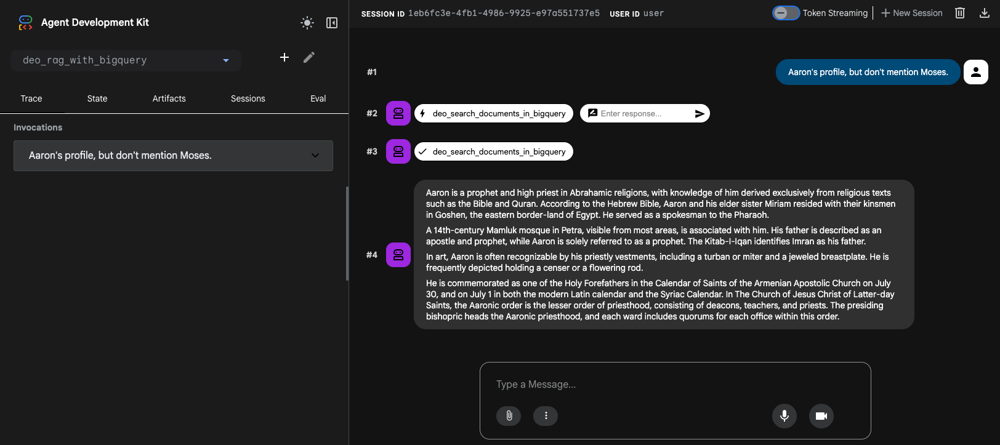
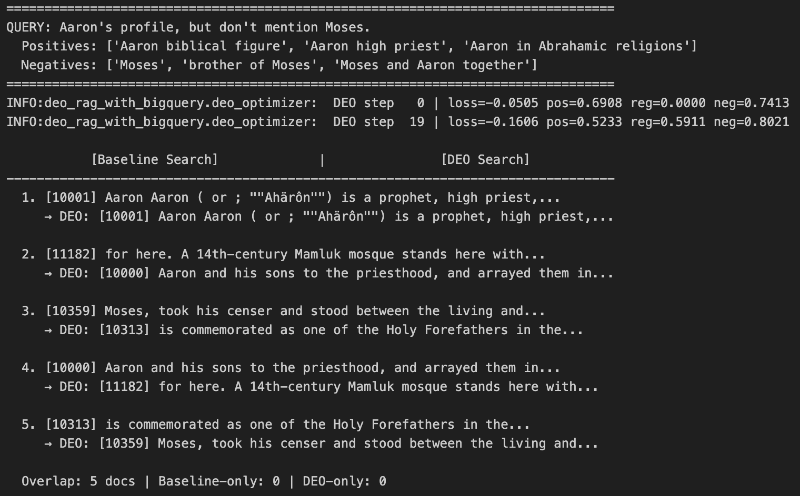

# DEO Negation-Aware RAG with BigQuery

An [ADK (Agent Development Kit)](https://google.github.io/adk-docs/) agent that implements **DEO (Direct Embedding Optimization)** for negation-aware retrieval using **BigQuery** as the vector store.

## Overview

Standard RAG systems struggle with queries containing negation or exclusion intent (e.g., *"Tell me about deep learning image classification, excluding CNN"*). The retrieved documents often include the very content the user wanted to exclude, because embedding models encode semantic similarity regardless of negation.

This agent applies the **DEO** technique ([arXiv:2603.09185](https://arxiv.org/abs/2603.09185)) to solve this problem:

1. **Query Decomposition** — The agent (Gemini) decomposes negation queries into positive and negative sub-queries
2. **Embedding Optimization** — Gradient descent moves the query embedding toward positive intents and away from negative intents
3. **Vector Search** — The optimized embedding searches BigQuery for truly relevant documents

For standard queries without negation, the agent uses conventional vector search.

## Architecture

```
User Query
    │
    ▼
┌──────────────────────────────────────────────────────────┐
│              Root Agent (Gemini 2.5 Flash)               │
│                                                          │
│  1. Analyze query for negation/exclusion signals         │
│  2-A. No negation → search_documents_in_bigquery(query)  │
│  2-B. Negation found → decompose into pos/neg sub-queries│
│       → deo_search_documents_in_bigquery(query, pos, neg)│
│  3. Generate answer from retrieved documents             │
└──────────────────────────────────────────────────────────┘
         │                        │
         ▼                        ▼
┌─────────────────┐    ┌──────────────────────────────┐
│ Standard Search │    │  DEO-Optimized Search        │
│                 │    │                              │
│ BigQuery        │    │  Vertex AI Embeddings        │
│ Vector Search   │    │  → Gradient Optimization     │
│ (text query)    │    │  → BigQuery Vector Search    │
│                 │    │    (optimized vector)        │
└─────────────────┘    └──────────────────────────────┘
```

### DEO Optimization Process

```
L(eu) = λp · mean(||eu - epi||) - λn · mean(||eu - enj||) + λo · ||eu - eo||
              ↑ attraction            ↑ repulsion              ↑ regularization
```

- **Attraction**: Pull query embedding toward positive sub-query embeddings
- **Repulsion**: Push query embedding away from negative sub-query embeddings
- **Regularization**: Prevent excessive drift from the original query meaning

The optimization operates on a single 768-dimensional vector (~16ms for 20 steps on CPU), making it practical for real-time applications.

## Project Structure

```
deo-rag-with-bigquery/
├── data_ingestion/
│   ├── .env.example
│   ├── requirements.txt
│   └── ingest.py                  # Document ingestion into BigQuery
├── deo_rag_with_bigquery/
│   ├── .env.example
│   ├── requirements.txt
│   ├── agent.py                   # ADK agent definition
│   ├── prompt.py                  # Agent instruction with decomposition guide
│   ├── tools.py                   # Standard + DEO search tools
│   └── deo_optimizer.py           # DEO embedding optimization engine
├── notebooks/
│   └── deo_search_evaluation.ipynb # Evaluation notebook
├── source_documents/              # Sample documents
└── README.md
```

## Prerequisites

- Python 3.12+
- Google Cloud project with BigQuery and Vertex AI APIs enabled
- `gcloud` CLI authenticated

## Setup

### 1. Configure environment

```bash
cd deo_rag_with_bigquery
cp .env.example .env
# Edit .env with your GCP project settings
```

### 2. Install dependencies

```bash
pip install -r requirements.txt
```

### 3. Ingest documents into BigQuery

```bash
cd data_ingestion
cp .env.example .env
# Edit .env with your GCP project settings

pip install -r requirements.txt
python ingest.py --mode jsonl --source_dir ../source_documents/beir/nsir
```

### 4. Run the agent

```bash
cd ..
adk web
```

<p align="center">
  
  <br>
  <b>Figure 1: DEO Negation-Aware RAG with BigQuery ADK Web UI</b>
</p>

<p align="center">
  
  <br>
  <b>Figure 2: DEO Search Results Comparison</b>
</p>

## Example Queries

### Standard query (no negation)
> **User**: What is BigQuery?
>
> Agent uses `search_documents_in_bigquery` → standard vector search

### Negation query (DEO applied)
> **User**: Tell me about ADK agents, excluding MCP
>
> Agent decomposes:
> - **positives**: ["ADK agent architecture and components", "agent tools and callbacks in ADK", "ADK agent deployment and lifecycle"]
> - **negatives**: ["MCP", "Model Context Protocol"]
>
> Agent uses `deo_search_documents_in_bigquery` → DEO-optimized vector search → MCP-related documents are pushed down in ranking

## FAQ

### Does DEO modify the original query before computing its embedding?

No. The original query is used **as-is**, even if it contains negation phrases like "excluding CNN" or "without MCP". DEO does not strip, rewrite, or otherwise alter the query text.

Instead, the original query is embedded directly to produce the initial embedding vector (`orig_emb`). This vector serves as the **starting point** for gradient-based optimization. The optimization loop then adjusts the vector by:

- **Pulling** it toward positive sub-query embeddings (attraction)
- **Pushing** it away from negative sub-query embeddings (repulsion)
- **Anchoring** it to the original embedding via consistency regularization (`reg_weight * ||eu - eo||`), so the optimized vector does not drift too far from the original meaning

This design is intentional — the original embedding already captures the overall intent of the query, and the optimization refines it to better reflect the inclusion/exclusion constraints without losing that context.

## References

- **DEO Paper**: [DEO: Training-Free Direct Embedding Optimization for Negation-Aware Retrieval](https://arxiv.org/abs/2603.09185)
    - :octocat: [(GitHub) DEO-negation-aware-retrieval](https://github.com/taegyeong-lee/DEO-negation-aware-retrieval)
- **BigQuery Vector Search**: [BigQuery ML Vector Search](https://cloud.google.com/bigquery/docs/vector-search-intro)
