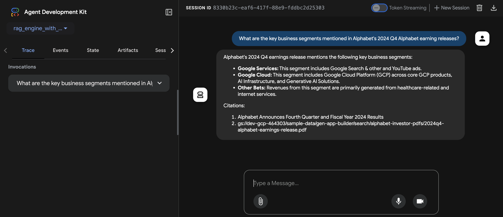

# Agentic RAG with Vertex AI RAG Engine and Managed DB

This project is a sample implementation of an Agentic RAG (Retrieval-Augmented Generation) application using the Google Agent Development Kit (ADK). It leverages the managed **Vertex AI RAG Engine**, which uses its own fully **managed database** for efficient, scalable document retrieval without needing to manage a separate Vector Search index.

## Project Structure

```
/rag-engine-with-managed-db
├── rag_engine_with_managed_db/   # ADK Agent directory
│   ├── .env.example
│   ├── agent.py                 # Core agent logic
│   ├── prompt.py                # Agent's instructional prompt
│   └── requirements.txt         # Agent dependencies
├── data_ingestion/              # Data ingestion scripts
│   ├── .env.example
│   ├── ingest.py                # Creates the RAG Corpus and ingests data
│   └── requirements.txt         # Data ingestion script dependencies
└── README.md
```

## Architecture

This project uses the managed Vertex AI RAG Engine with its built-in managed database to simplify the retrieval process. The architecture works as follows:

1.  **User Query**: A user sends a query to the ADK agent, which is deployed on Vertex AI Agent Engine.
2.  **Context Retrieval**: The agent's `VertexAiRagRetrieval` tool automatically queries the Vertex AI RAG Engine with the user's question.
3.  **Return Context**: The RAG Engine, backed by its powerful managed database, finds the most relevant document chunks and returns them as context.
4.  **Generate Response**: The agent uses the retrieved context to generate a comprehensive and accurate answer for the user.

### Architecture Diagram

```text
+--------------+   (1) Query    +----------------------------+   (2) Retrieve Context  +-------------------------+
|              | -------------> |      ADK Agent             | ----------------------> |   Vertex AI RAG Engine  |
|  User/Client |                |(on Vertex AI Agent Engine) |                         |   (RAG Corpus)          |
|              | <------------- |                            | <---------------------- |                         |
+--------------+  (4) Response  +----------------------------+   (3) Return Context    +-------------------------+
                                                                                                    |
                                                                                                    |
                                                                                                    v
                                                                                    +---------------------------+
                                                                                    | Vertex AI RAG Engine's    |
                                                                                    |    Managed Database       |
                                                                                    +---------------------------+
```

## Prerequisites

Before you begin, you need to have an active Google Cloud project and the `gcloud` CLI installed.

### 1. Configure your Google Cloud project

First, authenticate with Google Cloud. Run the following command and follow the instructions to log in.

```bash
gcloud auth application-default login
```

Next, set up your project and enable the necessary APIs.

```bash
# Set your project ID and location
export PROJECT_ID=$(gcloud config get-value project)
export LOCATION="us-central1" # Or your preferred location

# Enable the required APIs
gcloud services enable \
  aiplatform.googleapis.com \
  cloudresourcemanager.googleapis.com
```

### 2. Grant Agent Engine Permissions

To allow the deployed Agent Engine to access your RAG Corpus, you must grant the `Vertex AI User` role to the Agent Engine's service account.

```bash
# Get your project number
export PROJECT_NUMBER=$(gcloud projects describe $PROJECT_ID --format="value(projectNumber)")

# Grant the Vertex AI User role to the Agent Engine service account
gcloud projects add-iam-policy-binding $PROJECT_ID \
    --member="serviceAccount:service-${PROJECT_NUMBER}@gcp-sa-aiplatform-re.iam.gserviceaccount.com" \
    --role="roles/aiplatform.user"
```

Without this permission, you will encounter a `403 IAM_PERMISSION_DENIED` error when the deployed agent tries to query the RAG Engine.

## Setup and Data Ingestion

The setup process involves preparing your source documents and ingesting them into the RAG Engine.

### 1. Install Dependencies

This project uses `uv` to manage the Python virtual environment and package dependencies.

**Create and activate the virtual environment:**
From the root of the `rag-engine-with-managed-db` directory:
```bash
# Create the virtual environment
uv venv

# Activate the virtual environment (macOS/Linux)
source .venv/bin/activate
# Activate the virtual environment (Windows)
.venv\Scripts\activate
```

**Install dependencies:**
```bash
# Install agent and deployment dependencies
uv pip install -r rag_engine_with_managed_db/requirements.txt
uv pip install "google-cloud-aiplatform[agent_engines,rag]>=1.108.0" absl-py

# Install data ingestion script dependencies
uv pip install -r data_ingestion/requirements.txt
```

### 2. Ingest Your Data into RAG Engine

Now, you will create a RAG Corpus and ingest documents into it.

**Run the data ingestion script:**
The `ingest.py` script can create a new RAG Corpus or add documents to an existing one.

**Scenario 1: Create a new corpus and ingest documents**
This example creates a new corpus using a sample of Alphabet earnings reports from a public GCS bucket.

```bash
# Navigate to the data ingestion directory
cd data_ingestion

# Run the script
python ingest.py \
  --project_id="$PROJECT_ID" \
  --location="$LOCATION" \
  --corpus_display_name="my-adk-rag-corpus" \
  --gcs_source_uri="gs://cloud-samples-data/gen-app-builder/search/alphabet-investor-pdfs"
```
This script will output the new **RAG Corpus resource name**. Save this value for the next step.

**Scenario 2: Ingest documents into an existing corpus**
If you already have a corpus, you can add more documents to it using the `--corpus_name` flag.

```bash
# From the data_ingestion directory
python ingest.py \
  --project_id="$PROJECT_ID" \
  --location="$LOCATION" \
  --corpus_name="projects/your-project-number/locations/your-location/ragCorpora/your-corpus-id" \
  --gcs_source_uri="gs://your-bucket/path/to/new-docs/"
```

**Grant RAG Engine GCS Access (For Your Own Data):**
If you want to use your own documents from a private GCS bucket, you must grant the `Storage Object Viewer` role to the Vertex RAG service account to allow it to read your files.
```bash
# Grant the required role to the RAG Engine service account
gcloud projects add-iam-policy-binding $PROJECT_ID \
    --member="serviceAccount:service-${PROJECT_NUMBER}@gcp-sa-vertex-rag.iam.gserviceaccount.com" \
    --role="roles/storage.objectViewer"
```

### 3. Run the Agent Locally

Before running the agent, create a `.env` file in the `rag_engine_with_managed_db` directory. Copy the example file and fill in the `RAG_CORPUS` resource name from the previous step.

```bash
# Navigate back to the project root
cd ..

# Create the .env file
cp rag_engine_with_managed_db/.env.example rag_engine_with_managed_db/.env

# Now, open rag_engine_with_managed_db/.env in an editor and set the RAG_CORPUS value.
# e.g., RAG_CORPUS="projects/your-project-number/locations/us-central1/ragCorpora/your-corpus-id"
```

You can now run the agent locally using the ADK CLI.

#### Using the Command-Line Interface (CLI)
```bash
adk run rag_engine_with_managed_db
```

#### Using the Web Interface
```bash
adk web
```

**Screenshot:**



## Deployment

The agent can be deployed to a scalable, serverless environment on **Vertex AI Agent Engine**.

### 1. Set Environment Variables

The deployment script uses these environment variables.
```bash
export GOOGLE_CLOUD_PROJECT=$(gcloud config get-value project)
export GOOGLE_CLOUD_LOCATION="your-gcp-location" # e.g., us-central1
export GOOGLE_CLOUD_STORAGE_BUCKET="your-gcs-bucket-for-staging" # A bucket for deployment artifacts
```
*Note: If the staging bucket doesn't exist, it will be created automatically.*

### 2. Run the Deployment Command

Deploy the agent using the ADK CLI. You will need to provide a GCS bucket for staging the deployment artifacts.

```bash
adk deploy agent_engine \
  --staging_bucket gs://$GOOGLE_CLOUD_STORAGE_BUCKET \
  --display_name "RAG Agent with Managed DB" \
  rag_engine_with_managed_db
```

This command packages the agent located in the `rag_engine_with_managed_db` directory and deploys it to Vertex AI Agent Engine.


When the deployment finishes, it will print a line like this:
`Successfully created remote agent: projects/<PROJECT_NUMBER>/locations/<LOCATION>/agentEngines/<AGENT_ENGINE_ID>`

Make a note of the `AGENT_ENGINE_ID`.

### 3. Interact with the Deployed Agent

You can interact with your deployed agent using the provided Python script.

**a. Set Environment Variables:**
Ensure the following environment variables are set. Use the `AGENT_ENGINE_ID` from the deployment step.

```bash
export GOOGLE_CLOUD_PROJECT="your-gcp-project-id"
export GOOGLE_CLOUD_LOCATION="your-gcp-location"
export AGENT_ENGINE_ID="your-agent-engine-id"
```

**b. Create and Run the Python Script:**
Create a file named `query_agent.py` in the project root and add the following code.

```python
import os
import vertexai
from vertexai import agent_engines

def query_remote_agent(project_id, location, agent_id, user_query):
    """Initializes Vertex AI and sends a query to the deployed agent."""
    vertexai.init(project=project_id, location=location)

    # Load the deployed agent
    remote_agent = agent_engines.get(agent_id)
    
    print(f"Querying agent: '{user_query}'...")

    # Stream the query and print the final text response
    response = remote_agent.query(
        message=user_query
    )
    print("Response:", response['output'])

if __name__ == "__main__":
    project = os.getenv("GOOGLE_CLOUD_PROJECT")
    loc = os.getenv("GOOGLE_CLOUD_LOCATION")
    agent = os.getenv("AGENT_ENGINE_ID")
    
    if not all([project, loc, agent]):
        print("Error: GOOGLE_CLOUD_PROJECT, GOOGLE_CLOUD_LOCATION, and AGENT_ENGINE_ID environment variables must be set.")
    else:
        query = "What are the key business segments mentioned in Alphabet's 2024 Q4 Alphabet earning releases?"
        query_remote_agent(project, loc, agent, query)
```

**c. Run the script:**
```bash
python query_agent.py
```

## Clean up

To avoid incurring future charges, delete the cloud resources you created.

```bash
# Delete the Agent Engine
# Note: As of August 2025, there is no adk command to delete an agent engine.
# Please delete it from the Google Cloud Console (Vertex AI > Agent Engine).

# Delete the RAG Corpus
# Note: As of August 2025, there is no gcloud command to delete a RAG corpus.
# Please delete it from the Google Cloud Console (Vertex AI > RAG Management).

# Delete the GCS bucket for staging
gsutil rm -r gs://$GOOGLE_CLOUD_STORAGE_BUCKET
```

## References

- [Vertex AI RAG Engine Documentation](https://cloud.google.com/vertex-ai/docs/generative-ai/rag/overview)
- [Agent Development Kit (ADK) Documentation](https://cloud.google.com/adk/docs)
- [Vector DB choices for RAG Engine](https://cloud.google.com/vertex-ai/generative-ai/docs/rag-engine/vector-db-choices)
- [Use RagManagedDb with RAG Engine](https://cloud.google.com/vertex-ai/generative-ai/docs/rag-engine/use-ragmanageddb-with-rag)
- [Deploying ADK agent with MCP tools on VertexAI Agent Engine](https://github.com/googleapis/python-aiplatform/issues/5372#issuecomment-3181870896)
