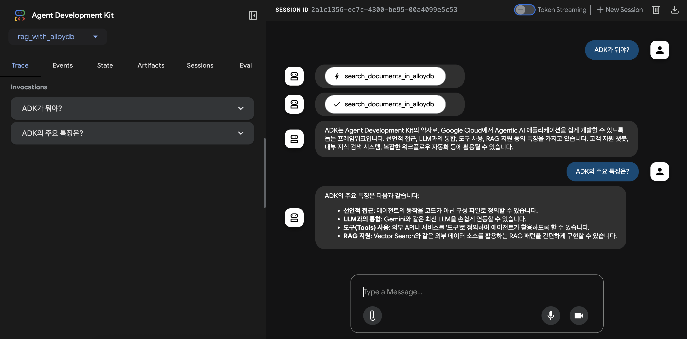

# Agentic RAG Project with AlloyDB Vector Search

This project is a sample implementation of an Agentic RAG using the Agent Development Kit (ADK) and the Vector Search feature of AlloyDB for PostgreSQL.

## Project Structure

```
/rag-with-alloydb
├── rag_with_alloydb/          # ADK Agent directory
│   └── requirements.txt     # Agent dependencies
├── data_ingestion/          # Data ingestion directory
│   └── requirements.txt     # Data ingestion script dependencies
├── source_documents/        # Source documents for RAG
└── README.md
```

## Prerequisites

Before you begin, you need to have an active Google Cloud project and an AlloyDB cluster.

### 1. Configure your Google Cloud project

First, set up your project, enable the necessary APIs, and create a service account with the required permissions.

```bash
# Set your project ID
export PROJECT_ID=$(gcloud config get-value project)

# Enable the required APIs
gcloud services enable \
  alloydb.googleapis.com \
  compute.googleapis.com \
  servicenetworking.googleapis.com \
  aiplatform.googleapis.com \
  cloudresourcemanager.googleapis.com

# Create a service account
export SERVICE_ACCOUNT="alloydb-rag-sa"
gcloud iam service-accounts create $SERVICE_ACCOUNT \
    --description="Service account for the AlloyDB RAG sample" \
    --display-name="AlloyDB RAG SA"

# Grant the required roles to the service account
gcloud projects add-iam-policy-binding $PROJECT_ID \
    --member="serviceAccount:${SERVICE_ACCOUNT}@${PROJECT_ID}.iam.gserviceaccount.com" \
    --role="roles/alloydb.client"

gcloud projects add-iam-policy-binding $PROJECT_ID \
    --member="serviceAccount:${SERVICE_ACCOUNT}@${PROJECT_ID}.iam.gserviceaccount.com" \
    --role="roles/aiplatform.user"
```

### 2. Create an AlloyDB Cluster and primary instance

Create an AlloyDB cluster and a primary instance using the `gcloud` CLI. For simplicity, this guide uses public IP, but for production environments, it is recommended to use a private IP and a VPC network.

Alternatively, you can create the cluster and instance using the Google Cloud Console. Follow the instructions in the [official documentation](https://cloud.google.com/alloydb/docs/ai/perform-vector-search).

```bash
# Set environment variables
export ALLOYDB_REGION="your-alloydb-region"
export ALLOYDB_CLUSTER="your-alloydb-cluster"
export ALLOYDB_INSTANCE="your-alloydb-instance"
export ALLOYDB_PASSWORD="your-db-password"
export PROJECT_NUMBER=$(gcloud projects describe ${PROJECT_ID} --format="value(projectNumber)")
export VPC_NETWORK="your-vpc-network"

# Create the AlloyDB cluster
gcloud alloydb clusters create $ALLOYDB_CLUSTER \
  --region=$ALLOYDB_REGION \
  --password=$ALLOYDB_PASSWORD \
  --network="projects/${PROJECT_NUMBER}/global/networks/${VPC_NETWORK}" \
  --project=$PROJECT_ID

# Create the primary instance
gcloud alloydb instances create $ALLOYDB_INSTANCE \
  --cluster=$ALLOYDB_CLUSTER \
  --region=$ALLOYDB_REGION \
  --instance-type=PRIMARY \
  --cpu-count=8 \
  --database-flags=google_ml_integration.enable_model_support=on,password.enforce_complexity=on \
  --assign-inbound-public-ip=ASSIGN_IPV4

# Note: It may take a few minutes for the cluster and instance to be ready.
```

### 3. Configure the Database

After creating the cluster and instance, connect to your database using AlloyDB Studio in the Google Cloud console to enable the necessary extensions and grant permissions.

1.  Navigate to the **AlloyDB clusters** page in the Google Cloud console.
2.  Find your cluster and click **Connect** under the **Actions** column.
3.  Select **AlloyDB Studio** and sign in with your database user and password.
4.  In the query editor, run the following SQL commands to enable the required extensions:

    ```sql
    CREATE EXTENSION IF NOT EXISTS vector;
    CREATE EXTENSION IF NOT EXISTS google_ml_integration;
    ```

5.  Grant the `EXECUTE` permission on the `embedding` function to your database user. This allows the user to generate embeddings.

    ```sql
    GRANT EXECUTE ON FUNCTION embedding TO postgres;
    ```

> **Note**: This example uses `postgres` as the username because it is the default user created when setting up the database.

### 4. Grant Vertex AI permissions to AlloyDB

To allow AlloyDB to call the Vertex AI embedding models, you must grant the "Vertex AI User" role to the AlloyDB service account.

First, get your project number:
```bash
gcloud projects describe $PROJECT_ID --format='value(projectNumber)'
```

Then, use the project number to grant the role to the AlloyDB service account:
```bash
gcloud projects add-iam-policy-binding $PROJECT_ID \
    --member="serviceAccount:service-${PROJECT_NUMBER}@gcp-sa-alloydb.iam.gserviceaccount.com" \
    --role="roles/aiplatform.user"

gcloud projects add-iam-policy-binding $PROJECT_ID \
    --member="serviceAccount:service-${PROJECT_NUMBER}@gcp-sa-alloydb.iam.gserviceaccount.com" \
    --role="roles/alloydb.serviceAgent"
```

## Setup

### 1. Install Dependencies

This project uses `uv` to manage the Python virtual environment and package dependencies.

**Create and activate the virtual environment:**
```bash
# Create the virtual environment
uv venv

# Activate the virtual environment (macOS/Linux)
source .venv/bin/activate
# Activate the virtual environment (Windows)
.venv\Scripts\activate
```

**Install dependencies:**
```bash
# Install agent dependencies
uv pip install -r rag_with_alloydb/requirements.txt

# Install data ingestion script dependencies
uv pip install -r data_ingestion/requirements.txt
```

### 2. Data Ingestion

Run the `data_ingestion/ingest.py` script to load the documents from `source_documents` into AlloyDB.

First, you need to create a `.env` file for the data ingestion script by copying the example file and filling in the required values.

```bash
cp data_ingestion/.env.example data_ingestion/.env
# Now, open data_ingestion/.env in an editor and modify the values.
```

Once the `.env` file is ready, you can run the data ingestion script with the following command. You can also override the values in the `.env` file using command-line arguments.

**Example:**
```bash
python data_ingestion/ingest.py \
  --database="your-alloydb-database" \
  --table_name="vector_store" \
  --user="your-db-user" \
  --password="your-db-password" \
  --source_dir="source_documents/"
```

### 3. Run the Agent

Before running the agent, you need to create a `.env` file in the `rag_with_alloydb` directory. Copy the example file and fill in the required values for your environment.

```bash
cp rag_with_alloydb/.env.example rag_with_alloydb/.env
# Now, open rag_with_alloydb/.env in an editor and modify the values.
```

You can run the agent using either the command-line interface or a web-based interface.

#### Using the Command-Line Interface (CLI)

Run the agent in your terminal using the `adk run` command.

```bash
adk run rag_with_alloydb
```

**Example Output:**

The example below shows the difference in the agent's responses before and after implementing RAG.

**Without RAG:**

The agent responds based on its general knowledge, which may be incorrect or not specific to the project's context.

```text
$ adk run rag_with_alloydb
Running agent rag_agent, type exit to exit.
[user]: What is ADK?
[rag_agent]: The ADK (Application Development Kit) is a set of APIs and services that allows an app to extend its functionality to the Android environment. It enables developers to integrate the app's features with the user's vehicle, such as starting and stopping the engine, controlling the air conditioning, and accessing vehicle information like tire pressure and fuel level. The ADK provides a secure way for apps to interact with vehicle systems.
[user]: Tell me main features of ADK
[rag_agent]: The ADK (Application Development Kit) offers several key features for developers:

*   **Vehicle Interaction:** It allows apps to interact with various vehicle systems, such as starting/stopping the engine, controlling air conditioning, and accessing vehicle data like tire pressure and fuel level.
*   **Security:** The ADK provides a secure framework for applications to communicate with the vehicle's systems.
*   **API and Services:** It is a collection of APIs and services designed to extend app functionality to the Android environment within a vehicle.
*   **Contextual Information:** It enables apps to leverage the in-vehicle context, enhancing the user experience by integrating vehicle-specific data and controls.
```

**With RAG:**

The agent uses the `search_documents_in_alloydb` tool to retrieve relevant information from the `source_documents` and provides an accurate answer based on that context.

```text
$ adk run rag_with_alloydb
Running agent rag_agent, type exit to exit.
[user]: What is ADK?
[rag_agent]: ADK (Agent Development Kit) is a framework designed to facilitate the development of Agentic AI applications on Google Cloud. It offers features such as declarative agent behavior definition, easy integration with LLMs like Gemini, the ability to define and utilize external APIs or services as 'tools', and support for RAG patterns using external data sources like Vector Search. ADK can be used for applications such as customer support chatbots, internal knowledge retrieval systems, and automating complex workflows.
[user]: Tell me main features of ADK.
[rag_agent]: The main features of ADK include:

*   **Declarative Approach:** Agents' behavior can be defined using configuration files instead of code.
*   **LLM Integration:** It allows for easy linkage with the latest Large Language Models like Gemini.
*   **Tool Usage:** External APIs or services can be defined as 'tools' for the agent to utilize.
*   **RAG Support:** It simplifies the implementation of RAG (Retrieval-Augmented Generation) patterns by leveraging external data sources like Vector Search.
```

#### Using the Web Interface

You can also interact with the agent through a web interface using the `adk web` command.

```bash
adk web rag_with_alloydb
```

**Screenshot:**



## Reference

#### Official Google Cloud Docs
- [Perform a vector search | AlloyDB for PostgreSQL | Google Cloud](https://cloud.google.com/alloydb/docs/ai/perform-vector-search)
- [Run a vector similarity search | AlloyDB for PostgreSQL | Google Cloud](https://cloud.google.com/alloydb/docs/ai/run-vector-similarity-search)
- [Run a hybrid vector similarity search | AlloyDB for PostgreSQL | Google Cloud](https://cloud.google.com/alloydb/docs/ai/run-hybrid-vector-similarity-search)
- [Choose an indexing strategy | AlloyDB for PostgreSQL | Google Cloud](https://cloud.google.com/alloydb/docs/ai/choose-index-strategy)
- [Generate text embeddings](https://cloud.google.com/alloydb/docs/ai/work-with-embeddings?resource=google_ml)

#### Google Codelabs
- [Getting started with Vector Embeddings with AlloyDB AI](https://codelabs.developers.google.com/alloydb-ai-embedding#0)
- [Build a Patent Search App with AlloyDB, Vector Search & Vertex AI!](https://codelabs.developers.com/patent-search-alloydb-gemini#0)
- [Building a Smart Shop Agent with Gemini and AlloyDB Omni | Codelabs | Google for Developers](https://codelabs.developers.google.com/smart-shop-agent-alloydb#0)

#### LangChain Integration
- [Google AlloyDB for PostgreSQL | 🦜️ LangChain](https://python.langchain.com/docs/integrations/vectorstores/google_alloydb/)
