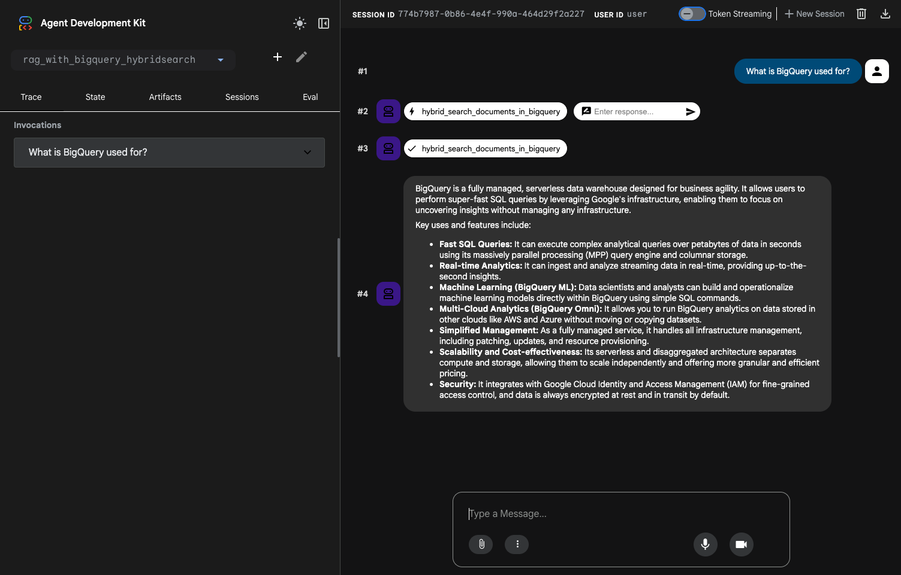

# Agentic RAG Project with BigQuery Hybrid Search

This project is a sample implementation of an Agentic RAG using the Agent Development Kit (ADK) and **BigQuery Hybrid Search** — a single retrieval step that combines BigQuery `VECTOR_SEARCH()` (semantic similarity) with `SEARCH()` (full-text keyword matching).

The hybrid retriever is provided by [langchain-bigquery-hybridsearch](https://github.com/ksmin23/langchain-bigquery-hybridsearch), an extension of `langchain-google-community`'s `BigQueryVectorStore`. The default mode is **Reciprocal Rank Fusion (RRF)**, which runs both searches independently and merges their rankings — keyword matches help with exact terms (e.g. acronyms like `MCP`, product names), while vector matches preserve semantic recall when the user's wording differs from the corpus.

## Project Structure

```
/rag-with-bigquery-hybridsearch
├── rag_with_bigquery_hybridsearch/   # ADK Agent directory
│   └── requirements.txt              # Agent dependencies
├── data_ingestion/                   # Data ingestion directory
│   └── requirements.txt              # Data ingestion script dependencies
├── source_documents/                 # Source documents for RAG
└── README.md
```

## Hybrid Search Modes

The agent's tool exposes two modes via the `hybrid_search_mode` argument:

- **`rrf`** (default) — runs `VECTOR_SEARCH()` and `SEARCH()` independently and merges results with Reciprocal Rank Fusion. A document that ranks high in either retriever surfaces in the final list. Best when you want a balance between semantic similarity and keyword relevance.
- **`pre_filter`** — first narrows candidates with `SEARCH()`, then ranks the survivors by vector distance. Use this when the answer **must** contain specific keywords (e.g. "Find documents that mention `MCP`").

The agent prompt instructs the LLM to extract salient keywords from the user's question and pass them as `text_query` while sending the full natural-language question as `query`.

## Prerequisites

Before you begin, you need to have an active Google Cloud project.

### 1. Configure your Google Cloud project

First, you need to authenticate with Google Cloud. Run the following command and follow the instructions to log in.

```bash
gcloud auth application-default login
```

Next, set up your project, enable the necessary APIs, and create a service account with the required permissions.

```bash
# Set your project ID
export PROJECT_ID=$(gcloud config get-value project)

# Enable the required APIs
gcloud services enable \
  bigquery.googleapis.com \
  aiplatform.googleapis.com \
  cloudresourcemanager.googleapis.com

# Create a service account for local execution and data ingestion
export SERVICE_ACCOUNT="bigquery-hybrid-rag-sa"
gcloud iam service-accounts create $SERVICE_ACCOUNT \
    --description="Service account for the BigQuery Hybrid Search RAG sample" \
    --display-name="BigQuery Hybrid RAG SA"

# Grant the required roles to the service account
gcloud projects add-iam-policy-binding $PROJECT_ID \
    --member="serviceAccount:${SERVICE_ACCOUNT}@${PROJECT_ID}.iam.gserviceaccount.com" \
    --role="roles/bigquery.user"

gcloud projects add-iam-policy-binding $PROJECT_ID \
    --member="serviceAccount:${SERVICE_ACCOUNT}@${PROJECT_ID}.iam.gserviceaccount.com" \
    --role="roles/aiplatform.user"
```

### 2. Create a BigQuery Dataset

Create a BigQuery dataset in your desired location.

```bash
export BIGQUERY_LOCATION="your-bigquery-location" # e.g., US
export BIGQUERY_DATASET="your_bigquery_dataset"

bq --location=$BIGQUERY_LOCATION mk --dataset \
    --description="Dataset for RAG with BigQuery Hybrid Search" \
    $PROJECT_ID:$BIGQUERY_DATASET
```

> **Note**: The first time the agent or the ingestion script initializes `BigQueryHybridSearchVectorStore`, it will automatically create a `SEARCH INDEX` on the table. The very first query may therefore take longer than subsequent ones.

## Setup

### 1. Install Dependencies

This project uses `uv` to manage the Python virtual environment and package dependencies.

**Create and activate the virtual environment:**
```bash
# Create the virtual environment
uv venv

# Activate the virtual environment (macOS/Linux)
source .venv/bin/activate
# Activate the virtual environment (Windows)
.venv\Scripts\activate
```

**Install dependencies:**
```bash
# Install agent dependencies
uv pip install -r rag_with_bigquery_hybridsearch/requirements.txt

# Install data ingestion script dependencies
uv pip install -r data_ingestion/requirements.txt
```

> The `langchain-bigquery-hybridsearch` library is installed directly from GitHub via `git+https://github.com/ksmin23/langchain-bigquery-hybridsearch.git@main`. Make sure the machine running `uv pip install` has network access and `git` available.

### 2. Data Ingestion

Run the `data_ingestion/ingest.py` script to load the documents from `source_documents` into BigQuery.

First, you need to create a `.env` file for the data ingestion script by copying the example file and filling in the required values.

```bash
cp data_ingestion/.env.example data_ingestion/.env
# Now, open data_ingestion/.env in an editor and modify the values.
```

Once the `.env` file is ready, you can run the data ingestion script with the following command. You can also override the values in the `.env` file using command-line arguments.

**Example:**
```bash
python data_ingestion/ingest.py \
  --dataset="your_bigquery_dataset" \
  --table_name="hybrid_store" \
  --source_dir="source_documents/"
```

### 3. Run the Agent Locally

Before running the agent, you need to create a `.env` file in the `rag_with_bigquery_hybridsearch` directory. Copy the example file and fill in the required values for your environment.

```bash
cp rag_with_bigquery_hybridsearch/.env.example rag_with_bigquery_hybridsearch/.env
# Now, open rag_with_bigquery_hybridsearch/.env in an editor and modify the values.
```

You can run the agent using either the command-line interface or a web-based interface.

#### Using the Command-Line Interface (CLI)

Run the agent in your terminal using the `adk run` command.

```bash
adk run rag_with_bigquery_hybridsearch
```

#### Using the Web Interface

You can also interact with the agent through a web interface using the `adk web` command.

```bash
adk web
```

**Screenshot:**



### 4. Try It Out

Suggested prompts to verify each retrieval mode:

| Prompt | Expected behavior |
|---|---|
| `What is BigQuery used for?` | Semantic-leaning question — RRF returns the BigQuery overview chunks even though the keyword "used" is generic. |
| `What is MCP?` | Keyword-leaning question — the agent extracts `text_query="MCP"`, and RRF surfaces the MCP overview document. |
| `Find documents that mention "ADK"` | Agent should switch to `pre_filter` mode so every returned chunk literally contains `ADK`. |
| `What is the population of Mars?` | No relevant context — agent should reply: `I couldn't find the information.` |

## References

- [langchain-bigquery-hybridsearch](https://github.com/ksmin23/langchain-bigquery-hybridsearch)
- [BigQuery `SEARCH()` function](https://cloud.google.com/bigquery/docs/reference/standard-sql/search_functions#search)
- [BigQuery `VECTOR_SEARCH()` function](https://cloud.google.com/bigquery/docs/reference/standard-sql/search_functions#vector_search)
- [BigQuery Search Indexes](https://cloud.google.com/bigquery/docs/search-index)
- [Introduction to vector search | BigQuery | Google Cloud](https://cloud.google.com/bigquery/docs/vector-search-intro)
- [Search embeddings with vector search | BigQuery | Google Cloud](https://cloud.google.com/bigquery/docs/vector-search)
- [Perform semantic search and retrieval-augmented generation](https://cloud.google.com/bigquery/docs/vector-index-text-search-tutorial)
- [Google BigQuery Vector Search | LangChain](https://python.langchain.com/docs/integrations/vectorstores/google_bigquery_vector_search/)
- [BigQuery IAM roles and permissions | Google Cloud](https://cloud.google.com/bigquery/docs/access-control)
