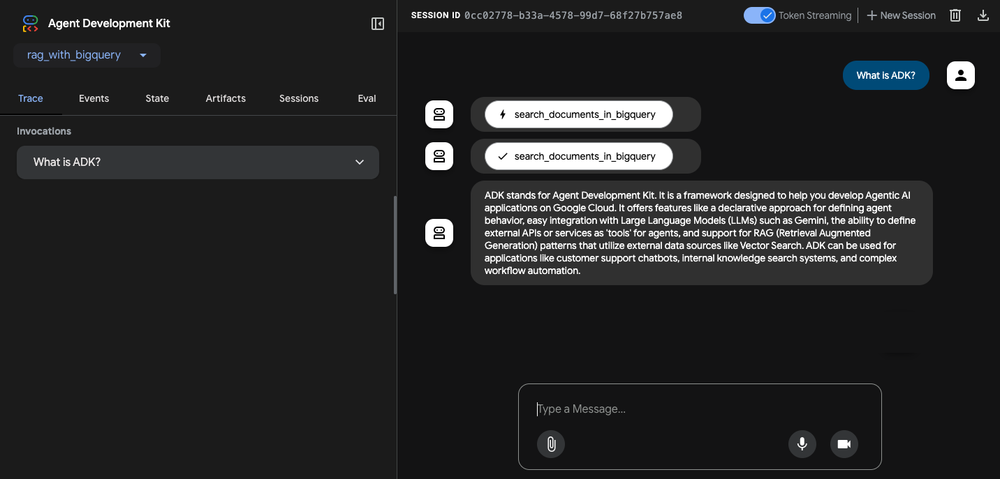

# Agentic RAG Project with BigQuery Vector Search

This project is a sample implementation of an Agentic RAG using the Agent Development Kit (ADK) and BigQuery Vector Search.

## Project Structure

```
/rag-with-bigquery
├── rag_with_bigquery/       # ADK Agent directory
│   └── requirements.txt     # Agent dependencies
├── data_ingestion/          # Data ingestion directory
│   └── requirements.txt     # Data ingestion script dependencies
├── source_documents/        # Source documents for RAG
└── README.md
```

## Prerequisites

Before you begin, you need to have an active Google Cloud project.

### 1. Configure your Google Cloud project

First, you need to authenticate with Google Cloud. Run the following command and follow the instructions to log in.

```bash
gcloud auth application-default login
```

Next, set up your project, enable the necessary APIs, and create a service account with the required permissions.

```bash
# Set your project ID
export PROJECT_ID=$(gcloud config get-value project)

# Enable the required APIs
gcloud services enable \
  bigquery.googleapis.com \
  aiplatform.googleapis.com \
  cloudresourcemanager.googleapis.com

# Create a service account for local execution and data ingestion
export SERVICE_ACCOUNT="bigquery-rag-sa"
gcloud iam service-accounts create $SERVICE_ACCOUNT \
    --description="Service account for the BigQuery RAG sample" \
    --display-name="BigQuery RAG SA"

# Grant the required roles to the service account
gcloud projects add-iam-policy-binding $PROJECT_ID \
    --member="serviceAccount:${SERVICE_ACCOUNT}@${PROJECT_ID}.iam.gserviceaccount.com" \
    --role="roles/bigquery.user"

gcloud projects add-iam-policy-binding $PROJECT_ID \
    --member="serviceAccount:${SERVICE_ACCOUNT}@${PROJECT_ID}.iam.gserviceaccount.com" \
    --role="roles/aiplatform.user"
```

### 2. Create a BigQuery Dataset

Create a BigQuery dataset in your desired location.

```bash
export BIGQUERY_LOCATION="your-bigquery-location" # e.g., US
export BIGQUERY_DATASET="your_bigquery_dataset"

bq --location=$BIGQUERY_LOCATION mk --dataset \
    --description="Dataset for RAG with BigQuery" \
    $PROJECT_ID:$BIGQUERY_DATASET
```

### 3. Grant Agent Engine permissions to BigQuery

To allow the deployed Agent Engine to connect to your BigQuery instance, you must grant the necessary IAM roles to the Agent Engine's service account.

Run the following commands to grant the required roles to the Agent Engine service account:

```bash
export PROJECT_NUMBER=$(gcloud projects describe $PROJECT_ID --format="value(projectNumber)")

# Grant permission to read dataset metadata and create tables
gcloud projects add-iam-policy-binding $PROJECT_ID \
    --member="serviceAccount:service-${PROJECT_NUMBER}@gcp-sa-aiplatform-re.iam.gserviceaccount.com" \
    --role="roles/bigquery.dataEditor"

# Grant permission to run jobs
gcloud projects add-iam-policy-binding $PROJECT_ID \
    --member="serviceAccount:service-${PROJECT_NUMBER}@gcp-sa-aiplatform-re.iam.gserviceaccount.com" \
    --role="roles/bigquery.jobUser"
```

The `roles/bigquery.dataEditor` and `roles/bigquery.jobUser` roles are granted to the Agent Engine service account to provide the necessary permissions to read dataset metadata, create tables, and run queries in BigQuery.

Without this permission, the following errors will occur:

- Permission `bigquery.datasets.get` denied on dataset

    ```
    ERROR:    An error occurred while searching in BigQuery: 403 GET https://bigquery.googleapis.com/bigquery/v2/projects/[PROJECT_ID]/datasets/[BIGQUERY_DATASET]?prettyPrint=false: Access Denied: Dataset [PROJECT_ID]:[BIGQUERY_DATASET]: Permission bigquery.datasets.get denied on dataset [PROJECT_ID]:[BIGQUERY_DATASET] (or it may not exist).
    ```

- Permission `bigquery.tables.create` denied on dataset

    ```
    ERROR:    An error occurred while searching in BigQuery: 403 POST https://bigquery.googleapis.com/bigquery/v2/projects/[PROJECT_ID]/datasets/[BIGQUERY_DATASET]/tables?prettyPrint=false: Access Denied: Dataset [PROJECT_ID]:[BIGQUERY_DATASET]: Permission bigquery.tables.create denied on dataset [PROJECT_ID]:[BIGQUERY_DATASET] (or it may not exist).
    ```

- User does not have `bigquery.jobs.create` permission

    ```
    ERROR:    An error occurred while searching in BigQuery: 403 POST https://bigquery.googleapis.com/bigquery/v2/projects/[PROJECT_ID]/queries?prettyPrint=false: Access Denied: Project [PROJECT_ID]:[BIGQUERY_DATASET]: User does not have bigquery.jobs.create permission in project [PROJECT_ID]:[BIGQUERY_DATASET].
    ```

To check the roles assigned to the Agent Engine, run the following command:

```bash
gcloud projects get-iam-policy $(gcloud config get-value project) \
    --flatten="bindings[].members" \
    --format='table(bindings.role)' \
    --filter="bindings.members:service-${PROJECT_NUMBER}@gcp-sa-aiplatform-re.iam.gserviceaccount.com"
```

## Setup

### 1. Install Dependencies

This project uses `uv` to manage the Python virtual environment and package dependencies.

**Create and activate the virtual environment:**
```bash
# Create the virtual environment
uv venv

# Activate the virtual environment (macOS/Linux)
source .venv/bin/activate
# Activate the virtual environment (Windows)
.venv\Scripts\activate
```

**Install dependencies:**
```bash
# Install agent dependencies
uv pip install -r rag_with_bigquery/requirements.txt

# Install data ingestion script dependencies
uv pip install -r data_ingestion/requirements.txt
```

### 2. Data Ingestion

Run the `data_ingestion/ingest.py` script to load the documents from `source_documents` into BigQuery.

First, you need to create a `.env` file for the data ingestion script by copying the example file and filling in the required values.

```bash
cp data_ingestion/.env.example data_ingestion/.env
# Now, open data_ingestion/.env in an editor and modify the values.
```

Once the `.env` file is ready, you can run the data ingestion script with the following command. You can also override the values in the `.env` file using command-line arguments.

**Example:**
```bash
python data_ingestion/ingest.py \
  --dataset="your_bigquery_dataset" \
  --table_name="vector_store" \
  --source_dir="source_documents/"
```

### 3. Run the Agent Locally

Before running the agent, you need to create a `.env` file in the `rag_with_bigquery` directory. Copy the example file and fill in the required values for your environment.

```bash
cp rag_with_bigquery/.env.example rag_with_bigquery/.env
# Now, open rag_with_bigquery/.env in an editor and modify the values.
```

You can run the agent using either the command-line interface or a web-based interface.

#### Using the Command-Line Interface (CLI)

Run the agent in your terminal using the `adk run` command.

```bash
adk run rag_with_bigquery
```

#### Using the Web Interface

You can also interact with the agent through a web interface using the `adk web` command.

```bash
adk web rag_with_bigquery
```

**Screenshot:**



## Deployment

The RAG with BigQuery agent can be deployed to Vertex AI Agent Engine using the following commands.

### 1. Set Environment Variables

Before running the deployment script, you need to set the following environment variables.

```bash
export GOOGLE_CLOUD_PROJECT=$(gcloud config get-value project)
export GOOGLE_CLOUD_LOCATION="your-gcp-location"
export GOOGLE_CLOUD_STORAGE_BUCKET="your-gcs-bucket-for-staging"
```

### 2. Install Deployment Dependencies

You will need to install `google-cloud-aiplatform` with the `agent_engines` extra.
```bash
uv pip install "google-cloud-aiplatform[agent_engines]>=1.91.0,!=1.92.0" cloudpickle absl-py
```

### 3. Run the Deployment Script

```bash
python3 deployment/deploy.py --create
```

### 4. Interact with the Deployed Agent

You can interact with your deployed agent using a simple Python script. (Instructions are identical to the AlloyDB example).

## References

- [Introduction to vector search | BigQuery | Google Cloud](https://cloud.google.com/bigquery/docs/vector-search-intro)
- [Search embeddings with vector search | BigQuery | Google Cloud](https://cloud.google.com/bigquery/docs/vector-search)
- [Perform semantic search and retrieval-augmented generation ...](https://cloud.google.com/bigquery/docs/vector-index-text-search-tutorial)
- [Explore the bq command-line tool | BigQuery | Google Cloud](https://cloud.google.com/bigquery/docs/bq-command-line-tool)
- [Google BigQuery Vector Search | 🦜️ LangChain](https://python.langchain.com/docs/integrations/vectorstores/google_bigquery_vector_search/)
- [RAG with BigQuery and Langchain in Cloud | Google Cloud Blog](https://cloud.google.com/blog/products/ai-machine-learning/rag-with-bigquery-and-langchain-in-cloud)
- [GitHub: RAG Q&A with BigQuery and Feature Store](https://github.com/GoogleCloudPlatform/generative-ai/blob/main/gemini/use-cases/retrieval-augmented-generation/rag_qna_with_bq_and_featurestore.ipynb)
- [BigQuery IAM roles and permissions | Google Cloud](https://cloud.google.com/bigquery/docs/access-control)
