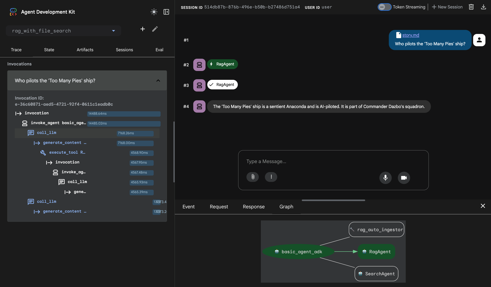
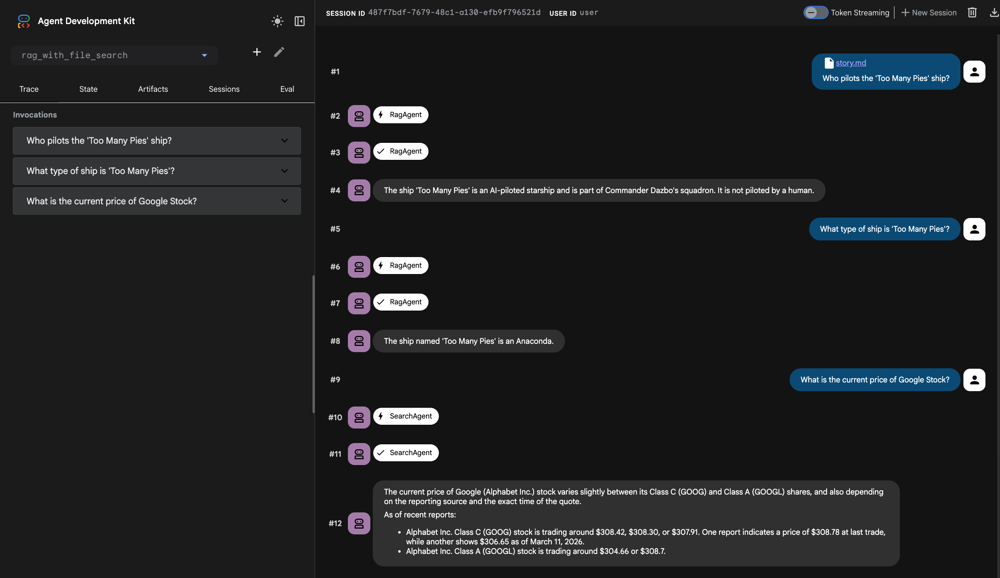

# Agentic RAG with Gemini File Search

This project is a sample implementation of an Agentic RAG using the Agent Development Kit (ADK), leveraging [Gemini File Search](https://ai.google.dev/gemini-api/docs/file-search) as the managed document store.

## Key Features of Gemini File Search

[Gemini File Search](https://ai.google.dev/gemini-api/docs/file-search) is Google's managed RAG solution that allows you to ground Gemini model responses in your own private data without managing a vector database.

- **Automated RAG Pipeline**: Managed ingestion, indexing, and retrieval out-of-the-box.
- **Auto-Ingestion & Patching**: Automatically processes files uploaded via ADK Web UI, including real-time MIME type correction.
- **Multi-User Isolation**: Supports metadata-based filtering (`user_id`, `session_id`) to ensure data privacy between users.
- **Bespoke Documentation Grounding**: Ground model answers in specifically uploaded PDF, TXT, or Markdown documents.
- **Management CLI**: Professional utility for store administration, granular document management, and direct retrieval testing.

## Project Structure

```
rag-with-file-search/
├── rag_with_file_search/       # ADK Agent directory
│   ├── .env.example
│   ├── agent.py                # Agent logic & Middleware
│   └── requirements.txt        # Agent dependencies
├── utils/                      # Helper utilities
│   └── gemini_fs_store_cli.py  # Store Management CLI
├── assets/                     # Screenshots and assets
├── data/                       # Source documents for RAG
└── README.md
```

## Architecture Pattern: Managed File Search with Auto-Ingestion

This architecture focuses on ease of use by delegating the heavy lifting of indexing and retrieval to Gemini's managed infrastructure.

### How It Works

1. **Auto-Ingestion**: The `RagAutoIngestor` middleware detects file uploads from the ADK Web UI.
2. **MIME Patching**: Before indexing, the middleware inspects file headers to fix incorrect or missing MIME types (e.g., from browser transfers).
3. **Managed Indexing**: Files are uploaded and indexed into a named **File Search Store**.
4. **Isolated Retrieval**: Queries are automatically filtered by `user_id` and `session_id` metadata tags.
5. **Grounded Response**: The `FileSearchTool` retrieves relevant context and the model generates a grounded answer.

### Architecture Diagram

```
+--------------+    (1) Query / Upload   +----------------------------+
|              | ----------------------> |        Agentic RAG         |
|  User/Client | <---------------------- |(Cloud Run, Agent Engine...)| 
|              |    (5) Final Result     +----------------------------+
+--------------+                                |            ^
                                  (2) Patch &   |            | (4) Return Grounded
                                      Ingest    v            |     Context
                                     +----------------------------------+
                                     |    Gemini File Search Store      |
                                     |  (Managed Indexing & Retrieval)  |
                                     |  - Metadata Filtering (user_id)  |
                                     |  - Vector Indexing (Auto)        |
                                     +----------------------------------+
```

## Prerequisites

Before you begin, ensure you have an active Google Cloud project or a Gemini API key.

### 1. Configure your environment

You can use either **Vertex AI** (recommended for production) or **AI Studio (API Key)**.

**For Vertex AI:**
```bash
# Authenticate with Google Cloud
gcloud auth application-default login

# Set project ID and location
export GOOGLE_CLOUD_PROJECT=$(gcloud config get-value project)
export GOOGLE_CLOUD_LOCATION="us-central1"

# Enable required APIs
gcloud services enable \
  generativelanguage.googleapis.com \
  aiplatform.googleapis.com
```

## Setup

### 1. Install Dependencies

This project uses `uv` to manage the Python virtual environment.

**Create and activate the virtual environment:**

```bash
# Navigate to the project directory
cd rag-with-file-search

# Create the virtual environment
uv venv

# Activate the virtual environment (macOS/Linux)
source .venv/bin/activate
# Activate the virtual environment (Windows)
.venv\Scripts\activate
```

**Install dependencies:**

```bash
# Install agent dependencies
uv pip install -r rag_with_file_search/requirements.txt
```

### 2. Configure Environment Variables

Create a `.env` file in the `rag_with_file_search/` directory:

```bash
cp rag_with_file_search/.env.example rag_with_file_search/.env
```

Edit `.env` with your configuration:
```env
GEMINI_API_KEY=your-api-key # Optional if using ADC
MODEL=gemini-2.5-flash
STORE_NAME=your-file-search-store-display-name
```

### 3. Create a File Search Store

```bash
# Create a new store using the store name from .env
uv run python utils/gemini_fs_store_cli.py create --store "your-file-search-store-display-name"
```

## Usage

### 1. Run the Agent Locally

**Using the Command-Line Interface (CLI):**

```bash
adk run rag_with_file_search
```

**Using the Web Interface:**

```bash
adk web
```

**Screenshot:**




### 2. Store Management CLI

Use the utility script for administrative tasks:

```bash
# Create a new store
uv run python utils/gemini_fs_store_cli.py create --store "your-file-search-store-display-name"

# List all documents in the store
uv run python utils/gemini_fs_store_cli.py list

# Upload a file manually
uv run python utils/gemini_fs_store_cli.py upload --path data/sample.pdf

# Delete a specific document
uv run python utils/gemini_fs_store_cli.py delete-doc --target "file_id_here"

# Query the store
uv run python utils/gemini_fs_store_cli.py query --query 'Who pilots "Too Many Pies" ship?'
```

## Advanced Patterns

### Metadata Filtering
The agent enforces data isolation by applying filters during retrieval:
`user_id = "{user_id}" AND session_id = "{session_id}"`

### Automatic MIME Patching
To resolve `400 Unsupported MIME type` errors, the built-in `RagAutoIngestor` middleware performs header inspection (magic bytes) to ensure correct MIME types are sent to the Gemini API.

## Deployment

### 1. Set Environment Variables

```bash
export GOOGLE_CLOUD_PROJECT=$(gcloud config get-value project)
export GOOGLE_CLOUD_LOCATION="us-central1"
```

### 2. Deploy the Agent

**Deploy to Cloud Run:**
```bash
adk deploy cloud_run \
  --project=$GOOGLE_CLOUD_PROJECT \
  --region=$GOOGLE_CLOUD_LOCATION \
  rag_with_file_search
```

**Deploy to Agent Engine:**
```bash
adk deploy agent_engine \
  --project=$GOOGLE_CLOUD_PROJECT \
  --region=$GOOGLE_CLOUD_LOCATION \
  --staging_bucket="gs://your-staging-bucket" \
  rag_with_file_search
```

## References

- [Gemini File Search Documentation](https://ai.google.dev/gemini-api/docs/file-search)
- 📓 [Colab: Using Google Gemini File Search Tool for RAG](https://codelabs.developers.google.com/gemini-file-search-for-rag)
- :octocat: [Gemini File Search Demo](https://github.com/derailed-dash/gemini-file-search-demo)
- [Improve gen AI search with Vertex AI embeddings](https://cloud.google.com/blog/products/ai-machine-learning/improve-gen-ai-search-with-vertex-ai-embeddings-and-task-types)
- [Agent Development Kit (ADK) Documentation](https://google.github.io/adk-docs/)
- 📓 [Colab:ADK Agentic Pattern with Memory & MCP - Agent as tool](https://codelabs.developers.google.com/adkcourse/instructions#6)
