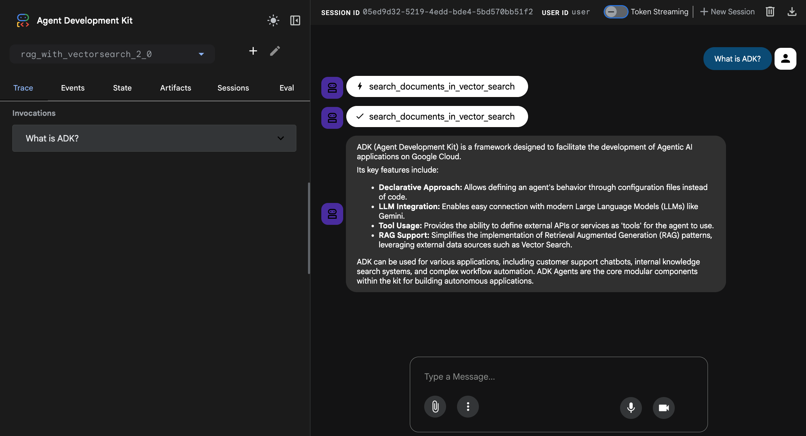

# Agentic RAG with Vertex AI Vector Search 2.0

This project is a sample implementation of an Agentic RAG using the Agent Development Kit (ADK), with **Vertex AI Vector Search 2.0** as the unified vector store.

## Key Features of Vector Search 2.0

Vector Search 2.0 is Google Cloud's fully managed, self-tuning vector database built on Google's [ScaNN (Scalable Nearest Neighbors)](https://github.com/google-research/google-research/tree/master/scann) algorithm.

- **Unified Data Storage**: Store both vector embeddings and user data together (no separate database needed)
- **Auto-Embeddings**: Automatically generate semantic embeddings using Vertex AI embedding models
- **Built-in Full Text Search**: Provides built-in full-text search without needing to generate sparse embeddings
- **Hybrid Search**: Combine semantic and keyword search with intelligent RRF ranking
- **Zero Indexing to Billion-Scale**: Start immediately with kNN, then scale to billions with ANN indexes

## Project Structure

```
rag-with-vectorsearch-2.0/
├── rag_with_vectorsearch_2_0/       # ADK Agent directory
│   ├── .env.example
│   ├── agent.py
│   ├── tools.py                     # Vector Search 2.0 Hybrid Search
│   └── requirements.txt             # Agent dependencies
├── data_ingestion/                  # Collection creation & Ingestion
│   ├── .env.example
│   ├── create_vector_search_collection.py
│   ├── ingest.py
│   └── requirements.txt             # Data ingestion dependencies
├── source_documents/                # Source documents for RAG
└── README.md
```

## Architecture Pattern: Unified Vector Store with Auto-Embeddings

Unlike the traditional pattern that requires a separate document store (e.g., Firestore), Vector Search 2.0 stores both vectors and data together, simplifying the architecture.

### How It Works

1. **Create Collection**: Define data schema and vector schema with auto-embedding configuration
2. **Ingest Data**: Store documents as Data Objects with `data` and empty `vectors` (auto-generated)
3. **Hybrid Search**: Query using both Semantic Search and Text Search combined with RRF
4. **Retrieve Data**: Get results directly from search response (no secondary lookup needed)

### Architecture Diagram

```
+--------------+    (1) Query      +----------------------------+
|              | ----------------> |        Agentic RAG         |
|  User/Client | <---------------- |(Cloud Run, Agent Engine...)| 
|              | (4) Final Result  +----------------------------+
+--------------+                          |            ^
                            (2) Hybrid    |            | (3) Return results
                               Search     v            |     with data
                              +----------------------------------+
                              |   Vertex AI Vector Search 2.0    |
                              |   (Collection with Auto-Embed)   |
                              |   - Semantic Search (Dense)      |
                              |   - Text Search (Keyword)        |
                              |   - RRF Ranking                  |
                              +----------------------------------+
```

## Prerequisites

Before you begin, you need to have an active Google Cloud project.

### 1. Configure your Google Cloud project

First, authenticate with Google Cloud:

```bash
gcloud auth application-default login
```

Set up your project and enable the necessary APIs:

```bash
# Set your project ID and location
export GOOGLE_CLOUD_PROJECT=$(gcloud config get-value project)
export GOOGLE_CLOUD_LOCATION="us-central1"

# Enable the required APIs
gcloud services enable \
  vectorsearch.googleapis.com \
  aiplatform.googleapis.com \
  cloudresourcemanager.googleapis.com
```

### 2. Grant Agent Engine permissions (for deployment)

To allow the deployed Agent Engine to access your Vector Search collection:

```bash
# Get your project number
export PROJECT_NUMBER=$(gcloud projects describe $GOOGLE_CLOUD_PROJECT --format="value(projectNumber)")

# Grant the Vertex AI User role
gcloud projects add-iam-policy-binding $GOOGLE_CLOUD_PROJECT \
    --member="serviceAccount:service-${PROJECT_NUMBER}@gcp-sa-aiplatform-re.iam.gserviceaccount.com" \
    --role="roles/aiplatform.user"

# Grant the Vertex AI Vector Search Viewer role
gcloud projects add-iam-policy-binding $GOOGLE_CLOUD_PROJECT \
    --member="serviceAccount:service-${PROJECT_NUMBER}@gcp-sa-aiplatform-re.iam.gserviceaccount.com" \
    --role="roles/vectorsearch.viewer"
```

## Setup

### 1. Install Dependencies

This project uses `uv` to manage the Python virtual environment.

**Create and activate the virtual environment:**

```bash
# Navigate to the project directory
cd rag-with-vectorsearch-2.0

# Create the virtual environment
uv venv

# Activate the virtual environment (macOS/Linux)
source .venv/bin/activate
# Activate the virtual environment (Windows)
.venv\Scripts\activate
```

**Install dependencies:**

```bash
# Install agent dependencies
uv pip install -r rag_with_vectorsearch_2_0/requirements.txt

# Install data ingestion script dependencies
uv pip install -r data_ingestion/requirements.txt
```

### 2. Create Vector Search Collection (with ANN Index)

Run the collection creation script. This creates a Collection with auto-embedding configuration and an ANN index for production-ready search.

```bash
cd data_ingestion

python create_vector_search_collection.py \
  --project_id=$GOOGLE_CLOUD_PROJECT \
  --location=$GOOGLE_CLOUD_LOCATION \
  --collection_name="rag-collection"
```

**Available options:**
- `--embedding_model`: Embedding model (default: `gemini-embedding-001`)
- `--embedding_dim`: Embedding dimensions (default: `768`)
- `--no-index`: Skip ANN index creation
- `--wait-for-index`: Wait for ANN index creation to complete

> **Note**: Collection creation is immediate, but ANN index creation takes 5-30 minutes.

### 3. Ingest Documents

Run the data ingestion script to load documents from `source_documents/`:

```bash
cd data_ingestion

python ingest.py \
  --project_id=$GOOGLE_CLOUD_PROJECT \
  --location=$GOOGLE_CLOUD_LOCATION \
  --collection_name="rag-collection" \
  --source_dir="../source_documents"
```

This script:
- Loads `.md` and `.txt` files from the source directory
- Splits documents into chunks (1000 chars, 100 overlap)
- Creates Data Objects with auto-generated embeddings

### 4. Run the Agent Locally

Before running the agent, create a `.env` file:

```bash
cp rag_with_vectorsearch_2_0/.env.example rag_with_vectorsearch_2_0/.env
```

Edit the `.env` file with your configuration:
```
GOOGLE_CLOUD_PROJECT=your-project-id
GOOGLE_CLOUD_LOCATION=us-central1
VECTOR_SEARCH_COLLECTION_NAME=rag-collection
```

**Using the Command-Line Interface (CLI):**

```bash
adk run rag_with_vectorsearch_2_0
```

**Using the Web Interface:**

```bash
adk web
```

**Screenshot:**



## Deployment

The RAG agent can be deployed to Vertex AI Agent Engine using the `adk deploy` command.

### 1. Set Environment Variables

```bash
export GOOGLE_CLOUD_PROJECT=$(gcloud config get-value project)
export GOOGLE_CLOUD_LOCATION="us-central1"
```

### 2. Deploy the Agent

```bash
adk deploy cloud_run \
  --project=$GOOGLE_CLOUD_PROJECT \
  --region=$GOOGLE_CLOUD_LOCATION \
  rag_with_vectorsearch_2_0
```

Or deploy to Agent Engine:

```bash
adk deploy agent_engine \
  --project=$GOOGLE_CLOUD_PROJECT \
  --region=$GOOGLE_CLOUD_LOCATION \
  --staging_bucket="gs://your-staging-bucket" \
  rag_with_vectorsearch_2_0
```

When the deployment finishes, it will print a line like this:
```
Successfully created remote agent: projects/<PROJECT_NUMBER>/locations/<PROJECT_LOCATION>/reasoningEngines/<AGENT_ENGINE_ID>
```
Make a note of the `AGENT_ENGINE_ID`. You will need it to interact with your deployed agent.

### Testing the Deployed Agent

Once your agent is deployed, you can use the provided Jupyter notebook to verify its functionality. 

1.  Navigate to the `notebooks/` directory.
2.  Open **[test_vector_search_2_0_agent_on_agent_engine.ipynb](./notebooks/test_vector_search_2_0_agent_on_agent_engine.ipynb)**.
3.  Follow the instructions in the notebook to:
    *   Configure your Project ID and Location.
    *   Connect to the deployed agent using your unique `AGENT_ENGINE_ID`.
    *   Test stateful sessions and real-time streaming queries.

This notebook provides a convenient way to interact with your agent in a stateful manner and serves as a starting point for building your own client applications.

## References

- [Vertex AI Vector Search 2.0 Overview](https://cloud.google.com/vertex-ai/docs/vector-search-2/overview)
    - [Vertex AI Vector Search 2.0 Collections](https://cloud.google.com/vertex-ai/docs/vector-search-2/collections/collections)
    - [Vertex AI Vector Search 2.0 Data Objects](https://cloud.google.com/vertex-ai/docs/vector-search-2/data-objects/data-objects)
    - [Vertex AI Vector Search 2.0 Search](https://cloud.google.com/vertex-ai/docs/vector-search-2/query-search/search)
- 📓 [Introduction to Vertex AI Vector Search 2.0](https://github.com/GoogleCloudPlatform/generative-ai/blob/main/embeddings/vector-search-2-intro.ipynb)
- 📓 [Vertex AI Vector Search 2.0 Public Preview Quickstart](https://github.com/GoogleCloudPlatform/generative-ai/blob/main/embeddings/vector-search-2-quickstart.ipynb)
- [Improve gen AI search with Vertex AI embeddings and task types (2024-10-03)](https://cloud.google.com/blog/products/ai-machine-learning/improve-gen-ai-search-with-vertex-ai-embeddings-and-task-types)
- 📓 [Deploy your first ADK agent on Vertex AI Agent Engine](https://github.com/GoogleCloudPlatform/generative-ai/blob/main/agents/agent_engine/tutorial_deploy_your_first_adk_agent_on_agent_engine.ipynb)
- [Migration from Vertex AI Vector Search 1.0 to 2.0](https://docs.cloud.google.com/vertex-ai/docs/vector-search-2/migration-from-vs-1_0)
- :octocat: [RAG with Vertex AI Vector Search 1.0 and Firestore](../rag-with-vectorsearch-ds/README.md)
- :octocat: [RAG with Vertex AI Vector Search 1.0 and GCS](../rag-with-vectorsearch-gcs/README.md)