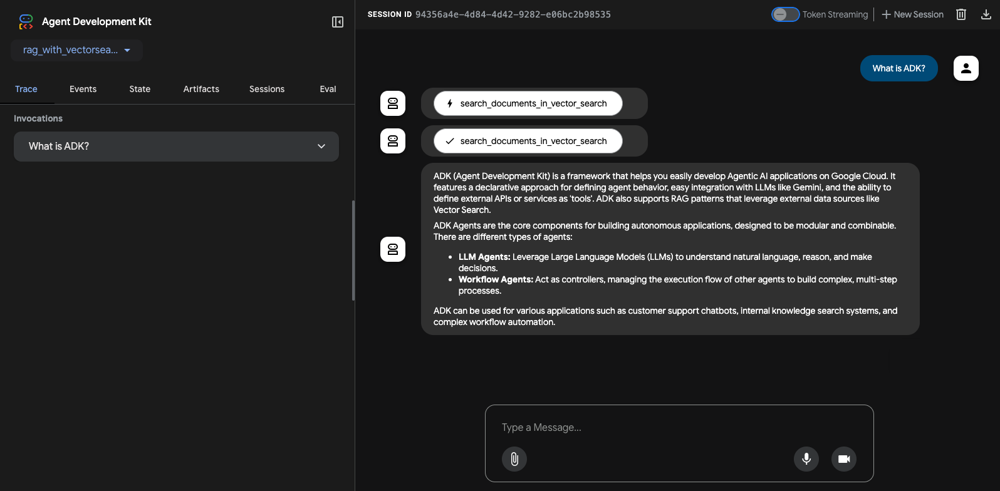

# Agentic RAG Project with Vertex AI Vector Search and GCS

This project is a sample implementation of an Agentic RAG using the Agent Development Kit (ADK), with Vertex AI Vector Search as the vector store and Google Cloud Storage (GCS) as the document store.

## Project Structure

```
/rag-with-vectorsearch-gcs
├── rag_with_vectorsearch_gcs/   # ADK Agent directory
│   ├── .env.example
│   ├── agent.py
│   ├── tools.py
│   └── requirements.txt         # Agent dependencies
├── data_ingestion/              # Data ingestion directory
│   ├── .env.example
│   ├── ingest.py
│   ├── create_vector_search_index.py
│   └── requirements.txt         # Data ingestion script dependencies
├── source_documents/            # Source documents for RAG
└── README.md
```

## Architecture Pattern: Using Vertex AI Vector Search (Specialized Service Architecture)
This pattern is used for handling extremely large-scale vector data (billions of vectors) or when ultra-low latency and advanced filtering capabilities are required. Vertex AI Vector Search is a dedicated, specialized service for large-scale similarity searches.

### How It Works

- **Store Ground Truth Data**: The original data is still stored in Google Cloud Storage (GCS) to ensure data consistency and easy management.
- **Generate Embeddings**: Create vector embeddings of the data using the Vertex AI Embedding API.
- **Build Index**: Upload the generated vector embeddings and their corresponding data IDs to Vertex AI Vector Search to build a dedicated index.
- **Primary Search (Get IDs)**: When a user makes a search request, the application first queries Vertex AI Vector Search to get a list of IDs for the most similar data points.
- **Secondary Lookup (Get Data)**: The application then uses these returned IDs to look up the full, original data from GCS to present to the user.

### Architecture Diagram

```
+--------------+    (1) Query      +----------------------------+  (5) Fetch Data by ID +------------------------+
|              | ----------------> |        Agentic RAG         | --------------------> |  Google Cloud Storage  |
|  User/Client | <---------------- |(Cloud Run, Agent Engine...)| <-------------------- |   (Ground Truth Data)  |
|              | (6) Final Result  +----------------------------+  (5) Return Data      +------------------------+
+--------------+                          |            ^
                            (2) Embedding |            | (4) Return similar data IDs
                                          v            |
                             +------------------+  +---------------------------+
                             |  Vertex AI       |  | Vertex AI Vector Search   |
                             |  Embedding API   |  | (ScaNN-based Index)       |
                             +------------------+  +---------------------------+
```

## Prerequisites

Before you begin, you need to have an active Google Cloud project.

### 1. Configure your Google Cloud project

First, you need to authenticate with Google Cloud. Run the following command and follow the instructions to log in.

```bash
gcloud auth application-default login
```

Next, set up your project and enable the necessary APIs.

```bash
# Set your project ID and location
export PROJECT_ID=$(gcloud config get-value project)
export LOCATION="us-central1" # Or your preferred location

# Enable the required APIs
gcloud services enable \
  aiplatform.googleapis.com \
  cloudresourcemanager.googleapis.com
```

### 2. Create a Vector Search Index and Endpoint

This project provides a script to create the necessary Vector Search index and endpoint.

**Create a Cloud Storage bucket:**
This bucket will be used by Vector Search to store the index data.
Note: If you do not specify a location with the `-l` flag, `gsutil` will use the default location configured for your project.

```bash
export BUCKET_NAME="your-gcs-bucket-for-vector-search"
gsutil mb -p $PROJECT_ID gs://$BUCKET_NAME
```

**Run the index creation script:**
The `create_vector_search_index.py` script automates the creation of both the index and the endpoint. You must provide a name for your index.
Note: This process can take 20-30 minutes to complete.

```bash
# Navigate to the data ingestion directory
cd rag-with-vectorsearch-gcs/data_ingestion

# Run the script
python create_vector_search_index.py --index_name="my-rag-index"
```

The script will output the **Index ID** and **Endpoint ID**. Make sure to save these values, as you will need them for the next steps.

### 3. Grant Agent Engine permissions

To allow the deployed Agent Engine to access your Vector Search index, you must grant the `Vertex AI User` role to the Agent Engine's service account.

Run the following commands to grant the necessary role:

```bash
# Get your project number
export PROJECT_NUMBER=$(gcloud projects describe $PROJECT_ID --format="value(projectNumber)")

# Grant the Vertex AI User role to the Agent Engine service account
gcloud projects add-iam-policy-binding $PROJECT_ID \
    --member="serviceAccount:service-${PROJECT_NUMBER}@gcp-sa-aiplatform-re.iam.gserviceaccount.com" \
    --role="roles/aiplatform.user"
```

Without this permission, you will encounter a `403 IAM_PERMISSION_DENIED` error when the deployed agent tries to query the Vector Search index.

## Setup

### 1. Install Dependencies

This project uses `uv` to manage the Python virtual environment and package dependencies.

**Create and activate the virtual environment:**
From the root of the `rag-with-vectorsearch-gcs` directory:
```bash
# Create the virtual environment
uv venv

# Activate the virtual environment (macOS/Linux)
source .venv/bin/activate
# Activate the virtual environment (Windows)
.venv\Scripts\activate
```

**Install dependencies:**
```bash
# Install agent dependencies
uv pip install -r rag_with_vectorsearch_gcs/requirements.txt

# Install data ingestion script dependencies
uv pip install -r data_ingestion/requirements.txt
```

### 2. Data Ingestion

Run the `data_ingestion/ingest.py` script to load documents from `source_documents/` into Vertex AI Vector Search.

This script requires your GCP `PROJECT_ID`, `LOCATION`, the `BUCKET_NAME` you created, and the `INDEX_ID` and `ENDPOINT_ID` from the previous step.

**Example:**
```bash
# Navigate to the data ingestion directory
cd rag-with-vectorsearch-gcs/data_ingestion

# Run the data ingestion script
python ingest.py \
  --project_id="your-gcp-project-id" \
  --location="us-central1" \
  --bucket_name="your-gcs-bucket-for-vector-search" \
  --index_id="your-vector-search-index-id" \
  --endpoint_id="your-vector-search-endpoint-id"
```

### 3. Run the Agent Locally

Before running the agent, you need to create a `.env` file in the `rag_with_vectorsearch_gcs` directory. Copy the example file and fill in the required values for your environment.

```bash
cp rag_with_vectorsearch_gcs/.env.example rag_with_vectorsearch_gcs/.env
# Now, open rag_with_vectorsearch_gcs/.env in an editor and modify the values.
# You will need to provide:
# - GOOGLE_CLOUD_PROJECT
# - GOOGLE_CLOUD_LOCATION
# - BUCKET_NAME
# - VECTOR_SEARCH_INDEX_ID
# - VECTOR_SEARCH_ENDPOINT_ID
```

You can run the agent using either the command-line interface or a web-based interface.

#### Using the Command-Line Interface (CLI)

Run the agent in your terminal using the `adk run` command.

```bash
adk run rag_with_vectorsearch_gcs
```

#### Using the Web Interface

You can also interact with the agent through a web interface using the `adk web` command.

```bash
adk web rag_with_vectorsearch_gcs
```

**Screenshot:**



## Deployment

The RAG with Vector Search agent can be deployed to Vertex AI Agent Engine using the following commands.

### 1. Set Environment Variables

Before running the deployment script, you need to set the following environment variables.

```bash
export GOOGLE_CLOUD_PROJECT=$(gcloud config get-value project)
export GOOGLE_CLOUD_LOCATION="your-gcp-location"
export GOOGLE_CLOUD_STORAGE_BUCKET="your-gcs-bucket-for-staging"
```

### 2. Install Deployment Dependencies

You will need to install `google-cloud-aiplatform` with the `agent_engines` extra.
```bash
uv pip install "google-cloud-aiplatform[agent_engines]>=1.56.0" absl-py
```

### 3. Run the Deployment Script

Navigate to the `deployment` directory and run the script with the `create` action.

```bash
python deployment/deploy.py create
```

When the deployment finishes, it will print a line like this:
```
Successfully created remote agent: projects/<PROJECT_NUMBER>/locations/<PROJECT_LOCATION>/reasoningEngines/<AGENT_ENGINE_ID>
```
Make a note of the `AGENT_ENGINE_ID`. You will need it to interact with your deployed agent.

If you forgot the ID, you can list existing agents using:
```bash
python deployment/deploy.py list
```

To delete the deployed agent, you may run the following command:
```bash
python deployment/deploy.py delete --resource-id=${AGENT_ENGINE_ID}
```

### 4. Interact with the Deployed Agent

You can interact with your deployed agent using a simple Python script.

**a. Set Environment Variables:**
Ensure the following environment variables are set in your terminal. You will need the `AGENT_ENGINE_ID` from the deployment step.

```bash
export GOOGLE_CLOUD_PROJECT="your-gcp-project-id"
export GOOGLE_CLOUD_LOCATION="your-gcp-location"
export AGENT_ENGINE_ID="your-agent-engine-id"
```

**b. Create and Run the Python Script:**
Create a file named `query_agent.py` in the root of the project and add the following code.

```python
import os
import vertexai
from vertexai import agent_engines

def query_remote_agent(project_id, location, agent_id, user_query):
    """Initializes Vertex AI and sends a query to the deployed agent."""
    vertexai.init(project=project_id, location=location)

    # Load the deployed agent
    remote_agent = agent_engines.get(agent_id)
    
    print(f"Querying agent: '{user_query}'...")

    # Stream the query and print the final text response
    response = remote_agent.query(
        message=user_query
    )
    print("Response:", response['output'])

if __name__ == "__main__":
    project = os.getenv("GOOGLE_CLOUD_PROJECT")
    loc = os.getenv("GOOGLE_CLOUD_LOCATION")
    agent = os.getenv("AGENT_ENGINE_ID")
    
    if not all([project, loc, agent]):
        print("Error: GOOGLE_CLOUD_PROJECT, GOOGLE_CLOUD_LOCATION, and AGENT_ENGINE_ID environment variables must be set.")
    else:
        query = "What is ADK?"
        query_remote_agent(project, loc, agent, query)
```

**c. Run the script:**
```bash
python query_agent.py
```

## References

- [Vertex AI Vector Search Quickstart](https://cloud.google.com/vertex-ai/docs/vector-search/quickstart)
- [Vertex AI Vector Search documentation](https://cloud.google.com/vertex-ai/docs/vector-search)
- [LangChain VectorSearchVectorStore](https://python.langchain.com/v0.2/docs/integrations/vectorstores/google_vertex_ai_vector_search/)
- [Google Cloud Generative AI Embeddings Samples](https://github.com/GoogleCloudPlatform/generative-ai/tree/main/embeddings)