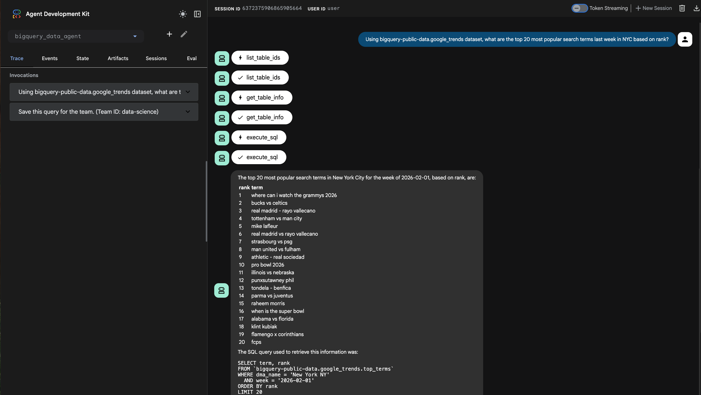
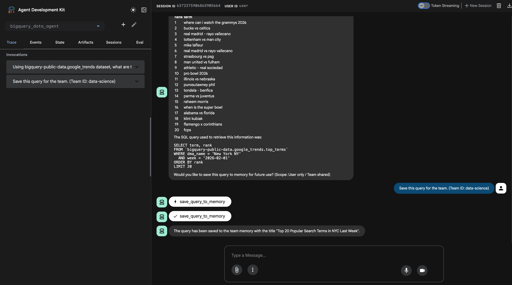
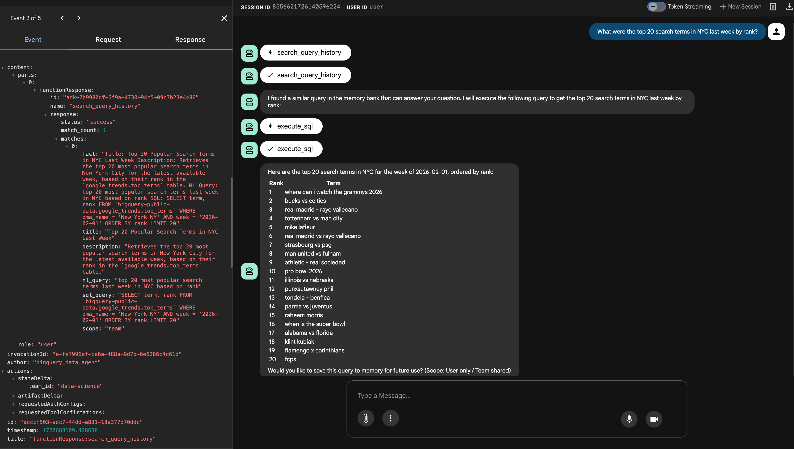
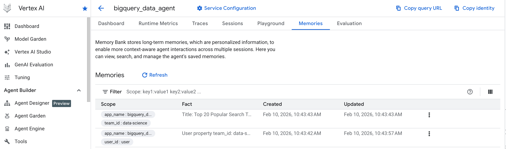

# BigQuery Data Agent with Agent Engine Memory Bank

This project demonstrates a self-learning BigQuery agent built with the [Google Agent Development Kit (ADK)](https://google.github.io/adk-docs/) that leverages the [Vertex AI Agent Engine Memory Bank](https://docs.cloud.google.com/agent-builder/agent-engine/memory-bank/overview).

The agent can convert natural language questions into BigQuery SQL queries and execute them. More importantly, it can **learn** from its interactions by saving successful queries to a long-term memory store. This memory is **scoped**, allowing queries to be private to a user or shared across a team, enabling detailed personalization and knowledge sharing.

## Features

- **Natural Language to SQL**: Converts user questions into syntactically correct BigQuery SQL.
- **Dynamic Context**: Automatically searches for relevant past queries to improve accuracy and efficiency.
- **Scoped Memory**:
    - `user`: Queries are private to the individual user.
    - `team`: Queries are shared with all members of a specific team.
- **Enhanced Searchability**: Stored queries include the original question, SQL, title, and description for accurate retrieval.
- **Built-in Memory Tools**:
    - `PreloadMemoryTool`: Automatically injecting relevant memories into the agent's context.
    - `LoadMemoryTool`: Enabling the agent to explicitly retrieve memories when needed.

## Directory Structure

The project is organized as follows:

```
bigquery-data-agent-with-dynamic-context/
├── README.md
├── utils/
│   ├── __init__.py
│   ├── memory_bank_customization.py  # Configuration for Memory Bank topics
│   └── setup_memory_bank.py          # Script to provision the Agent Engine
└── bigquery_data_agent/
    ├── __init__.py
    ├── .env.example                  # Template for environment variables
    ├── agent.py                      # Main agent definition and callbacks
    ├── prompts.py                    # System instructions and prompt templates
    └── tools.py                      # Tool implementations (BigQuery, Memory)
```

- `bigquery_data_agent/agent.py`: Defines the `LlmAgent`, including model configuration and tool registration.
- `bigquery_data_agent/tools.py`: Implements the core logic for executing SQL, saving queries to memory, and searching history.
- `utils/setup_memory_bank.py`: A utility script to initialize the Vertex AI Agent Engine and Memory Bank.

## Prerequisites

To run this agent, you will need:

- **Python 3.10+**
- **Google Cloud Project** with the following APIs enabled:
    - BigQuery API (`bigquery.googleapis.com`)
    - Vertex AI API (`aiplatform.googleapis.com`)
    - Agent Engine API (if applicable for your region)
- **ADK** installed (`pip install google-adk`)
- **Vertex AI SDK** (`pip install google-cloud-aiplatform`)

## Setup

### 1. Installation

Clone the repository and install the dependencies:

```bash
# Navigate to the project directory
cd agents/agent-memory/bigquery-data-agent-with-dynamic-context

# Create and activate virtual environment
python3 -m venv .venv
source .venv/bin/activate

# Install dependencies (assuming adk and other libs are in requirements.txt or installed manually)
pip install google-adk google-cloud-aiplatform python-dotenv
```

### 2. Configuration

Create a `.env` file in the `bigquery_data_agent/` directory:

```bash
cp bigquery_data_agent/.env.example bigquery_data_agent/.env
```

Edit the `.env` file with your project details:

```ini
# Google Cloud Configuration
GOOGLE_GENAI_USE_VERTEXAI=1
GOOGLE_CLOUD_PROJECT=your-project-id
GOOGLE_CLOUD_LOCATION=us-central1

# (Optional) BigQuery Configuration
BIGQUERY_DATASET=your_dataset_name

# Agent Configuration
AGENT_MODEL=gemini-2.5-flash
```

### 3. Provision Memory Bank

Before running the agent for the first time, you must provision the Agent Engine Memory Bank. This script creates the necessary resources on Vertex AI.

```bash
python utils/setup_memory_bank.py --project=your-project-id --location=us-central1
```

This will create an Agent Engine named `bigquery_data_agent` (matching the agent's name in `agent.py`). The ADK framework automatically connects to this engine at runtime.

## Running the Agent

You can run the agent using the ADK CLI web server:

```bash
adk web bigquery_data_agent
```

Then open your browser to the URL provided (usually `http://127.0.0.1:8000`).

## Demo Walkthrough

### 1. Natural Language to SQL & Context Saving
In this first session, the user asks a question about Google Trends data. The agent generates the SQL, executes it, and then saves the successful query to memory for future use.




### 2. Retrieving from Memory in a New Session
In a subsequent session, the user asks a similar question. The agent recognizes the intent, retrieves the saved query from the Memory Bank, and executes it immediately without needing to regenerate the SQL.



### 3. Agent Engine Memory Bank view
The saved queries are stored as structured memories in the Agent Engine, visible in the Google Cloud Console.



## Usage Examples

### Scenario 1: Natural Language to SQL

**User**: "Using bigquery-public-data.google_trends dataset, what are the top 20 most popular search terms last week in NYC based on rank?"

**Agent**:
1.  Searches memory for similar past queries (none found).
2.  Generates and executes the BigQuery SQL.
3.  Returns the results.
4.  Asks if you want to save this query.

### Scenario 2: Saving to User Memory

**User**: "Save this query as 'NYC Top Search Terms' to my private memory."

**Agent**: Saves the query with scope `user`. Only you will be able to retrieve this query in future sessions.

### Scenario 3: Saving to Team Memory

**User**: "Save this query as 'Weekly Trend Report' for the team."

**Agent**: Requires a `team_id` (e.g., "data-science-team"). Saves the query with scope `team`. All members of "data-science-team" can now access this query.

### Scenario 4: Retrieving from Memory

**User**: "What were the top search terms in NYC?"

**Agent**:
1.  Searches memory and finds the "NYC Top Search Terms" query.
2.  Uses the saved SQL as a starting point.
3.  Executes the query and returns the answer immediately, without needing to regenerate the SQL from scratch.

## Architecture Details

### Memory Scopes

| Scope | Identifier | Visibility | Usage |
| :--- | :--- | :--- | :--- |
| **`user`** | `user_id` | **Private** | Personal analysis, ad-hoc queries |
| **`team`** | `team_id` | **Shared** | Standard reports, team dashboards, common metrics |
| **`global`** | N/A | **Public** | (Implementation dependent) Organization-wide KPIs |

### Memory Storage Structure

Saved memories are structured to maximize retrieval accuracy:

```text
Title: Monthly Sales Report
Description: Aggregates sales data by month for the last 12 months.
NL Query: Show me monthly sales trends
SQL: SELECT FORMAT_DATE('%Y-%m', date) as month, SUM(amount) FROM ...
```

## References

- 📓 [Get started with Memory Bank on ADK](https://github.com/GoogleCloudPlatform/generative-ai/blob/main/agents/agent_engine/memory_bank/get_started_with_memory_bank_on_adk.ipynb)
- 📝 [Self Improving Text2Sql Agent with Dynamic Context](https://www.ashpreetbedi.com/articles/sql-agent)
- :octocat: [Dash - Self-learning Data Agent](https://github.com/agno-agi/dash)
- 📝 [OpenAI's in-house data agent](https://openai.com/index/inside-our-in-house-data-agent/)
- [Gemini for Google Cloud > Conversational Analytics API: Build data agents and chat with your data](https://docs.cloud.google.com/gemini/docs/conversational-analytics-api/overview)
  - [Google Codelabs: Introduction to the Conversational Analytics API](https://codelabs.developers.google.com/ca-api-bigquery#0)
  - :octocat: [Intro to Gemini Data Analytics](https://github.com/GoogleCloudPlatform/generative-ai/blob/main/agents/gemini_data_analytics/intro_gemini_data_analytics_sdk.ipynb)