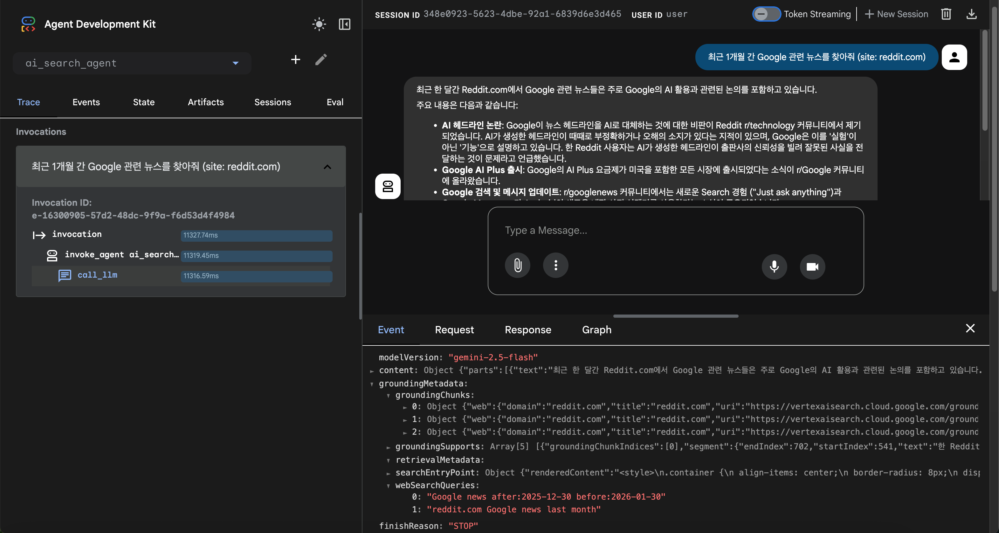

# AI Search Agent with Advanced Filtering

This project is an AI-powered search agent built with the **Agent Development Kit (ADK)**. It leverages Google Search with advanced filtering capabilities to provide precise, high-quality information.

## Key Features

- **Advanced Search Operators**: Automatically utilizes operators like `site:`, `filetype:`, `after:`, `intitle:`, and more to narrow down searches.
- **Automated Result Validation**: The agent strictly validates search results against the user's specified criteria (e.g., domain, file extension, date range) before including them in the final response.
- **Multilingual Support**: Supports queries and responses in both Korean and English.
- **Flexible Execution**: Can be run as a CLI tool, a web interface, or integrated programmatically.

## Project Structure

```
ai-search-agent/
├── ai_search_agent/
│   ├── .env.example         # Template for environment variables
│   ├── agent.py            # ADK Agent definition with Google Search tool
│   ├── prompts.py          # System instructions and search strategies
│   └── requirements.txt    # Project dependencies
├── assets/                 # Documentation assets (screenshots, etc.)
└── README.md
```

## Prerequisites

Before running the agent, ensure you have a Google Cloud project and the necessary credentials.

### 1. Authenticate with Google Cloud

```bash
gcloud auth application-default login
```

### 2. Configure Project Environment

```bash
export GOOGLE_CLOUD_PROJECT=$(gcloud config get-value project)
export GOOGLE_CLOUD_LOCATION="us-central1"
```

## Setup

### 1. Install Dependencies

This project uses `uv` for fast Python package management.

```bash
# Navigate to the project directory
cd ai-search-agent

# Create and activate virtual environment
uv venv
source .venv/bin/activate

# Install dependencies
uv pip install -r ai_search_agent/requirements.txt
```

### 2. Configure Environment Variables

Copy the example environment file and update it with your project details:

```bash
cp ai_search_agent/.env.example ai_search_agent/.env
```

Edit `ai_search_agent/.env`:
```
GOOGLE_CLOUD_PROJECT=your-project-id
GOOGLE_CLOUD_LOCATION=us-central1
```

## Usage

### 1. Running Locally (CLI)

Use the ADK CLI to chat with the agent in your terminal:

```bash
adk run ai_search_agent
```

### 2. Running the Web Interface

Launch a local web UI to interact with the agent:

```bash
adk web
```

**Screenshot:**


## Deployment

The AI Search Agent can be deployed to **Vertex AI Agent Engine** (Reasoning Engine).

### Deploy to Agent Engine

```bash
adk deploy agent_engine \
  --project=$GOOGLE_CLOUD_PROJECT \
  --region=$GOOGLE_CLOUD_LOCATION \
  --staging_bucket="gs://your-staging-bucket" \
  ai_search_agent
```

Once deployed, you will receive a Resource Name like:
`projects/<PROJECT_ID>/locations/<LOCATION>/reasoningEngines/<ENGINE_ID>`

## References

- [Agent Development Kit (ADK) Documentation](https://github.com/GoogleCloudPlatform/generative-ai/tree/main/agents/adk)
- [Vertex AI Agent Engine (Reasoning Engine) Guide](https://cloud.google.com/vertex-ai/docs/generative-ai/reasoning-engine/overview)
- [Google Search Operators](https://support.google.com/websearch/answer/2466433)
