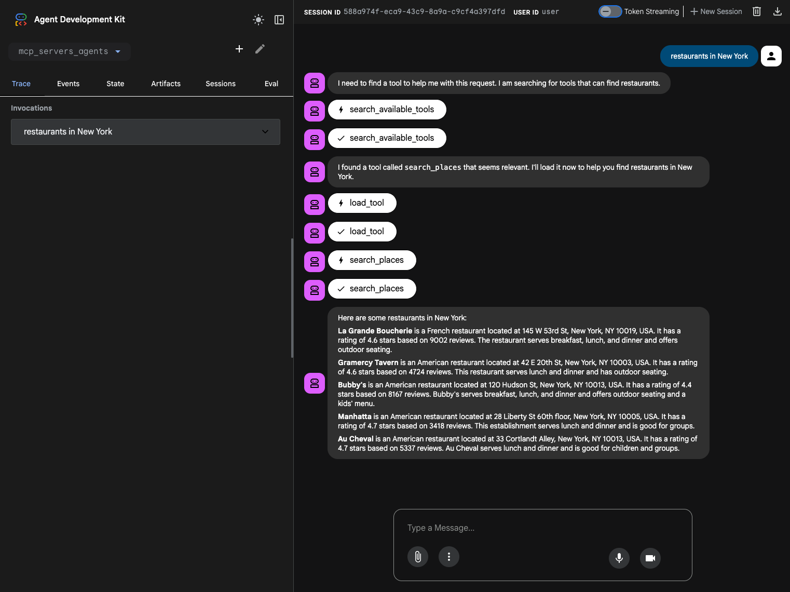

# Dynamic MCP Agent with ADK

This project demonstrates an advanced agent built with the Google Agent Development Kit (ADK) that dynamically discovers and loads tools from Google Managed MCP servers. By only loading tools into the context when they are actually needed, this agent can support hundreds of tools while maintaining high performance and reducing token costs by over 90%.

## Overview

This agent is designed for scalability and efficiency. Instead of pre-loading a large set of tools, it uses a two-phase "Search & Load" pattern.

- **`mcp_servers_agents/`**: The main agent application.
  - **`agent.py`**: Defines the `root_agent` and implements the `after_tool_callback` for dynamic tool injection.
  - **`tools.py`**: Defines the `search_available_tools` and `load_tool` functions, and handles connections to Google Managed MCP servers (Maps, BigQuery).
  - **`registry.py`**: Implements a tool registry using the `rank_bm25` algorithm to index and search through all available MCP tools based on their descriptions.
  - **`requirements.txt`**: Project dependencies including `google-adk`, `rank_bm25`, and `google-auth`.

## Architecture

The agent uses a dynamic injection flow where the primary agent discovers tools using a lightweight search tool and then loads the full tool definition into its context.

```ascii
+----------+
|          |
|   User   |
|          |
+----------+
     |
     | 1. Request (e.g., "Find coffee shop statistics in BigQuery")
     v
+-------------------------------------------------------------+
| Google Cloud / Local Environment                            |
|                                                             |
|  +-------------------------------------------------------+  |
|  | ADK Agent (mcp_dynamic_agent)                         |  |
|  |                                                       |  |
|  |  [Turn 1]                                             |  |
|  |  - Calls `search_available_tools`                     |  |
|  |  - Finds "bigquery_query" in Registry                 |  |
|  |  - Calls `load_tool("bigquery_query")`                |  |
|  +-------------------------------------------------------+  |
|           |                       ^                         |
|           | 2. Search & Load      | 3. Tool Injection       |
|           v                       | (after_tool_callback)   |
|  +-------------------+    +------------------------------+  |
|  | Tool Registry     |    | Google Managed MCP Servers   |  |
|  | (BM25 Index)      |    | (Maps, BigQuery)             |  |
|  +-------------------+    +------------------------------+  |
|                               |                             |
|                               | 4. Execute Injected Tool    |
|                               v                             |
|                      +-----------------------+              |
|                      | Final Tool Output     |              |
|                      +-----------------------+              |
+-------------------------------------------------------------+
```

## Getting Started

### 1. Prerequisites

- Python 3.10+
- `uv` (or `pip` and `venv`)
- A Google Cloud Project with Billing enabled.
- **Enable MCP servers**: Enable the Google Cloud MCP servers for the services you want to use (e.g., Maps, BigQuery).
    ```bash
    gcloud beta services mcp enable <SERVICE> --project=<PROJECT_ID>
    ```
    *Refer to the [Supported products](https://docs.cloud.google.com/mcp/supported-products) for a list of available services and [Enable or disable MCP servers](https://docs.cloud.google.com/mcp/enable-disable-mcp-servers) for detailed instructions.*

### 2. Installation

```bash
# Navigate to the project directory
cd dynamic-tool-search-tool/mcp_servers_agents

# Create and activate a virtual environment
uv venv
source .venv/bin/activate

# Install packages
uv pip install -r requirements.txt
```

### 3. Configuration

1.  **Environment Variables**:
    Create a `.env` file in the `mcp_servers_agents` directory:
    ```bash
    cp .env.example .env
    ```
2.  **Edit `.env`**:
    - `GOOGLE_CLOUD_PROJECT`: Your GCP Project ID.
    - `GOOGLE_MAPS_API_KEY`: A valid Google Maps API Key.
3.  **Authentication**:
    Ensure you have authenticated with your GCP account for BigQuery access:
    ```bash
    gcloud auth application-default login
    ```

## Running the Agent

You can interact with the agent locally using the ADK web interface.

1.  Navigate to the `dynamic-tool-search-tool` directory.
2.  Run the agent:
    ```bash
    adk web
    ```
3.  Open the provided URL (default `http://127.0.0.1:8000`) and select `mcp_servers_agents`.

## Deploying to Vertex AI Agent Engine

1.  **Authenticate**:
    ```bash
    gcloud auth login
    gcloud config set project your-gcp-project-id
    ```
2.  **Deploy**:
    ```bash
    adk deploy agent_engine dynamic-tool-search-tool/mcp_servers_agents \
      --staging_bucket="gs://your-staging-bucket" \
      --display_name="Dynamic MCP Agent" \
      --project="your-gcp-project-id" \
      --region="us-central1"
    ```

## Example Usage



**User:**
> "restaurants in New York"

**Agent Workflow:**
1.  **Discovery**: The agent calls `search_available_tools(query="restaurants in New York")` to find relevant tools.
2.  **Selection**: It identifies `search_places` from the Maps MCP as the best match.
3.  **Loading**: The agent calls `load_tool("search_places")` to retrieve the full tool definition.
4.  **Injection**: The `after_tool_callback` dynamically injects the tool into the current session.
5.  **Execution**: The agent now calls the newly available `search_places` tool to get the restaurant data and responds to the user.

## References

- [ADK Documentation: Callbacks - Observe, Customize, and Control Agent Behavior](https://google.github.io/adk-docs/callbacks/)
- [Implementing Anthropic-style Dynamic Tool Search Tool](https://medium.com/google-cloud/implementing-anthropic-style-dynamic-tool-search-tool-f39d02a35139)
- [Tutorial: Getting Started with Google MCP Services](https://medium.com/google-cloud/tutorial-getting-started-with-google-mcp-services-60b23b22a0e7)
- [Google Cloud MCP Overview](https://docs.cloud.google.com/mcp/overview)
    - [Google Cloud MCP Supported Products](https://docs.cloud.google.com/mcp/supported-products)
    - [Google Cloud MCP GitHub repository](https://github.com/Google/mcp)
    - [Google Cloud MCP Enable/Disable MCP Servers](https://docs.cloud.google.com/mcp/enable-disable-mcp-servers)
