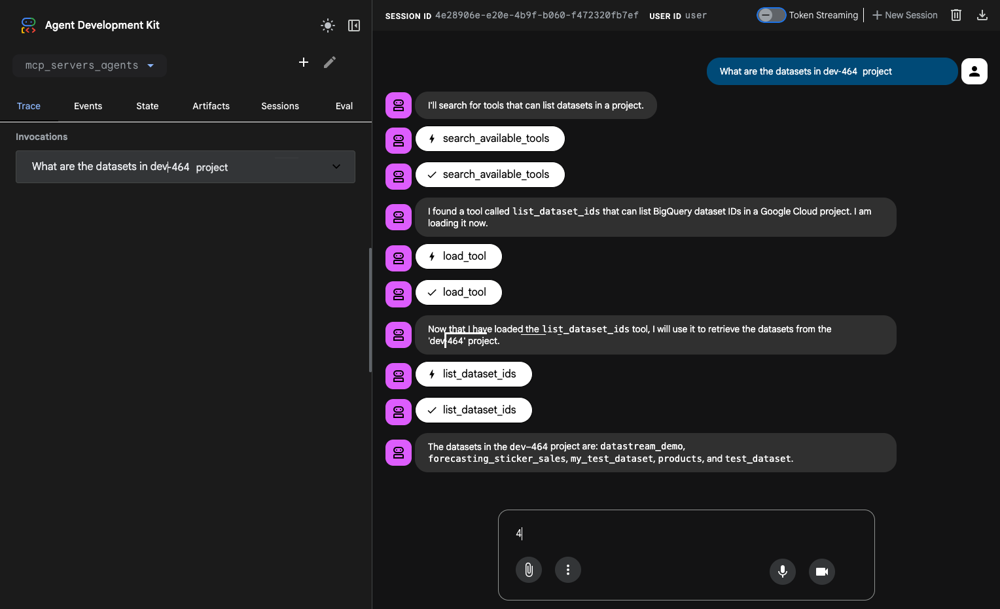
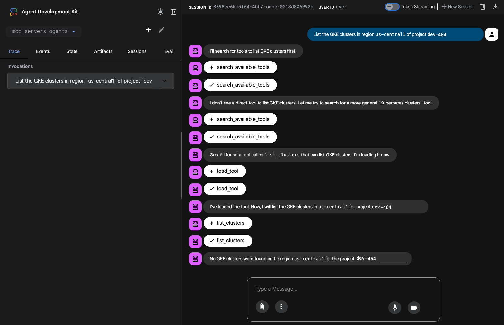

# Dynamic MCP Agent with ADK

This project demonstrates an advanced agent built with the Google Agent Development Kit (ADK) that dynamically discovers and loads tools from [Google Managed MCP servers](https://docs.cloud.google.com/mcp/supported-products). By only loading tools into the context when they are actually needed, this agent can support hundreds of tools while maintaining high performance and reducing token costs by over 90%.

## Overview

This agent is designed for scalability and efficiency. Instead of pre-loading a large set of tools, it uses a two-phase "Search & Load" pattern.

- **`mcp_servers_agents/`**: The main agent application.
  - **`agent.py`**: Defines the `root_agent` and implements the `after_tool_callback` for dynamic tool injection.
  - **`lib/`**: Core logic and utility modules.
    - **`tools.py`**: Defines the dynamic loading functions and handles connections to Google Cloud MCP servers (Maps, BigQuery, Compute Engine, GKE).
    - **`registry.py`**: Implements a BM25-based tool registry for indexing and searching available MCP tools.
  - **`requirements.txt`**: Project dependencies including `google-adk`, `rank_bm25`, and `google-auth`.

## Architecture

The agent uses a dynamic injection flow where the primary agent discovers tools using a lightweight search tool and then loads the full tool definition into its context.

```ascii
+----------+
|          |
|   User   |
|          |
+----------+
     |
     | 1. Request (e.g., "Find coffee shop statistics in BigQuery")
     v
+-------------------------------------------------------------+
| Google Cloud / Local Environment                            |
|                                                             |
|  +-------------------------------------------------------+  |
|  | ADK Agent (mcp_dynamic_agent)                         |  |
|  |                                                       |  |
|  |  [Turn 1]                                             |  |
|  |  - Calls `search_available_tools`                     |  |
|  |  - Finds "bigquery_query" in Registry                 |  |
|  |  - Calls `load_tool("bigquery_query")`                |  |
|  +-------------------------------------------------------+  |
|           |                       ^                         |
|           | 2. Search & Load      | 3. Tool Injection       |
|           v                       | (after_tool_callback)   |
|  +-------------------+    +------------------------------+  |
|  | Tool Registry     |    | Google Managed MCP Servers   |  |
|  | (BM25 Index)      |    | (Maps, BigQuery)             |  |
|  +-------------------+    +------------------------------+  |
|                               |                             |
|                               | 4. Execute Injected Tool    |
|                               v                             |
|                      +-----------------------+              |
|                      | Final Tool Output     |              |
|                      +-----------------------+              |
+-------------------------------------------------------------+
```

## Getting Started

### 1. Prerequisites

- Python 3.10+
- `uv` (or `pip` and `venv`)
- A Google Cloud Project with Billing enabled.

#### 1.1 Project Setup and API Enablement

1.  **Authenticate and set your Project**:
    ```bash
    # Authenticate with Google Cloud
    gcloud auth login

    # Set your project ID
    gcloud config set project <YOUR_PROJECT_ID>
    ```

2.  **Enable the required Product APIs**:
    ```bash
    gcloud services enable \
      bigquery.googleapis.com \
      compute.googleapis.com \
      container.googleapis.com \
      mapstools.googleapis.com
    ```

#### 1.2 Enable Google MCP Services

The MCP services are currently in a **beta** state and require explicit enablement of the MCP endpoints, which are distinct from the product APIs.

```bash
# Define your project variable
export PROJECT_ID=$(gcloud config get-value project)

# Enable the MCP Endpoints
gcloud beta services mcp enable bigquery.googleapis.com --project=$PROJECT_ID
gcloud beta services mcp enable mapstools.googleapis.com --project=$PROJECT_ID
gcloud beta services mcp enable container.googleapis.com --project=$PROJECT_ID
gcloud beta services mcp enable compute.googleapis.com --project=$PROJECT_ID
```

### 2. Identity and Access Management (IAM)

The MCP servers enforce a **dual-layer security model**. Your identity must pass two gates:

1.  **The MCP Gate**: Requires `roles/mcp.toolUser` to interact with the MCP server.
2.  **The Service Gate**: Requires underlying service permissions (e.g., `roles/bigquery.dataViewer`).

Grant the MCP Tool User role to your identity:

```bash
export USER_EMAIL=$(gcloud config get-value account)

gcloud projects add-iam-policy-binding $PROJECT_ID \
  --member="user:$USER_EMAIL" \
  --role="roles/mcp.toolUser"
```

### 3. Installation

```bash
# Navigate to the project directory
cd dynamic-tool-search-tool/mcp_servers_agents

# Create and activate a virtual environment
uv venv
source .venv/bin/activate

# Install packages
uv pip install -r requirements.txt
```

### 4. Configuration

1.  **Environment Variables**:
    Create a `.env` file in the `mcp_servers_agents` directory:
    ```bash
    cp .env.example .env
    ```
2.  **Edit `.env`**:
    - `GOOGLE_CLOUD_PROJECT`: Your GCP Project ID.
    - `GOOGLE_MAPS_API_KEY`: A valid Google Maps API Key.
3.  **Google Maps API Key**:
    The Maps Grounding Lite server requires an API Key for quota and billing.
    ```bash
    # Create the key
    gcloud alpha services api-keys create --display-name="Maps-MCP-Key"

    # Note the 'keyString' from the output and add it to your .env file
    ```
4.  **Authentication**:
    Ensure you have authenticated with your GCP account:
    ```bash
    gcloud auth application-default login
    ```

## Running the Agent

You can interact with the agent locally using the ADK web interface.

1.  Navigate to the `dynamic-tool-search-tool` directory.
2.  Run the agent:
    ```bash
    adk web
    ```
3.  Open the provided URL (default `http://127.0.0.1:8000`) and select `mcp_servers_agents`.

## Deploying to Vertex AI Agent Engine

1.  **Authenticate**:
    ```bash
    gcloud auth login
    gcloud config set project your-gcp-project-id
    ```
2.  **Deploy**:
    ```bash
    adk deploy agent_engine dynamic-tool-search-tool/mcp_servers_agents \
      --staging_bucket="gs://your-staging-bucket" \
      --display_name="Dynamic MCP Agent" \
      --project="your-gcp-project-id" \
      --region="us-central1"
    ```

## Example Usage

The agent can discover and use tools across various Google Cloud services. Here are a few examples:

### 1. Google Maps Platform (Discovery & Execution)


**User:**
> "restaurants in New York"

**Agent Workflow:**
1.  **Discovery**: The agent calls `search_available_tools(query="restaurants in New York")`.
2.  **Selection**: It identifies `search_places` from the Maps MCP as the best match.
3.  **Loading**: The agent calls `load_tool("search_places")` to retrieve the full tool definition.
4.  **Injection**: The `after_tool_callback` dynamically injects the tool into the current session.
5.  **Execution**: The agent calls `search_places` to get the restaurant data.

### 2. BigQuery (Data Discovery)



**User:**
> "What are the datasets in `dev-464` project"

**Agent Workflow:**
1.  **Discovery**: The agent calls `search_available_tools(query="list BigQuery datasets")`.
2.  **Selection**: It identifies `list_dataset_ids` as the appropriate tool.
3.  **Loading**: The agent calls `load_tool("list_dataset_ids")`.
4.  **Injection**: The tool is dynamically injected.
5.  **Execution**: The agent calls `list_dataset_ids(project_id="dev-464")`.

### 3. Google Kubernetes Engine (Infrastructure Discovery)



**User:**
> "List the GKE clusters in region `us-central1` of project `dev-464`."

**Agent Workflow:**
1.  **Discovery**: The agent calls `search_available_tools(query="list GKE clusters")`.
2.  **Selection**: It identifies `list_clusters` as the correct tool.
3.  **Loading**: The agent calls `load_tool("list_clusters")`.
4.  **Injection**: The tool is dynamically injected.
5.  **Execution**: The agent calls `list_clusters(project_id="dev-464", location="us-central1")`.

## References

- [Implementing Anthropic-style Dynamic Tool Search Tool (2025-11-29)](https://medium.com/google-cloud/implementing-anthropic-style-dynamic-tool-search-tool-f39d02a35139)
- [Introducing advanced tool use on the Claude Developer Platform (2025-11-24)](https://www.anthropic.com/engineering/advanced-tool-use)
- [Google ADK Documentation: Callbacks - Observe, Customize, and Control Agent Behavior](https://google.github.io/adk-docs/callbacks/)
- [Tutorial: Getting Started with Google MCP Services (2025-12-11)](https://medium.com/google-cloud/tutorial-getting-started-with-google-mcp-services-60b23b22a0e7)
    - [Getting Started with Google Cloud API Registry](https://github.com/GoogleCloudPlatform/generative-ai/blob/main/agents/agent_engine/tutorial_get_started_with_cloud_api_registry.ipynb): Google Cloud API Registry acts as a centralized catalog of MCP (Model Context Protocol) servers.
- [Google Cloud MCP Overview](https://docs.cloud.google.com/mcp/overview)
    - [Google Cloud MCP Supported Products](https://docs.cloud.google.com/mcp/supported-products)
    - [Google Cloud MCP GitHub repository](https://github.com/Google/mcp)
    - [Google Cloud MCP Enable/Disable MCP Servers](https://docs.cloud.google.com/mcp/enable-disable-mcp-servers)
