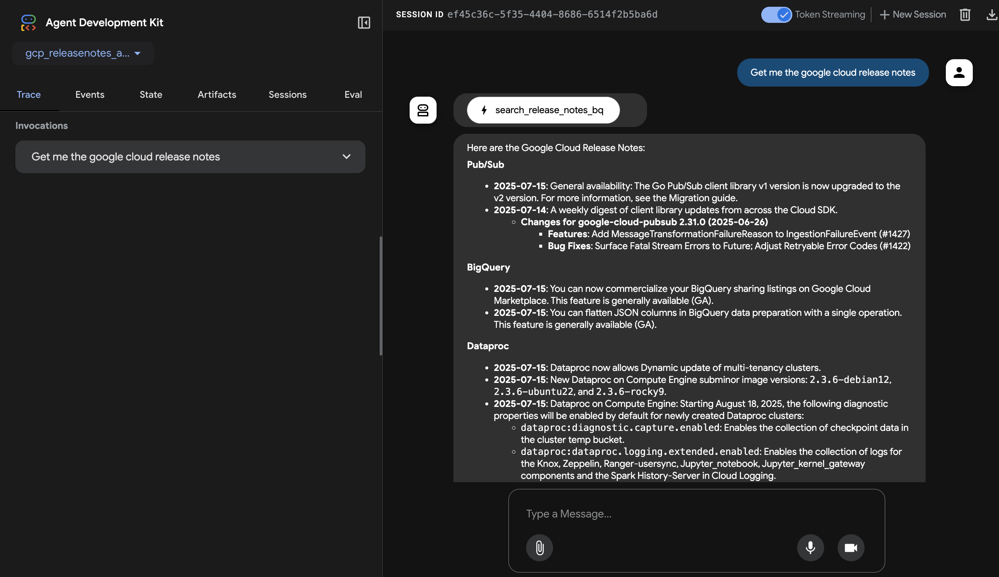

# Google Cloud Release Notes Agent

This agent is designed to answer questions about Google Cloud Release Notes. It utilizes the Google Agent Development Kit (ADK) and connects to the [MCP Toolbox for Databases](https://googleapis.github.io/genai-toolbox/getting-started/) to query information.

The core logic is in `gcp_releasenotes_agent/agent.py`.

## Architecture

This agent uses a secure, two-tiered network architecture. The user-facing `gcp-releasenotes-agent-service` (`Cloud Run - A`) is deployed as a public Cloud Run service, while the backend `mcp-toolbox-service` (`Cloud Run - B`) is isolated in a private subnet within a VPC. Communication from the public agent to the private backend is secured via a Serverless VPC Access connector and authenticated using a Google-signed ID token.

```ascii
+----------+
|          |
|   User   |
|          |
+----------+
     |
     | 1. User Question (HTTPS)
     v
+--------------------------------------------------------------------------------------------------+
| Google Cloud                                                                                     |
|                                                                                                  |
|  +--------------------------------------+                                                        |
|  |   gcp-releasenotes-agent-service     |                                                        |
|  |   (Cloud Run - A, Public)            |                                                        |
|  +--------------------------------------+                                                        |
|     |                                                                                            |
|     | 2. Call with Auth Token (via VPC Connector)                                                |
|     v                                                                                            |
|  +-------------------------------------------------------+          +----------------------+     |
|  | VPC / Private Subnet                                  |          |                      |     |
|  |                                                       |          |   BigQuery Public    |     |
|  |    +--------------------------------------+           | 3. Query |       Datasets       |     |
|  |    |   mcp-toolbox-service                |-----------|--------->|                      |     |
|  |    |   (Cloud Run - B, Internal)          |           |          |                      |     |
|  |    +--------------------------------------+           |          +----------------------+     |
|  |                                                       |                                       |
|  +-------------------------------------------------------+                                       |
|                                                                                                  |
+--------------------------------------------------------------------------------------------------+
```

### Diagram Description

1.  **Public Agent, Private Backend**:
    *   The `gcp-releasenotes-agent-service (Cloud Run - A)` is deployed as a standard Cloud Run service with public ingress, accessible from the internet.
    *   The `mcp-toolbox-service (Cloud Run - B)` is deployed in a **Private Subnet** with **Internal Ingress** only. This isolates it from the public internet.

2.  **Communication Path**:
    *   When a user sends a request to the agent (`Cloud Run - A`), the agent needs to call the private backend service.
    *   To do this, the agent's service account generates a Google-signed **ID Token** with the audience set to the target service (`Cloud Run - B`).
    *   This call, including the authentication token in the `Authorization` header, is routed from the public agent into the private VPC network via a **Serverless VPC Access connector**.
    *   The `mcp-toolbox-service` then queries the public BigQuery dataset to fetch the requested release notes.

3.  **Architecture Purpose**:
    *   This architecture enhances security by exposing only the agent to the internet, while the backend toolbox service, which has access to data sources, remains protected in an isolated private network. All communication is authenticated and occurs over the private network.

## Prerequisites

Before running the agent, you must have a running instance of the [MCP Toolbox for Databases](https://googleapis.github.io/genai-toolbox/getting-started/) and have the agent's local environment configured.

### 1. Deploy the MCP Toolbox Server to Cloud Run

The agent relies on a backend service called the MCP Toolbox for Databases, which provides the tools to query information (e.g., from BigQuery). Follow these steps to deploy it to Cloud Run.

**A. Set Up Your Google Cloud Environment**

First, set the following environment variables to simplify the setup commands. Replace the values with your own.
```bash
# Your Google Cloud project ID
export GOOGLE_CLOUD_PROJECT="your-gcp-project-id"

# The region to deploy your services
export GOOGLE_CLOUD_LOCATION="us-central1"

# The name for your toolbox service
export TOOLBOX_SERVICE_NAME="mcp-toolbox-service"

# The name of the service account for the toolbox
export TOOLBOX_SA_NAME="toolbox-identity"

# The name of the secret to store your toolbox configuration
export TOOLBOX_SECRET_NAME="mcp-toolbox-for-databases"
```

Enable the necessary Google Cloud APIs:
```bash
gcloud services enable \
    run.googleapis.com \
    cloudbuild.googleapis.com \
    artifactregistry.googleapis.com \
    iam.googleapis.com \
    secretmanager.googleapis.com
```

**B. Create a Service Account**

Create a service account that the Toolbox will use to access other Google Cloud services.
```bash
gcloud iam service-accounts create $TOOLBOX_SA_NAME \
    --display-name="MCP Toolbox Service Account"
```
Grant it the necessary roles. At a minimum, it needs to access secrets and any data sources you configure.
```bash
# Role for Secret Manager
gcloud projects add-iam-policy-binding $GOOGLE_CLOUD_PROJECT \
    --member="serviceAccount:$TOOLBOX_SA_NAME@$GOOGLE_CLOUD_PROJECT.iam.gserviceaccount.com" \
    --role="roles/secretmanager.secretAccessor"

# Role for BigQuery (if you plan to use it)
gcloud projects add-iam-policy-binding $GOOGLE_CLOUD_PROJECT \
    --member="serviceAccount:$TOOLBOX_SA_NAME@$GOOGLE_CLOUD_PROJECT.iam.gserviceaccount.com" \
    --role="roles/bigquery.dataViewer"
```

**C. Create the Toolbox Configuration**

Create a `tools.yaml` file to define the tools your agent will use. For this agent, we need a tool to query a public BigQuery dataset containing Google Cloud release notes.
```yaml
# tools.yaml
my_bq_toolset:
  description: "This toolset is for querying Google Cloud release notes."
  tools:
    - name: "release_notes_tool"
      description: "A tool for querying Google Cloud release notes from a BigQuery table."
      type: "BIGQUERY"
      bigquery:
        project_id: "bigquery-public-data"
        dataset_id: "google_cloud_release_notes"
        table_id: "release_notes"
```

**D. Store the Configuration in Secret Manager**

Create a secret and store your `tools.yaml` configuration in it.
```bash
gcloud secrets create $TOOLBOX_SECRET_NAME \
    --replication-policy="automatic"

gcloud secrets versions add $TOOLBOX_SECRET_NAME \
    --data-file="tools.yaml"
```

**E. Deploy the Toolbox to Cloud Run**

Deploy the pre-built MCP Toolbox container image to Cloud Run. This command configures the service to use your service account and the `tools.yaml` from Secret Manager.
```bash
gcloud run deploy $TOOLBOX_SERVICE_NAME \
  --image="us-docker.pkg.dev/mcp-tool-releases/mcp-toolbox/mcp-toolbox-server:latest" \
  --region=$GOOGLE_CLOUD_LOCATION \
  --service-account="$TOOLBOX_SA_NAME@$GOOGLE_CLOUD_PROJECT.iam.gserviceaccount.com" \
  --update-secrets=TOOL_CONFIG_FILE="$TOOLBOX_SECRET_NAME:latest" \
  --allow-unauthenticated
```
Once the deployment is complete, **copy the service URL**. You will need it to configure the agent.

### 2. Configure the Local Agent Environment

Now, set up the agent itself.

1.  **Python & ADK**: Ensure Python 3.x and the Google Agent Development Kit are installed.
2.  **Google Cloud SDK (`gcloud`)**: If you don't have it, [install it from here](https://cloud.google.com/sdk/docs/install).
3.  **Authentication**: Authenticate your local environment to allow the agent to invoke the deployed Toolbox service.
    ```bash
    gcloud auth application-default login
    ```


## Setup and Local Execution

1.  **Navigate to the Agent Directory**:
    From the root of the `my-agents` repository, change to this agent's directory:
    ```bash
    cd gcp-releasenotes-agent-app
    ```

2.  **Install Dependencies**:
    *   Create a virtual environment using `uv`:
        ```bash
        uv venv
        ```
    *   Activate the virtual environment:
        *   **macOS/Linux:**
            ```bash
            source .venv/bin/activate
            ```
        *   **Windows:**
            ```bash
            .venv\Scripts\activate
            ```
    *   Install the required Python packages:
        ```bash
        uv pip install -r gcp_releasenotes_agent/requirements.txt
        ```

3.  **Configure Environment**:
    Create a `.env` file for the agent by copying the example:
    ```bash
    cp gcp_releasenotes_agent/.env.example gcp_releasenotes_agent/.env
    ```
    Open the `gcp_releasenotes_agent/.env` file and set the `TOOLBOX_ENDPOINT` variable to the URL of the MCP Toolbox service you deployed in the prerequisites.

4.  **Run the Agent Locally**:
    To start the agent and interact with it through the ADK's web interface, run the following command from the `gcp-releasenotes-agent-app/` directory:
    ```bash
    export ADK_AGENT_HOST=localhost
    adk web
    ```
    This will start a local web server where you can test the agent.

## Example Usage

Once the agent is running in the ADK Web UI, you can interact with it.

**Example prompt:**
> "Get me the google cloud release notes"

The agent will use the `search_release_notes_bq` tool to query BigQuery for release notes and return the results.


## Deploying to Cloud Run

You can deploy this agent as a containerized application on Google Cloud Run using the ADK CLI. The ADK automatically handles containerization, so a manual `Dockerfile` is not needed.

1.  **Authenticate with Google Cloud**:
    If you haven't already, authenticate your user account:
    ```bash
    gcloud auth login
    ```

2.  **Set Project and Location**:
    Set your default project and region to simplify the deployment command.
    ```bash
    # Replace with your actual project ID and desired region
    export GOOGLE_CLOUD_PROJECT="your-gcp-project-id"
    export GOOGLE_CLOUD_LOCATION="us-central1"
    ```

3.  **Deploy**:
    From the `gcp-releasenotes-agent-app/` directory, run the following command to deploy the agent:
    ```bash
    adk deploy cloud_run \
        --project=$GOOGLE_CLOUD_PROJECT \
        --region=$GOOGLE_CLOUD_LOCATION \
        --service_name="gcp-releasenotes-agent-service" \
        --with_ui \
        ./gcp_releasenotes_agent
    ```
    During deployment, you may be prompted to allow unauthenticated invocations. Once complete, the ADK will provide a URL to access your agent on Cloud Run.

## Configuration Details

-   **Toolbox Endpoint**: The agent connects to a Toolbox service defined by the `TOOLBOX_ENDPOINT` variable in `gcp_releasenotes_agent/agent.py`.
-   **Authentication**: The agent automatically obtains a Google ID token from the credentials configured via the `gcloud auth` command.
-   **Tools**: The agent is configured to load a toolset named `my_bq_toolset` from the Toolbox service.

## References

- [Deploy to Cloud Run | MCP Toolbox for Databases](https://googleapis.github.io/genai-toolbox/how-to/deploy_toolbox/)
- [MCP Toolbox for Databases: Making BigQuery datasets available to LLMs](https://codelabs.developers.google.com/mcp-toolbox-bigquery-dataset?hl=en#6)
- [Build a Travel Agent using MCP Toolbox for Databases and Agent Development Kit (ADK)](https://codelabs.developers.google.com/travel-agent-mcp-toolbox-adk#0)
- [Build a Sports Shop Agent AI Assistant with ADK, MCP Toolbox and AlloyDB](https://codelabs.developers.google.com/codelabs/devsite/codelabs/sports-agent-adk-mcp-alloydb#0)
- [MCP Toolbox for Databases](https://googleapis.github.io/genai-toolbox/getting-started/)
- [toolbox-core - PyPI](https://pypi.org/project/toolbox-core/)
- [googleapis/mcp-toolbox-sdk-python: Python SDK for interacting with the MCP Toolbox for Databases. - GitHub](https://github.com/googleapis/mcp-toolbox-sdk-python)
