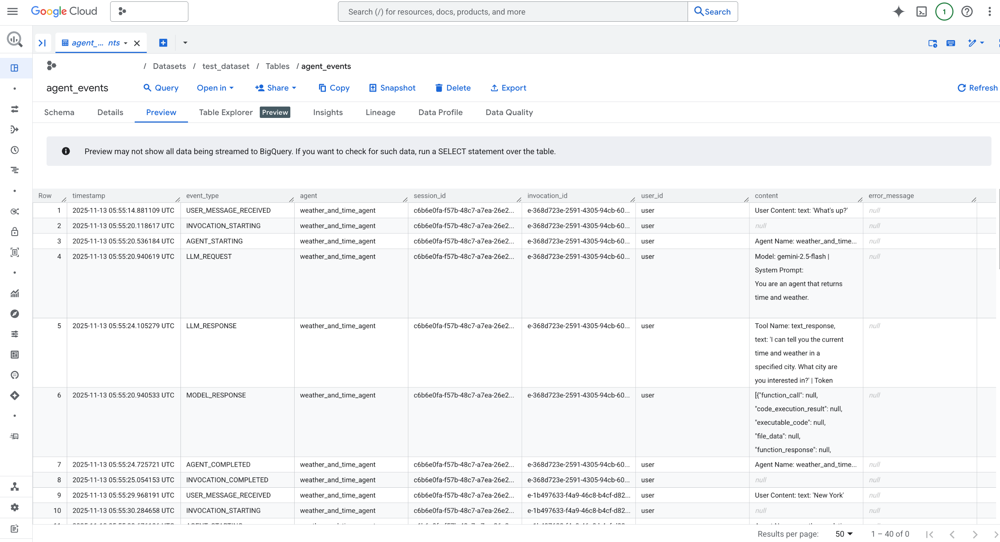
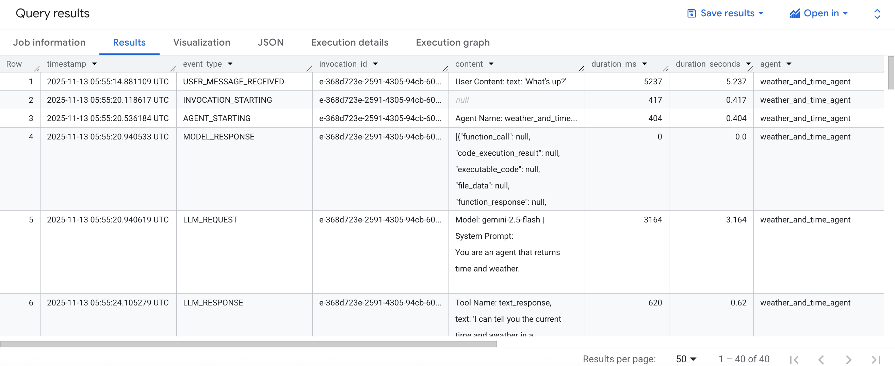

# ADK BigQuery Logging Plugin Example

This project contains a sample agent built with [ADK Python](https://google.github.io/adk-docs/) that demonstrates how to use the [`BigQueryAgentAnalyticsPlugin`](https://google.github.io/adk-docs/plugins/#prebuilt-plugins) to log agent interactions and analytics to Google BigQuery.

ADK's plugin system allows for extending agent functionality. This project implements the `BigQueryAgentAnalyticsPlugin` to capture events such as tool calls, agent responses, and errors, and store them in a structured BigQuery table for later analysis.

This approach enables developers to monitor agent performance, debug issues, and gain insights into user interactions.

---

## Directory Structure

The project is organized as follows:

```
./plugins/bigquery-logging-plugin
├── README.md
└── weather_app
    ├── __init__.py
    ├── .env.example
    ├── agent.py
    ├── prompt.py
    └── tools.py
```

- `weather_app/`: The main application directory containing the agent definition and supporting files.
- `weather_app/agent.py`: Defines a simple agent that can report the time and weather, and it includes the `BigQueryAgentAnalyticsPlugin`.
- `weather_app/prompt.py`: The instructional prompt for the weather agent.
- `weather_app/tools.py`: Contains the `get_weather` and `get_current_time` tool definitions.
- `weather_app/.env.example`: A template for the required environment variables.

## Prerequisites

To run this agent, you will need:
- A terminal
- Git
- Python 3.10+
- [uv](https://docs.astral.sh/uv/getting-started/installation/)
- A Google Cloud project with the BigQuery API enabled.
- A BigQuery dataset.

## Run Locally

1.  **Clone this repository** and navigate to the `plugins/bigquery-logging-plugin` subdirectory.

2.  **Authenticate with Google Cloud**:

    Run the following command to authenticate your `gcloud` CLI for application default credentials. This is necessary to create BigQuery datasets.

    ```bash
    gcloud auth application-default login
    ```

3.  **Create a BigQuery dataset**:

    Use the [`bq` CLI](https://docs.cloud.google.com/bigquery/docs/reference/bq-cli-reference) to create a BigQuery dataset. Replace `your-gcp-project-id`, `your-bigquery-dataset-id`, and `your-gcp-location` with your actual project ID, desired dataset ID, and Google Cloud location (e.g., `us-central1`).

    ```bash
    bq mk \
       --dataset_id your-bigquery-dataset-id \
       --location your-gcp-location \
       --project_id your-gcp-project-id
    ```

4.  **Set up environment variables** (after creating the dataset):

    Copy the `.env.example` file to `.env` and fill in your Google Cloud project details.

    ```bash
    cp weather_app/.env.example weather_app/.env
    ```

    Your `weather_app/.env` file should look like this:

    ```
    GOOGLE_GENAI_USE_VERTEXAI=1
    GOOGLE_CLOUD_PROJECT="your-gcp-project-id"
    GOOGLE_CLOUD_LOCATION="your-gcp-location (e.g., us-central1)"
    BIGQUERY_DATASET="your-bigquery-dataset-id"
    BIGQUERY_TABLE='agent_events'
    ```

5.  **Install dependencies**:

    Create a virtual environment and install the required packages from the root of the repository.

    ```bash
    uv venv
    source .venv/bin/activate
    uv pip install -r ../../requirements.txt  # Assuming a requirements file at the root
    ```
    *Note: You may need to adjust the path to the `requirements.txt` file based on the project structure.*

6.  **Run the ADK web UI**:

    Start the ADK web server, pointing to the agent directory.

    ```bash
    adk web
    ```

    Navigate to `127.0.0.1:8000` in your browser to interact with the agent.

    

## Inspecting Logs in BigQuery

As you interact with the agent, analytics data will be logged to the specified BigQuery table. You can inspect this data using the Google Cloud Console or the `gcloud` CLI.

1.  **Go to the BigQuery section** in your Google Cloud Console.
2.  **Navigate to your dataset** and select the `agent_events` table (or the name you configured).
3.  **Query the table** to see the logged events:

    ```sql
    SELECT * FROM `<your-gcp-project-id>.<your-bigquery-dataset-id>.agent_events`
    LIMIT 100;
    ```

    This will show you the structured logs of the agent\'s operations, including tool inputs and outputs, and agent responses.
    

### Generating Trace Information from Logs

Based on the BigQuery table schema, you can generate Trace information for agent activities. This involves reconstructing events that occurred within each session (`session_id`) in chronological order, and identifying how long each step (span) took and in what order they were called. `session_id` and `invocation_id` play a key role in creating this information.

**Table Schema:**
```json
[{
  "column_name": "timestamp",
  "data_type": "TIMESTAMP",
  "is_nullable": "YES"
}, {
  "column_name": "event_type",
  "data_type": "STRING",
  "is_nullable": "YES"
}, {
  "column_name": "agent",
  "data_type": "STRING",
  "is_nullable": "YES"
}, {
  "column_name": "session_id",
  "data_type": "STRING",
  "is_nullable": "YES"
}, {
  "column_name": "invocation_id",
  "data_type": "STRING",
  "is_nullable": "YES"
}, {
  "column_name": "user_id",
  "data_type": "STRING",
  "is_nullable": "YES"
}, {
  "column_name": "content",
  "data_type": "STRING",
  "is_nullable": "YES"
}, {
  "column_name": "error_message",
  "data_type": "STRING",
  "is_nullable": "YES"
}]
```

**BigQuery SQL Query for Generating Trace Information**

The query below generates Trace information for a specific `session_id`. It reconstructs the flow of the entire operation by calculating the occurrence time of each event, its order, and the duration (time taken) until the next event occurs.

You need to replace `your_project.your_dataset.your_table` with your actual project, dataset, and table names.

```sql
-- Query to generate Trace information for a specific session_id
-- This query sorts events by time and calculates the duration of each event.
WITH
  -- 1. Order events for a specific session by time and assign a sequence number.
  ordered_events AS (
    SELECT
      timestamp,
      event_type,
      agent,
      session_id,
      invocation_id,
      user_id,
      content,
      error_message,
      -- Get the timestamp of the next event within the same session (using LEAD window function)
      LEAD(timestamp, 1) OVER (
        PARTITION BY
          session_id
        ORDER BY
          timestamp
      ) AS next_event_timestamp
    FROM
      `your_project.your_dataset.your_table`
    WHERE
      session_id = 'ENTER-YOUR-DESIRED-SESSION-ID-HERE' -- Filter for a specific session.
  ),
  -- 2. Calculate the duration of each event.
  events_with_duration AS (
    SELECT
      timestamp,
      event_type,
      agent,
      session_id,
      invocation_id,
      user_id,
      content,
      error_message,
      -- Calculate the time difference between the current event and the next event to get the duration.
      -- For the last event, next_event_timestamp will be NULL, so the duration will also be NULL.
      TIMESTAMP_DIFF(next_event_timestamp, timestamp, MILLISECOND) AS duration_ms
    FROM
      ordered_events
  )
-- 3. Retrieve the final Trace information.
SELECT
  timestamp,
  event_type,
  invocation_id,
  content,
  duration_ms,
  -- Also display duration in seconds for better readability.
  SAFE_DIVIDE(duration_ms, 1000) AS duration_seconds,
  agent,
  session_id,
  user_id,
  error_message
FROM
  events_with_duration
ORDER BY
  timestamp;
```

**Detailed Query Explanation**

1.  **`ordered_events` CTE (Common Table Expression)**
    *   `WHERE session_id = '...'`: Filters only the logs of a specific session you want to analyze. You can remove this `WHERE` clause if you want to analyze all sessions.
    *   `LEAD(timestamp, 1) OVER (...)`: `LEAD` is a window function that can retrieve the value of the row that follows the current row. Here, it partitions by `session_id` and orders by `timestamp`, then retrieves the `timestamp` value of the very next event as `next_event_timestamp`. For the last event in a session, this value will be `NULL` as there is no next event.

2.  **`events_with_duration` CTE**
    *   `TIMESTAMP_DIFF(...)`: Calculates the difference between two timestamps. `TIMESTAMP_DIFF(next_event_timestamp, timestamp, MILLISECOND)` calculates the time taken from the start of the current event until the start of the next event, returning it in milliseconds (ms) as `duration_ms`. This value indicates how long the operation of that `event_type` lasted.

3.  **Final `SELECT` Statement**
    *   Selects key columns necessary for tracing along with the calculated `duration_ms`.
    *   `SAFE_DIVIDE(duration_ms, 1000)`: Converts the duration from milliseconds to seconds for easier human understanding.
    *   `ORDER BY timestamp`: Sorts the final results chronologically to clearly show the event flow.

**Interpreting and Utilizing Results**

Executing this query will yield results in the following format:

| timestamp | event\_type | invocation\_id | content | duration\_ms | duration\_seconds |
| :--- | :--- | :--- | :--- | :--- | :--- |
| 2025-11-13 10:00:00 | AGENT\_START | inv-001 | "User question: What\'s the weather today?" | 50 | 0.05 |
| 2025-11-13 10:00:00.050 | MODEL\_REQUEST | inv-001 | "I need to use the weather search tool." | 1200 | 1.2 |
| 2025-11-13 10:00:01.250 | TOOL\_CALL | inv-002 | "search\_weather(location=\'Seoul\')" | 2500 | 2.5 |
| 2025-11-13 10:00:03.750 | TOOL\_RESULT | inv-002 | "Result: Clear, 20 degrees" | 800 | 0.8 |
| 2025-11-13 10:00:04.550 | MODEL\_RESPONSE | inv-001 | "Today\'s weather in Seoul is clear and 20 degrees." | 100 | 0.1 |
| 2025-11-13 10:00:04.650 | AGENT\_END | inv-001 | | NULL | NULL |

*   **Flow Analysis**: By viewing the results in `timestamp` order, you can trace the entire process of the agent receiving a user question, calling the model, using tools, and generating a final answer.
*   **Performance Analysis**: The `duration_seconds` value helps identify performance bottlenecks by showing which steps (especially `TOOL_CALL` or `MODEL_REQUEST`) take a long time.
*   **Debugging**: By looking at `TOOL_CALL` and `TOOL_RESULT` with the same `invocation_id`, you can verify if the input and output of a specific tool call were correct. If there is a value in the `error_message` field, you can immediately identify at which step the error occurred.

Based on this query, you can create dashboards or perform additional analysis (e.g., finding the `event_type` that takes the longest, analyzing the lifecycle of a specific `invocation_id`, etc.) to gain a deeper understanding of the agent\'s behavior.

**Trace Visualization Example**


## References

- [ADK Python Plugins](https://google.github.io/adk-docs/plugins/#how-do-plugins-work)
  - [ADK Python: feat(plugins): add BigQueryAgentAnalyticsPlugin (v.1.18.0)](https://github.com/google/adk-python/commit/b7dbfed4a3d4a0165e2c6e51594d1f547bec89d3)
  - [ADK Python Prebuilt Plugins](https://google.github.io/adk-docs/plugins/#prebuilt-plugins)
- [BigQuery CLI Reference](https://docs.cloud.google.com/bigquery/docs/reference/bq-cli-reference)
