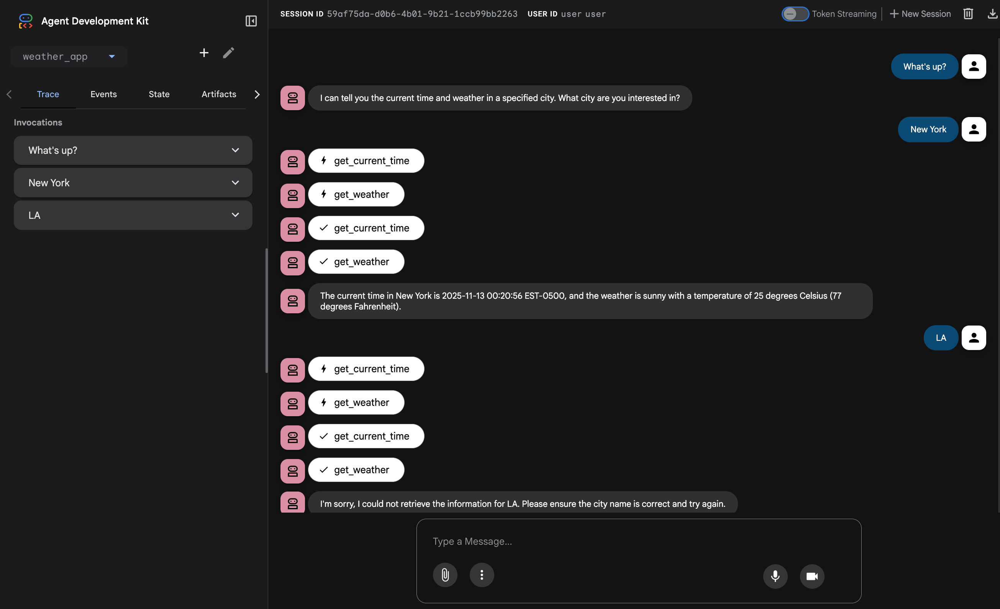

# ADK BigQuery Logging Plugin Example

This project contains a sample agent built with [ADK Python](https://google.github.io/adk-docs/) that demonstrates how to use the [`BigQueryAgentAnalyticsPlugin`](https://google.github.io/adk-docs/plugins/#prebuilt-plugins) to log agent interactions and analytics to Google BigQuery.

ADK's plugin system allows for extending agent functionality. This project implements the `BigQueryAgentAnalyticsPlugin` to capture events such as tool calls, agent responses, and errors, and store them in a structured BigQuery table for later analysis.

This approach enables developers to monitor agent performance, debug issues, and gain insights into user interactions.

---

## Directory Structure

The project is organized as follows:

```
./plugins/bigquery-logging-plugin
├── README.md
└── weather_app
    ├── __init__.py
    ├── .env.example
    ├── agent.py
    ├── prompt.py
    └── tools.py
```

- `weather_app/`: The main application directory containing the agent definition and supporting files.
- `weather_app/agent.py`: Defines a simple agent that can report the time and weather, and it includes the `BigQueryAgentAnalyticsPlugin`.
- `weather_app/prompt.py`: The instructional prompt for the weather agent.
- `weather_app/tools.py`: Contains the `get_weather` and `get_current_time` tool definitions.
- `weather_app/.env.example`: A template for the required environment variables.

## Prerequisites

To run this agent, you will need:
- A terminal
- Git
- Python 3.10+
- [uv](https://docs.astral.sh/uv/getting-started/installation/)
- A Google Cloud project with the BigQuery API enabled.
- A BigQuery dataset.

## Run Locally

1.  **Clone this repository** and navigate to the `plugins/bigquery-logging-plugin` subdirectory.

2.  **Set up environment variables**:

    Copy the `.env.example` file to `.env` and fill in your Google Cloud project details.

    ```bash
    cp weather_app/.env.example weather_app/.env
    ```

    Your `weather_app/.env` file should look like this:

    ```
    GOOGLE_GENAI_USE_VERTEXAI=1
    GOOGLE_CLOUD_PROJECT="your-gcp-project-id"
    GOOGLE_CLOUD_LOCATION="your-gcp-location (e.g., us-central1)"
    BIGQUERY_DATASET="your-bigquery-dataset-id"
    BIGQUERY_TABLE='agent_events'
    ```

3.  **Install dependencies**:

    Create a virtual environment and install the required packages from the root of the repository.

    ```bash
    uv venv
    source .venv/bin/activate
    uv pip install -r ../../requirements.txt  # Assuming a requirements file at the root
    ```
    *Note: You may need to adjust the path to the `requirements.txt` file based on the project structure.*

4.  **Run the ADK web UI**:

    Start the ADK web server, pointing to the agent directory.

    ```bash
    adk web
    ```

    Navigate to `127.0.0.1:8000` in your browser to interact with the agent.

    

## Inspecting Logs in BigQuery

As you interact with the agent, analytics data will be logged to the specified BigQuery table. You can inspect this data using the Google Cloud Console or the `gcloud` CLI.

1.  **Go to the BigQuery section** in your Google Cloud Console.
2.  **Navigate to your dataset** and select the `agent_events` table (or the name you configured).
3.  **Query the table** to see the logged events:

    ```sql
    SELECT * FROM `<your-gcp-project-id>.<your-bigquery-dataset-id>.agent_events`
    LIMIT 100;
    ```

This will show you the structured logs of the agent's operations, including tool inputs and outputs, and agent responses.

## References

- [ADK Python Plugins](https://google.github.io/adk-docs/plugins/#how-do-plugins-work)
- [ADK Python: feat(plugins): add BigQueryAgentAnalyticsPlugin](https://github.com/google/adk-python/commit/b7dbfed4a3d4a0165e2c6e51594d1f547bec89d3)
- [ADK Python Prebuilt Plugins](https://google.github.io/adk-docs/plugins/#prebuilt-plugins)
