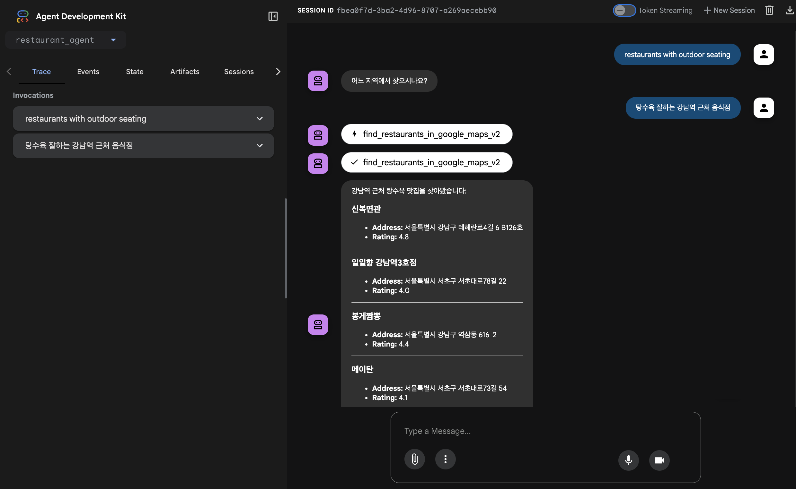

# Restaurant Finder Agent

This demo showcases a conversational AI agent that helps users find restaurants based on a specific dish or ingredient. It is built using the Google Agent Development Kit (ADK) and leverages the Google Maps Platform API to provide accurate, real-time restaurant information.

## Overview

This agent is built using the Google Agent Development Kit (ADK). It demonstrates how an agent can use external tools to answer user queries.

- **`restaurant_agent/`**: The core ADK agent.
  - **`agent.py`**: Defines the main `root_agent` which orchestrates the workflow.
  - **`tools.py`**: Contains the `find_restaurants` tool, which queries the Google Maps API to find relevant restaurants.
  - **`prompt.py`**: Provides the system instructions that guide the agent's behavior and response format.

## Architecture

The agent uses a simple, direct architecture where the ADK agent processes the user's natural language request and calls the Google Maps API to fetch relevant data.

```ascii
+----------+
|          |
|   User   |
|          |
+----------+
     |
     | 1. User Request (e.g., "Find pizza near me")
     v
+-------------------------------------------------+
| Google Cloud / Local Environment                |
|                                                 | 
|  +-------------------------------------------+  |
|  | ADK Agent (restaurant_finder_agent)       |  |
|  |                                           |  |
|  |  - Processes user input                   |  |  
|  |  - Calls the `find_restaurants` tool      |  |  
|  |                                           |  |
|  +-------------------------------------------+  |
|                 |                               |
|                 | 2. API Call with search query |
|                 v                               |
|  +-------------------------------------------+  |
|  | Google Maps Platform API                  |  |  
|  | (Places API)                              |  |  
|  +-------------------------------------------+  |
|                                                 |
+-------------------------------------------------+
```

## Getting Started

### 1. Prerequisites

- Python 3.10+
- `uv` (or `pip` and `venv`)

### 2. Installation

- **Install dependencies for the agent**:
    ```bash
    # From the repository root, navigate to the agent's directory
    cd restaurant-finder/restaurant_agent

    # Create and activate a virtual environment
    uv venv
    source .venv/bin/activate

    # Install packages
    uv pip install -r requirements.txt
    ```

### 3. Configuration

- **Set up your Google Maps API Key**:
    1.  This agent requires a Google Maps Platform API key with the following APIs enabled:
        -   **Address Validation API** (`addressvalidation.googleapis.com`)
        -   **Directions API** (`directions-backend.googleapis.com`)
        -   **Distance Matrix API** (`distance-matrix-backend.googleapis.com`)
        -   **Maps Elevation API** (`elevation-backend.googleapis.com`)
        -   **Geocoding API** (`geocoding-backend.googleapis.com`)
        -   **Geolocation API** (`geolocation.googleapis.com`)
        -   **Places API** (`places-backend.googleapis.com`)
        -   **Places API (New)** (`places.googleapis.com`)
        -   **Roads API** (`roads.googleapis.com`)
        -   **Routes API** (`routes.googleapis.com`)
        -   **Maps Static API** (`static-maps-backend.googleapis.com`)
        -   **Time Zone API** (`timezone-backend.googleapis.com`)
    2.  Follow the [official guide](https://developers.google.com/maps/gmp-get-started) to create a project, enable the APIs, and get your API key. Make sure to also [link a billing account](https://cloud.google.com/billing/docs/how-to/manage-billing-account) to your project, which is required to use the APIs.

        You can enable all the necessary APIs at once by running the following `gcloud` command:
        ```bash
        gcloud services enable \
            addressvalidation.googleapis.com \
            directions-backend.googleapis.com \
            distance-matrix-backend.googleapis.com \
            elevation-backend.googleapis.com \
            geocoding-backend.googleapis.com \
            geolocation.googleapis.com \
            places-backend.googleapis.com \
            places.googleapis.com \
            roads.googleapis.com \
            routes.googleapis.com \
            static-maps-backend.googleapis.com \
            timezone-backend.googleapis.com
        ```
    3.  Once you have your key, create a `.env` file in the `restaurant-finder/restaurant_agent` directory by copying the example file:
        ```bash
        cp .env.example .env
        ```
    4.  Open the `.env` file and add your API key:
        ```
        GOOGLE_MAPS_API_KEY="YOUR_API_KEY_HERE"
        ```

## Running the Agent

You can interact with the agent locally using the ADK web interface.

1.  Make sure you are in the `restaurant-finder` directory and the virtual environment (created in the `restaurant_agent` directory) is activated.
2.  Run the agent using the `adk web` command:
    ```bash
    # From the restaurant-finder directory
    adk web .
    ```
3.  The command will start a local web server. Open the provided URL in your browser to interact with the agent.

## Deploying to Vertex AI Agent Engine

1.  **Authenticate with Google Cloud**:
    ```bash
    gcloud auth login
    gcloud config set project your-gcp-project-id
    ```

2.  **Run the ADK deployment command**:
    From the repository root (`./my-adk-python-samples`), run the `adk deploy agent_engine` command. This command packages your agent and deploys it to a new or existing Agent Engine instance.

    **Command Syntax:**
    ```bash
    adk deploy agent_engine [OPTIONS] AGENT_PATH
    ```

    **Example:**
    ```bash
    adk deploy agent_engine restaurant-finder/restaurant_agent \
      --staging_bucket="gs://your-gcs-bucket-for-staging" \
      --display_name="Restaurant Finder" \
      --project="your-gcp-project-id" \
      --region="us-central1"
    ```

    **Key Parameters:**
    *   `AGENT_PATH`: The path to your agent's source code directory (e.g., `restaurant-finder/restaurant_agent`).
    *   `--staging_bucket`: **(Required)** A Google Cloud Storage bucket used to store deployment artifacts. You must create this bucket first.
    *   `--display_name`: The name for your agent as it will appear in the Vertex AI console.
    *   `--project`: Your Google Cloud Project ID.
    *   `--region`: The Google Cloud region where you want to deploy the agent (e.g., `us-central1`).

    After running the command, the deployment process will begin. Once it's complete, you can interact with your agent through the Vertex AI console or via API calls.

## Example Usage



Here is a sample conversation with the agent:

**User:**
> "판교역 근처에서 아보카도 샐러드 파는 곳 알려줘"

**Agent:**
> (The agent calls the `find_restaurants` tool with a query like "아보카도 샐러드 in 판교역")

> ### Salady Pangyo Techone
> *   **Address:** KR 경기도 성남시 분당구 분당내곡로 131 1층 113호
> *   **Rating:** 4.4
>
> ---
>
> ### La Sandwicherie
> *   **Address:** KR 경기도 성남시 분당구 판교역로1번길 28
> *   **Rating:** 4.6
>
> ---

## References

- [Google Maps Platform Places API Overview](https://developers.google.com/maps/documentation/places/web-service/overview)
- [Google Maps Platform Client Libraries](https://developers.google.com/maps/documentation/places/web-service/client-libraries)
- [PyPI: google-maps-places](https://pypi.org/project/google-maps-places/) - Google Maps Places API (New)
- [PyPI: googlemaps](https://pypi.org/project/googlemaps/) - Google Maps Places API (Legacy)
