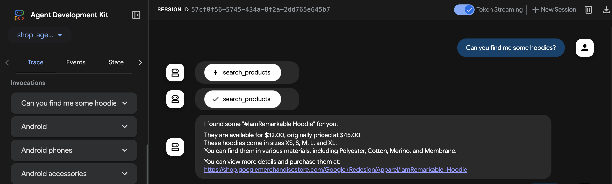
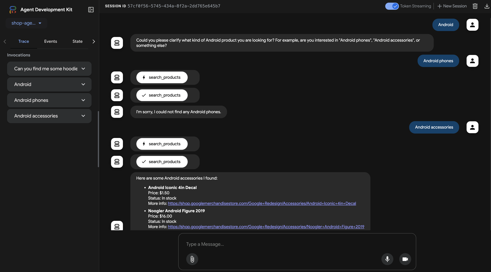

# Shop Search Agent

This agent acts as a shopping assistant, using a tool to search for products in a product catalog.

## Overview

The agent is built using the Google Agent Development Kit (ADK). It leverages the Model Context Protocol (MCP) to communicate with a separate server process that provides access to a Vertex AI Search for Retail backend.

The core logic is in `agent.py`. It defines an `LlmAgent` that is configured to use the `search_products` tool, which is made available through an `MCPToolset`. The toolset starts and communicates with the MCP server defined in `../../mcp-search-server/server.py`.

## Prerequisites

1.  **Install ADK and Dependencies:** Ensure you have the ADK installed and a virtual environment set up for this project. You can install the required Python packages using the `requirements.txt` file:
    ```bash
    uv pip install -r requirements.txt
    ```

2.  **Configure the MCP Server:** The agent relies on the `@mcp-search-server` to function. You must configure it correctly.
    *   Navigate to the `mcp-search-server` directory: `cd ../../mcp-search-server`
    *   Create a `.env` file by copying the example: `cp .env.example .env`
    *   Edit the `.env` file and provide the necessary values for your Google Cloud project:
        *   `PROJECT_ID`: Your Google Cloud Project ID.
        *   `LOCATION`: The location of your catalog (e.g., `global`).
        *   `CATALOG_ID`: The ID of your Vertex AI Search catalog.
        *   `SERVING_CONFIG_ID`: The ID of the serving config to use (e.g., `default_serving_config`).
        *   `MCP_SERVER_URL`: The URL for the remote MCP server. Defaults to `http://localhost:8000/mcp` if not set.
    *   Install the server's dependencies: `uv pip install -r requirements.txt`

## Running the Agent

You can run this agent using the ADK Web UI for interactive testing.

1.  Navigate to the parent directory (`my-agents`):
    ```bash
    cd .. 
    ```
2.  Start the ADK web server:
    ```bash
    adk web
    ```
3.  Open the provided URL in your browser.
4.  Select the `shop_search_agent` from the list of available agents.

## Example Usage

Once the agent is running in the ADK Web UI, you can interact with it.

**Example prompt:**
> "Can you find me some hoodies?"

The agent will use the `search_products` tool to query the catalog and return the results.




## References

- [(YouTube) Build AI agents for e-commerce with ADK + Vector Search](https://www.youtube.com/watch?v=UIntXBP--gI)
- [Agent Development Kit (ADK)](https://goo.gle/3RGrB9T)
- [Vertex AI Vector Search](https://goo.gle/3T5xxK5)
- [Shopper's Concierge demo video](https://goo.gle/4jRbMJb)
- [Shopper's Concierge sample notebook](https://goo.gle/4kMkxot)